# Styling and Design System

<cite>
**Referenced Files in This Document**   
- [globals.css](file://src/app/globals.css)
- [components.json](file://components.json)
- [theme-provider.tsx](file://src/components/theme-provider.tsx)
- [button.tsx](file://src/components/ui/button.tsx)
- [card.tsx](file://src/components/ui/card.tsx)
- [form.tsx](file://src/components/ui/form.tsx)
- [navbar.tsx](file://src/components/landing/navbar.tsx)
- [hero-section.tsx](file://src/components/landing/hero-section.tsx)
- [about-tab.tsx](file://src/components/admin/content-tabs/about-tab.tsx)
- [layout.tsx](file://src/app/layout.tsx)
</cite>

## Table of Contents
1. [Introduction](#introduction)
2. [Global Styles and Theme Configuration](#global-styles-and-theme-configuration)
3. [Component Styling Architecture](#component-styling-architecture)
4. [Responsive Design Strategy](#responsive-design-strategy)
5. [Dark Mode Implementation](#dark-mode-implementation)
6. [Design System Consistency](#design-system-consistency)
7. [Creating New Styles](#creating-new-styles)
8. [Conclusion](#conclusion)

## Introduction
The smmm-system implements a modern, scalable styling architecture using Tailwind CSS with a comprehensive design system. The styling approach combines utility-first CSS with component-based architecture to ensure consistency across the public site, admin dashboard, and client portal. This documentation details the styling architecture, focusing on the global styles, component styling patterns, responsive design implementation, and theme management system.

## Global Styles and Theme Configuration

The styling system is built on a foundation of CSS custom properties and global utility classes defined in `globals.css`. The design system uses the OKLCH color space for precise color representation and smooth transitions between light and dark modes.

The theme configuration establishes a comprehensive set of CSS variables for colors, spacing, and typography that are used throughout the application. These variables are defined in the `:root` selector for light mode and in the `.dark` class for dark mode, enabling seamless theme switching.

The global styles include base layer configurations that apply consistent border and outline styles across all elements, ensuring visual harmony. The theme also incorporates `tw-animate-css` for standardized animations and transitions.

**Diagram sources**
- [globals.css](file://src/app/globals.css#L1-L122)

**Section sources**
- [globals.css](file://src/app/globals.css#L1-L122)

## Component Styling Architecture

The component styling approach follows the shadcn/ui pattern, using utility classes combined with component variants to create a consistent design system. Components are built using `class-variance-authority` (CVA) to define variant-based styling that can be easily extended and maintained.

The `components.json` configuration file integrates with the UI library, establishing aliases and defining the styling approach. This configuration points to `globals.css` as the primary CSS file and enables CSS variables for theme consistency.

Key UI components like Button, Card, and Form implement a variant-based styling system that allows for multiple visual representations while maintaining design consistency:

- **Button component**: Implements variants for default, destructive, outline, secondary, ghost, and link styles with size variations
- **Card component**: Uses a structured layout with header, title, description, content, and footer sections
- **Form components**: Follow accessibility best practices with proper labeling and error states

**Diagram sources**
- [button.tsx](file://src/components/ui/button.tsx#L1-L60)
- [card.tsx](file://src/components/ui/card.tsx#L1-L92)
- [form.tsx](file://src/components/ui/form.tsx#L1-L167)
- [components.json](file://components.json#L1-L22)

**Section sources**
- [button.tsx](file://src/components/ui/button.tsx#L1-L60)
- [card.tsx](file://src/components/ui/card.tsx#L1-L92)
- [form.tsx](file://src/components/ui/form.tsx#L1-L167)
- [components.json](file://components.json#L1-L22)

## Responsive Design Strategy

The responsive design strategy implements a mobile-first approach with breakpoints that adapt to different screen sizes. The system uses Tailwind's responsive prefixes (sm, md, lg) to create layouts that work across devices.

Key responsive patterns include:

- **Navigation**: The navbar component displays a horizontal menu on desktop (md and larger) and switches to a hamburger menu on mobile devices
- **Layouts**: Grid systems adapt from single-column layouts on mobile to multi-column layouts on larger screens (e.g., hero section uses `lg:grid-cols-2`)
- **Typography**: Font sizes scale appropriately across breakpoints to maintain readability
- **Spacing**: Padding and margins adjust based on screen size to optimize space usage

The carousel components implement dynamic responsive behavior, automatically adjusting the number of visible items based on screen width. This ensures optimal content presentation across all device sizes.

```mermaid
flowchart TD
A["Device Detection"] --> B["Mobile (<768px)"]
A --> C["Tablet (768px-1023px)"]
A --> D["Desktop (≥1024px)"]
B --> E["Hamburger Menu"]
B --> F["Single Column Layout"]
B --> G["Adjusted Typography"]
C --> H["Horizontal Menu"]
C --> I["Two Column Layout"]
C --> J["Standard Typography"]
D --> K["Full Horizontal Menu"]
D --> L["Multi-column Layouts"]
D --> M["Desktop Typography"]
style A fill:#f9f,stroke:#333,stroke-width:2px
style B fill:#bbf,stroke:#333,stroke-width:2px
style C fill:#bbf,stroke:#333,stroke-width:2px
style D fill:#bbf,stroke:#333,stroke-width:2px
```

**Diagram sources**
- [navbar.tsx](file://src/components/landing/navbar.tsx#L1-L156)
- [hero-section.tsx](file://src/components/landing/hero-section.tsx#L1-L163)
- [carousel.tsx](file://src/components/ui/carousel.tsx#L1-L217)

**Section sources**
- [navbar.tsx](file://src/components/landing/navbar.tsx#L1-L156)
- [hero-section.tsx](file://src/components/landing/hero-section.tsx#L1-L163)

## Dark Mode Implementation

Dark mode support is implemented through the `theme-provider` component, which wraps the Next.js `next-themes` package to manage theme state across the application. The theme provider is configured in the root layout to handle theme persistence and system preference detection.

The dark mode implementation uses CSS classes rather than CSS custom properties on the `:root` element, applying the `.dark` class to the `html` element when dark mode is active. This approach ensures that all theme variables are properly scoped and inherited.

The color system uses OKLCH values for both light and dark modes, providing perceptually uniform color transitions and ensuring accessibility compliance. The theme variables are carefully selected to maintain proper contrast ratios in both modes, with specific adjustments for text, backgrounds, borders, and interactive elements.

**Diagram sources**
- [theme-provider.tsx](file://src/components/theme-provider.tsx#L1-L11)
- [layout.tsx](file://src/app/layout.tsx#L1-L42)
- [globals.css](file://src/app/globals.css#L80-L121)

**Section sources**
- [theme-provider.tsx](file://src/components/theme-provider.tsx#L1-L11)
- [layout.tsx](file://src/app/layout.tsx#L1-L42)
- [globals.css](file://src/app/globals.css#L80-L121)

## Design System Consistency

The design system ensures consistency across the public site, admin dashboard, and client portal through several key mechanisms:

1. **Centralized Theme Variables**: All components reference the same CSS custom properties, ensuring color and spacing consistency
2. **Component Library**: Reusable UI components from the `ui` directory provide standardized building blocks
3. **Utility-First Approach**: Tailwind classes promote consistent styling patterns
4. **Configuration File**: `components.json` standardizes component imports and styling

The system maintains visual hierarchy through consistent typography scales, spacing systems, and color usage. Interactive elements follow predictable patterns for hover, focus, and active states across all interfaces.

For the admin dashboard, the styling extends the base system with additional data visualization components and table layouts while maintaining the core design language. The client portal uses the same component library but with a simplified layout focused on user tasks.

## Creating New Styles

When creating new styles within the established design system, follow these guidelines:

1. **Leverage Existing Components**: Use existing UI components whenever possible rather than creating new ones
2. **Extend with Utility Classes**: Use Tailwind utility classes to modify existing components rather than creating custom CSS
3. **Follow Variant Patterns**: When creating new component variants, follow the established CVA pattern used in existing components
4. **Use Theme Variables**: Reference CSS custom properties rather than hardcoded values
5. **Ensure Responsive Behavior**: Test new components at all breakpoints
6. **Support Both Themes**: Verify appearance in both light and dark modes

For example, to create a custom button variant, extend the existing button component using CVA rather than creating a new component:

**Diagram sources**
- [button.tsx](file://src/components/ui/button.tsx#L1-L60)
- [card.tsx](file://src/components/ui/card.tsx#L1-L92)
- [components.json](file://components.json#L1-L22)

**Section sources**
- [button.tsx](file://src/components/ui/button.tsx#L1-L60)
- [card.tsx](file://src/components/ui/card.tsx#L1-L92)
- [components.json](file://components.json#L1-L22)

## Conclusion

The smmm-system styling architecture provides a robust, scalable foundation for consistent user interfaces across multiple application contexts. By combining Tailwind CSS with a component-based approach and a comprehensive theme system, the design system enables rapid development while maintaining visual consistency.

The implementation of OKLCH color space, responsive design patterns, and dark mode support demonstrates a modern approach to web styling that prioritizes accessibility and user experience. The component library and utility-first methodology allow for efficient development while ensuring design coherence across the public site, admin dashboard, and client portal.

By following the established patterns and guidelines, developers can extend the design system with new components and styles that integrate seamlessly with the existing architecture.