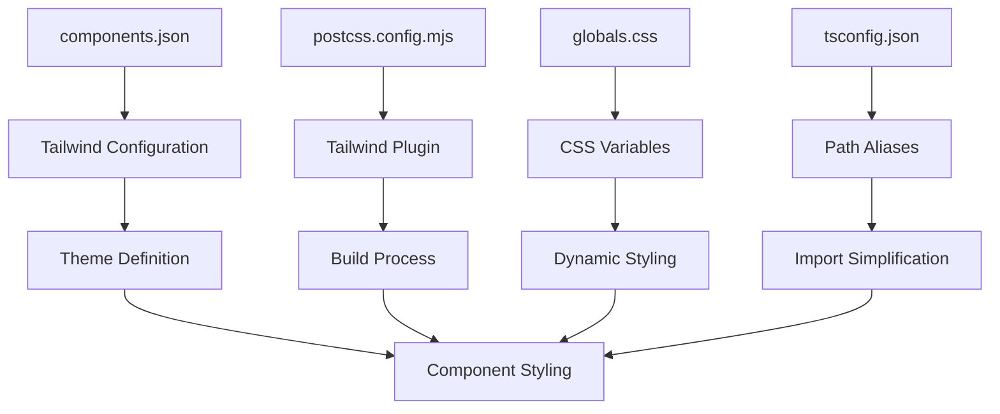
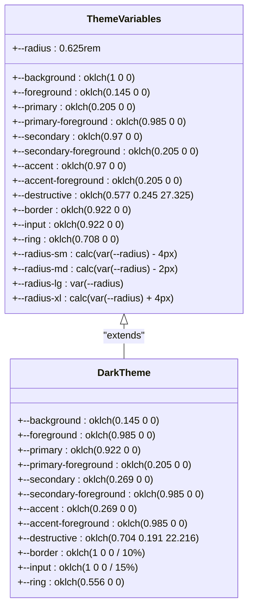
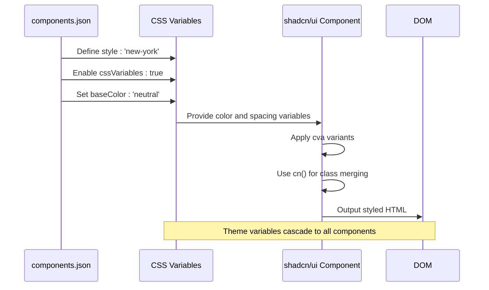
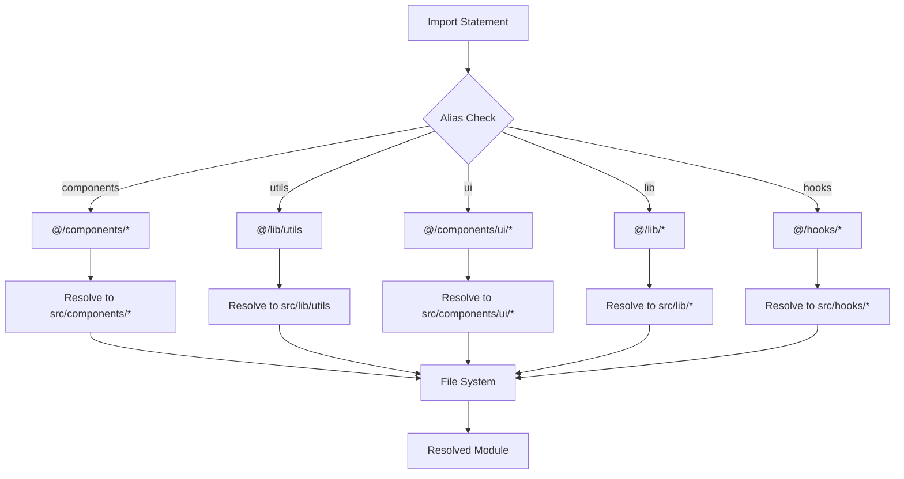

# Tailwind CSS Configuration

<cite>
**Referenced Files in This Document**   
- [components.json](file://components.json)
- [globals.css](file://src/app/globals.css)
- [postcss.config.mjs](file://postcss.config.mjs)
- [next.config.ts](file://next.config.ts)
- [button.tsx](file://src/components/ui/button.tsx)
- [card.tsx](file://src/components/ui/card.tsx)
- [utils.ts](file://src/lib/utils.ts)
- [tsconfig.json](file://tsconfig.json)
</cite>

## Table of Contents
1. [Introduction](#introduction)
2. [Configuration Structure](#configuration-structure)
3. [Theme Extensions and CSS Variables](#theme-extensions-and-css-variables)
4. [Integration with shadcn/ui](#integration-with-shadcnui)
5. [Import Aliases System](#import-aliases-system)
6. [Extending the Theme](#extending-the-theme)
7. [Common Configuration Issues](#common-configuration-issues)
8. [Performance Considerations](#performance-considerations)
9. [Conclusion](#conclusion)

## Introduction
The Tailwind CSS configuration in the smmm-system project is designed to provide a consistent, maintainable, and scalable styling system. This documentation details the configuration structure, theme extensions, integration with the shadcn/ui component library, and best practices for extending and maintaining the design system. The configuration leverages modern CSS features like CSS variables and integrates seamlessly with the Next.js framework.

**Section sources**
- [components.json](file://components.json#L1-L23)
- [globals.css](file://src/app/globals.css#L1-L123)

## Configuration Structure
The Tailwind CSS configuration in smmm-system follows a modular approach that integrates with the shadcn/ui component library through the components.json file. Unlike traditional setups that use a tailwind.config.js file, this project relies on the components.json configuration to define Tailwind-related settings.

The PostCSS configuration in postcss.config.mjs properly includes the Tailwind CSS plugin, ensuring that Tailwind directives are processed during the build process. The Next.js configuration in next.config.ts does not contain specific Tailwind settings, as the framework automatically detects and integrates with Tailwind when the necessary dependencies are present.

The project uses CSS modules through the globals.css file, which imports Tailwind CSS and additional styling utilities like tw-animate-css. This approach allows for global style definitions while maintaining the utility-first benefits of Tailwind.

**Diagram sources**
- [components.json](file://components.json#L1-L23)
- [postcss.config.mjs](file://postcss.config.mjs#L1-L8)
- [globals.css](file://src/app/globals.css#L1-L123)
- [tsconfig.json](file://tsconfig.json#L1-L45)

**Section sources**
- [components.json](file://components.json#L1-L23)
- [postcss.config.mjs](file://postcss.config.mjs#L1-L8)
- [next.config.ts](file://next.config.ts#L1-L18)

## Theme Extensions and CSS Variables
The theme configuration in smmm-system is implemented through CSS variables defined in the globals.css file, following the modern approach of using CSS custom properties for theme management. The configuration defines a comprehensive set of color, spacing, and typography variables that create a cohesive design system.

The theme uses the OKLCH color space for defining colors, which provides perceptually uniform color transitions and better color consistency across different devices. The color palette includes semantic variables for background, foreground, primary, secondary, accent, and destructive colors, with corresponding foreground colors for proper contrast.

Spacing is managed through radius variables that define different corner radii sizes (sm, md, lg, xl) based on a base radius value. This approach allows for consistent spacing across components while enabling easy adjustments to the overall design aesthetic by modifying the base value.

Dark mode is implemented through a .dark class that overrides the CSS variables with values appropriate for a dark color scheme. This approach provides smooth transitions between light and dark modes without requiring separate utility classes for each color variant.

**Diagram sources**
- [globals.css](file://src/app/globals.css#L35-L121)

**Section sources**
- [globals.css](file://src/app/globals.css#L35-L121)

## Integration with shadcn/ui
The integration with shadcn/ui is configured through the components.json file, which specifies the 'new-york' style preset and enables CSS variables for theme management. This configuration ensures that all shadcn/ui components inherit the project's custom theme and maintain visual consistency across the application.

The 'new-york' style preset provides a specific design aesthetic that emphasizes readability and accessibility, with appropriate spacing, typography, and color contrasts. By setting cssVariables to true, the configuration enables dynamic theme switching and ensures that component styles respond to changes in CSS variables.

The component library integration is further enhanced by the use of the @radix-ui primitives, which provide accessible, unstyled UI components that are styled using Tailwind CSS utilities. This approach separates component behavior from presentation, allowing for greater flexibility in design customization.

The button.tsx and card.tsx components demonstrate how shadcn/ui components leverage the Tailwind configuration. The Button component uses the cva (Class Variance Authority) library to define variants based on the theme's color variables, while the Card component applies consistent spacing and border styles using the theme's radius and color variables.

**Diagram sources**
- [components.json](file://components.json#L1-L23)
- [button.tsx](file://src/components/ui/button.tsx#L1-L61)
- [card.tsx](file://src/components/ui/card.tsx#L1-L93)

**Section sources**
- [components.json](file://components.json#L1-L23)
- [button.tsx](file://src/components/ui/button.tsx#L1-L61)
- [card.tsx](file://src/components/ui/card.tsx#L1-L93)

## Import Aliases System
The import aliases system is configured in the components.json file and supported by the tsconfig.json configuration. This system simplifies imports across the codebase by providing shorthand aliases for commonly used directories.

The aliases defined in components.json include:
- "components": "@/components" - for component imports
- "utils": "@/lib/utils" - for utility functions
- "ui": "@/components/ui" - for shadcn/ui components
- "lib": "@/lib" - for shared libraries
- "hooks": "@/hooks" - for custom React hooks

These aliases are supported by the TypeScript path mapping in tsconfig.json, which defines "@/*" to resolve to "./src/*". This configuration enables consistent and readable imports throughout the codebase, reducing the complexity of relative path references and making code refactoring easier.

The cn() utility function in utils.ts leverages tailwind-merge and clsx to combine and merge CSS classes, with special handling for Tailwind classes to avoid conflicts. This function is used extensively throughout the component library to combine component-specific classes with user-provided className props.

**Diagram sources**
- [components.json](file://components.json#L1-L23)
- [tsconfig.json](file://tsconfig.json#L1-L45)
- [utils.ts](file://src/lib/utils.ts#L1-L7)

**Section sources**
- [components.json](file://components.json#L1-L23)
- [tsconfig.json](file://tsconfig.json#L1-L45)
- [utils.ts](file://src/lib/utils.ts#L1-L7)

## Extending the Theme
Extending the theme in smmm-system follows a structured approach that maintains design consistency while allowing for necessary customization. When creating new components or modifying existing ones, developers should adhere to the established theme variables and patterns.

To extend the theme for new components, follow these steps:
1. Use existing CSS variables for colors, spacing, and typography whenever possible
2. Define new component-specific variables within the same naming convention if necessary
3. Leverage the cn() utility function to combine classes and handle conditional styling
4. Use the cva library for defining component variants with consistent styling

For example, when creating a new Alert component, use the existing color variables (primary, secondary, accent, destructive) for different alert types rather than introducing new colors. This ensures visual consistency with the rest of the application.

When adding new spacing values, consider whether existing radius variables (sm, md, lg, xl) can be used or extended rather than creating entirely new values. This maintains spacing harmony across the interface.

For typography, use the font variables defined in the theme (--font-sans, --font-mono) rather than specifying font families directly in components. This ensures consistent typography across the application and makes global font changes easier to implement.

## Common Configuration Issues
Several common issues may arise when working with the Tailwind configuration in smmm-system, along with their troubleshooting steps:

**Missing Utility Classes**: If expected Tailwind utility classes are not being generated, verify that:
- The component files are properly included in the Tailwind content configuration (typically handled automatically in Next.js)
- The class names are not being dynamically constructed in a way that prevents Tailwind from detecting them
- There are no syntax errors in the component files

**Incorrect Theme Inheritance**: If components are not respecting the theme variables:
- Check that the globals.css file is properly imported in the root layout
- Verify that the CSS variables are correctly defined in the :root selector
- Ensure that the .dark class is being applied correctly for dark mode
- Confirm that the components are using the CSS variables (e.g., var(--primary)) rather than hardcoded colors

**Import Alias Resolution Issues**: If import aliases are not resolving:
- Verify that the tsconfig.json path mappings are correctly configured
- Ensure that the IDE or editor has been restarted after configuration changes
- Check that the component files use the correct alias syntax (e.g., "@/components/ui/button")

**Performance Issues**: If build times are slow:
- Ensure that only necessary component files are included in the Tailwind content configuration
- Avoid using arbitrary values excessively, as they increase the CSS bundle size
- Consider using the @apply directive for frequently used class combinations

## Performance Considerations
When customizing the Tailwind configuration in smmm-system, several performance considerations should be taken into account:

**CSS Bundle Size**: The use of CSS variables and the 'new-york' style preset from shadcn/ui helps optimize CSS bundle size by reducing the need for numerous utility classes. However, excessive use of arbitrary values (e.g., class="w-[345px]") can significantly increase the generated CSS size.

**Build Performance**: The configuration leverages Tailwind's JIT (Just-In-Time) compiler, which generates styles on-demand. This improves build performance by only generating the utility classes that are actually used in the codebase.

**Runtime Performance**: The use of CSS variables enables dynamic theme switching without requiring additional CSS bundles. However, excessive use of complex selectors or deeply nested @apply directives can impact rendering performance.

**Optimization Strategies**:
- Use the cn() utility function to merge classes efficiently
- Leverage the cva library for consistent variant definitions
- Avoid inline styles in favor of Tailwind utility classes
- Use the @apply directive judiciously for commonly repeated class combinations
- Regularly audit unused CSS classes using tools like PurgeCSS

## Conclusion
The Tailwind CSS configuration in smmm-system provides a robust, maintainable foundation for the application's styling system. By leveraging the shadcn/ui component library with the 'new-york' style preset and CSS variables, the configuration ensures design consistency while allowing for necessary customization.

The integration of import aliases simplifies code organization and improves developer experience, while the use of modern CSS features like OKLCH color space and CSS variables enables sophisticated theming capabilities.

When extending the theme or creating new components, developers should prioritize consistency with the existing design system by using established variables and patterns. This approach ensures a cohesive user experience while maintaining the scalability and maintainability of the codebase.