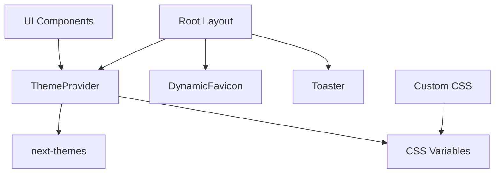
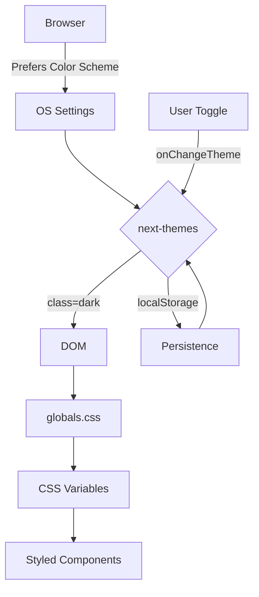
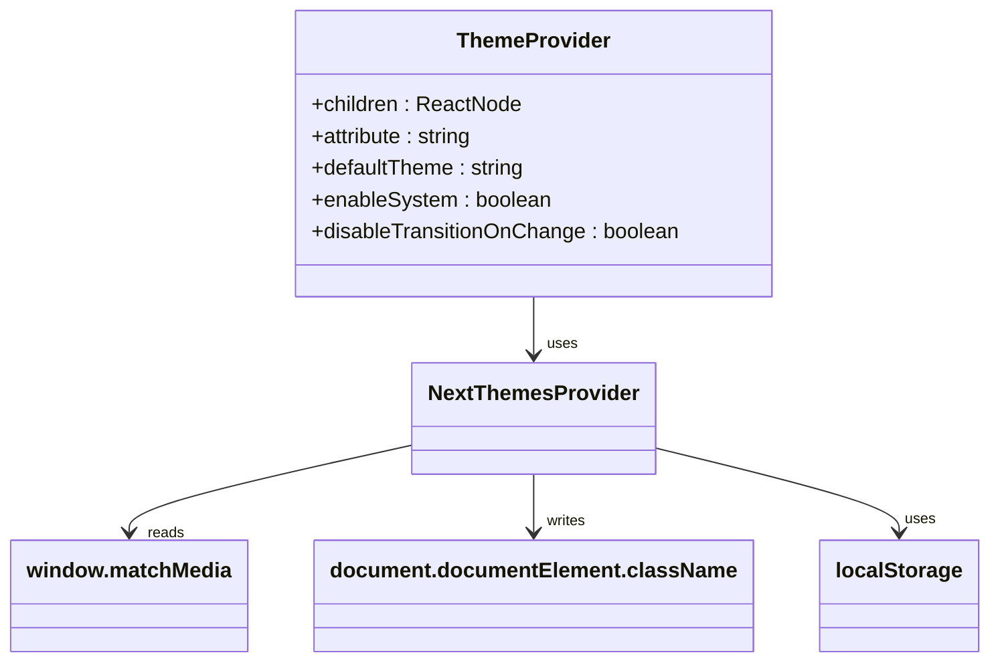
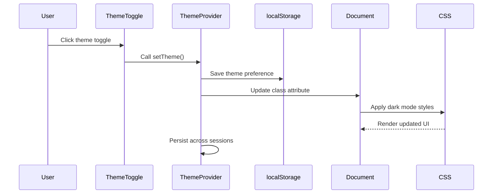
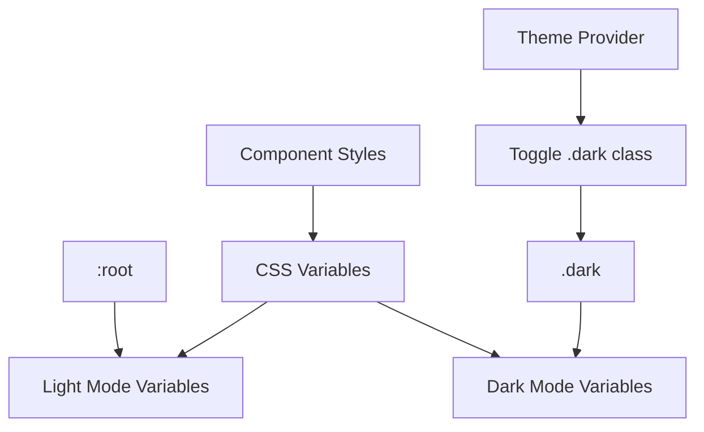
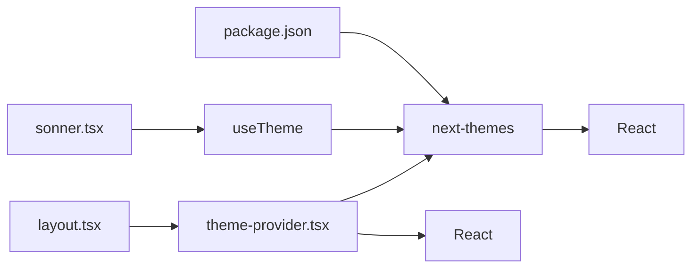

# Theme Management and Dark Mode

<cite>
**Referenced Files in This Document**   
- [theme-provider.tsx](file://src/components/theme-provider.tsx)
- [globals.css](file://src/app/globals.css)
- [layout.tsx](file://src/app/layout.tsx)
- [package.json](file://package.json)
- [sonner.tsx](file://src/components/ui/sonner.tsx)
</cite>

## Table of Contents
1. [Introduction](#introduction)
2. [Project Structure](#project-structure)
3. [Core Components](#core-components)
4. [Architecture Overview](#architecture-overview)
5. [Detailed Component Analysis](#detailed-component-analysis)
6. [Dependency Analysis](#dependency-analysis)
7. [Performance Considerations](#performance-considerations)
8. [Troubleshooting Guide](#troubleshooting-guide)
9. [Conclusion](#conclusion)

## Introduction
The theme management system in the smmm-system enables seamless client-side switching between light and dark modes using the `next-themes` library. This documentation details how the `ThemeProvider` component wraps `next-themes` to manage theme state, persist preferences via localStorage, and integrate with CSS variables for dynamic styling. The system respects user's OS-level color scheme preferences while allowing manual override through UI controls. It ensures smooth rendering without flash of incorrect theme (FOUT) by suppressing hydration warnings during SSR.

## Project Structure

**Diagram sources**
- [layout.tsx](file://src/app/layout.tsx#L1-L42)
- [theme-provider.tsx](file://src/components/theme-provider.tsx#L1-L12)
- [globals.css](file://src/app/globals.css#L1-L123)

**Section sources**
- [layout.tsx](file://src/app/layout.tsx#L1-L42)
- [theme-provider.tsx](file://src/components/theme-provider.tsx#L1-L12)

## Core Components

The core of the theme system consists of the `ThemeProvider` wrapper component that interfaces with `next-themes`, CSS variables defined in `globals.css`, and the root layout that initializes the theme context. The system uses React's client components to handle theme switching and persistence.

**Section sources**
- [theme-provider.tsx](file://src/components/theme-provider.tsx#L1-L12)
- [globals.css](file://src/app/globals.css#L1-L123)

## Architecture Overview

**Diagram sources**
- [theme-provider.tsx](file://src/components/theme-provider.tsx#L1-L12)
- [globals.css](file://src/app/globals.css#L1-L123)
- [layout.tsx](file://src/app/layout.tsx#L1-L42)

## Detailed Component Analysis

### ThemeProvider Analysis

The `ThemeProvider` is a lightweight wrapper around `next-themes` that provides type safety and seamless integration with the Next.js application. It uses the class strategy for theme application, adding a `dark` class to the HTML element when dark mode is active.

**Diagram sources**
- [theme-provider.tsx](file://src/components/theme-provider.tsx#L1-L12)

**Section sources**
- [theme-provider.tsx](file://src/components/theme-provider.tsx#L1-L12)

### Theme Data Flow Analysis

When a user toggles the theme, a series of coordinated actions occur across the application stack to ensure consistent and persistent theme application.

**Diagram sources**
- [theme-provider.tsx](file://src/components/theme-provider.tsx#L1-L12)
- [globals.css](file://src/app/globals.css#L1-L123)

### CSS Variables Integration

The theme system leverages CSS custom properties to define color schemes that respond to the `dark` class. This approach enables efficient theme switching without requiring JavaScript-based style recalculations.

**Diagram sources**
- [globals.css](file://src/app/globals.css#L1-L123)

## Dependency Analysis

**Diagram sources**
- [package.json](file://package.json#L1-L64)
- [theme-provider.tsx](file://src/components/theme-provider.tsx#L1-L12)
- [layout.tsx](file://src/app/layout.tsx#L1-L42)
- [sonner.tsx](file://src/components/ui/sonner.tsx#L1-L20)

**Section sources**
- [package.json](file://package.json#L1-L64)
- [sonner.tsx](file://src/components/ui/sonner.tsx#L1-L20)

## Performance Considerations

The theme management system is optimized for performance through several key strategies:
- Theme state is managed at the root level to minimize re-renders
- CSS variables enable GPU-accelerated theme transitions
- localStorage persistence avoids network requests for theme preferences
- The `disableTransitionOnChange` flag prevents layout thrashing during theme switches
- Hydration is suppressed to prevent FOUT during SSR

The system leverages `next-themes` built-in optimizations including:
- Synchronous theme application during rendering
- Debounced system theme detection
- Efficient localStorage operations
- Proper cleanup of event listeners

## Troubleshooting Guide

Common issues and their solutions in the theme management system:

**Flash of Incorrect Theme (FOUT)**
- Ensure `suppressHydrationWarning` is set on html and body tags
- Verify `next-themes` is configured with `enableSystem` and proper default theme
- Check that no conflicting theme scripts run during SSR

**Theme Persistence Issues**
- Verify localStorage permissions are not blocked
- Check for browser extensions that clear localStorage on page load
- Ensure no race conditions in theme initialization

**CSS Variable Inheritance Problems**
- Confirm CSS variables are defined in :root and .dark scopes
- Verify Tailwind classes properly reference theme variables
- Check for CSS specificity conflicts

**Accessibility Considerations**
- Ensure sufficient color contrast in both themes
- Support reduced motion preferences
- Maintain semantic HTML structure regardless of theme
- Test with screen readers in both light and dark modes

**Section sources**
- [layout.tsx](file://src/app/layout.tsx#L1-L42)
- [globals.css](file://src/app/globals.css#L1-L123)

## Conclusion

The theme management system in smmm-system provides a robust, performant solution for client-side theme switching. By leveraging `next-themes` with a custom wrapper component, the system offers seamless integration between React state management, CSS variables, and browser persistence mechanisms. The architecture effectively handles theme persistence across sessions, respects user's system preferences, and prevents common rendering issues like FOUT. The use of CSS custom properties ensures efficient style updates without re-renders, while the component-based approach maintains clean separation of concerns. This implementation serves as a scalable foundation for theme management that can be extended with additional themes or customization options in the future.