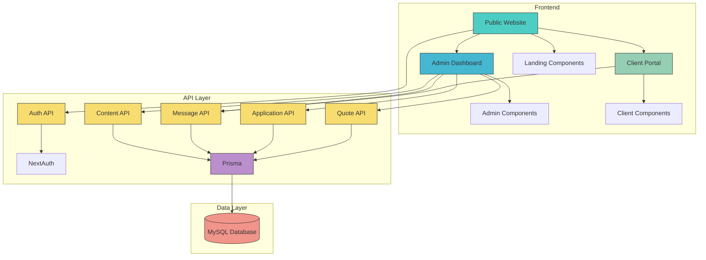
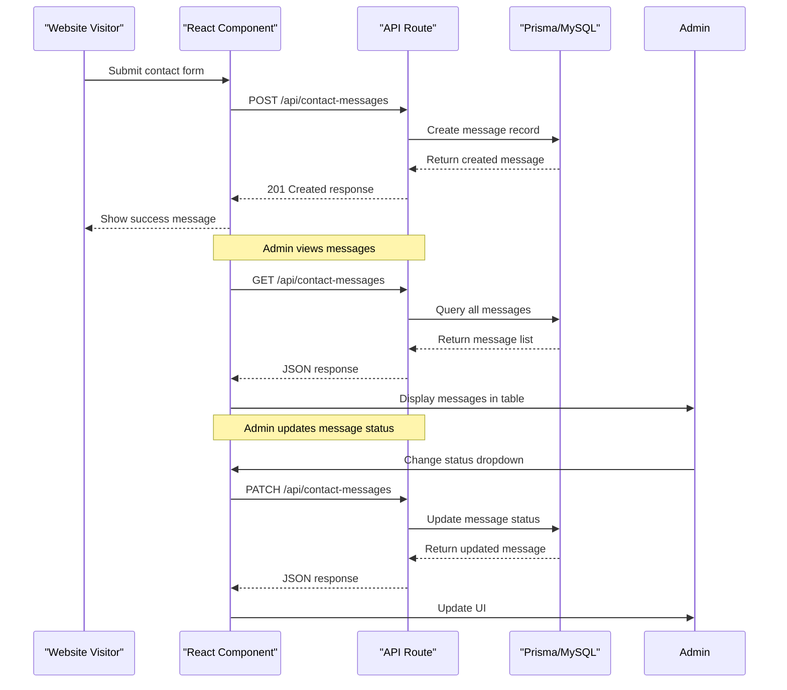
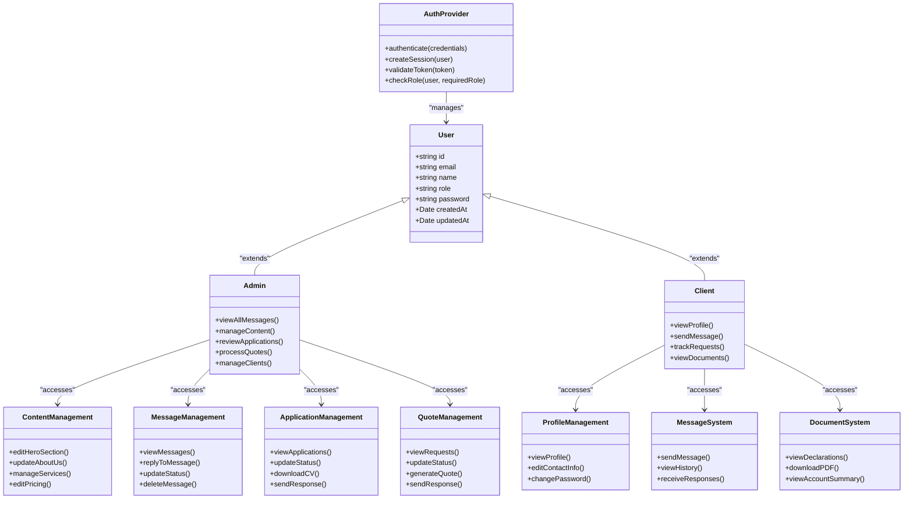
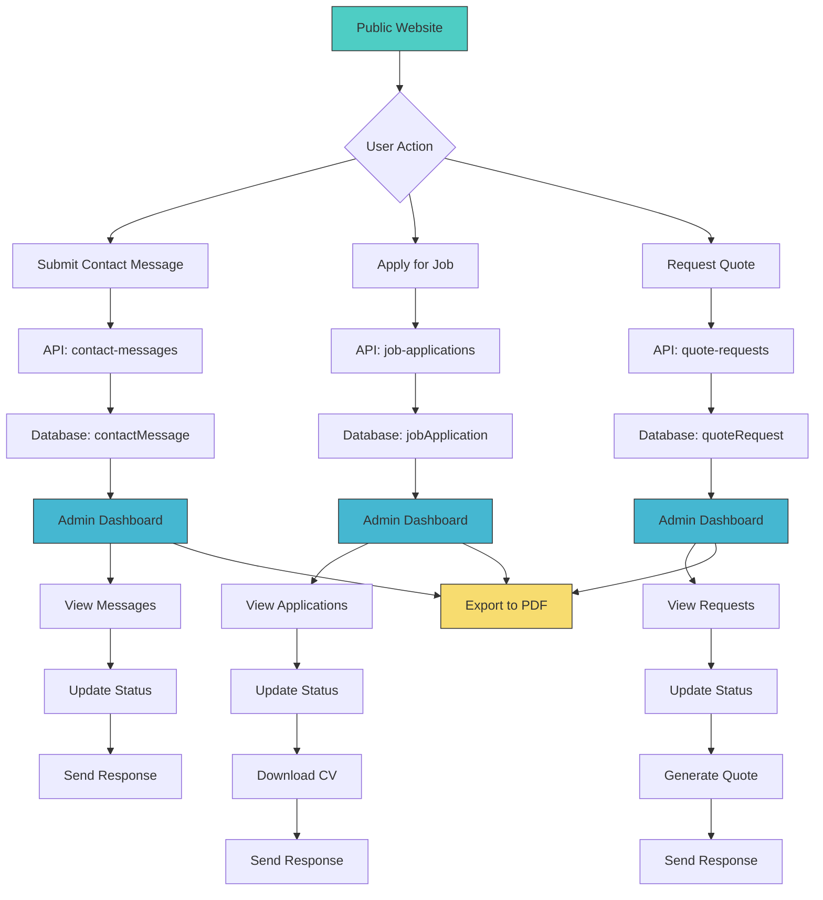

# System Overview

<cite>
**Referenced Files in This Document**   
- [README.md](file://README.md)
- [package.json](file://package.json)
- [layout.tsx](file://src/app/layout.tsx)
- [auth.ts](file://src/lib/auth.ts)
- [db.ts](file://src/lib/db.ts)
- [prisma.ts](file://src/lib/prisma.ts)
- [admin/layout.tsx](file://src/app/admin/layout.tsx)
- [client/layout.tsx](file://src/app/client/layout.tsx)
- [api/auth/[...nextauth]/route.ts](file://src/app/api/auth/[...nextauth]/route.ts)
- [api/content/site-settings/route.ts](file://src/app/api/content/site-settings/route.ts)
- [api/contact-messages/route.ts](file://src/app/api/contact-messages/route.ts)
- [api/job-applications/route.ts](file://src/app/api/job-applications/route.ts)
- [api/quote-requests/route.ts](file://src/app/api/quote-requests/route.ts)
- [components/admin/content-tabs/about-tab.tsx](file://src/components/admin/content-tabs/about-tab.tsx)
- [lib/pdf-export.ts](file://src/lib/pdf-export.ts)
- [prisma/schema.prisma](file://prisma/schema.prisma)
</cite>

## Table of Contents
1. [Introduction](#introduction)
2. [Core Objectives](#core-objectives)
3. [Technology Stack](#technology-stack)
4. [System Architecture](#system-architecture)
5. [Data Flow and Component Relationships](#data-flow-and-component-relationships)
6. [User Roles and Access Control](#user-roles-and-access-control)
7. [Key Functional Modules](#key-functional-modules)
8. [Deployment and Scalability](#deployment-and-scalability)
9. [Integration Points](#integration-points)
10. [Conclusion](#conclusion)

## Introduction

The SMMM System is a comprehensive full-stack solution designed for a tax consulting firm (Serbest Muhasebeci Mali Müşavir). This integrated platform combines a public-facing website, an administrative dashboard, and a client portal to streamline operations and enhance client engagement. Built with modern web technologies, the system provides a unified interface for managing content, communications, job applications, quote requests, and client data. The architecture follows the Next.js App Router pattern, leveraging server-side rendering for optimal performance and SEO while maintaining rich interactive experiences through client components.

**Section sources**
- [README.md](file://README.md#L1-L155)
- [package.json](file://package.json#L1-L63)

## Core Objectives

The primary objectives of the SMMM System are to provide a centralized platform that addresses the key operational needs of a tax consulting firm. The system enables content management for the public website, facilitating easy updates to services, team information, and company details without requiring technical expertise. Client communication is streamlined through integrated messaging systems that allow prospective clients to submit inquiries and receive responses through the admin interface.

Job application tracking is implemented as a complete workflow from submission to status management, allowing the firm to efficiently process candidates. Quote requests functionality enables potential clients to request service quotations, which are then managed and responded to through the administrative dashboard. Role-based user access ensures that sensitive information is protected while providing appropriate access levels for administrators and clients. These objectives collectively create a professional digital presence that enhances client acquisition, improves operational efficiency, and strengthens client relationships.

**Section sources**
- [README.md](file://README.md#L75-L105)
- [components/admin/content-tabs/about-tab.tsx](file://src/components/admin/content-tabs/about-tab.tsx#L1-L580)

## Technology Stack

The SMMM System is built on a modern technology stack that combines cutting-edge frontend frameworks with robust backend capabilities. The foundation is Next.js 16, which provides server-side rendering, static site generation, and the App Router pattern for efficient routing and data fetching. React 18 serves as the core UI library, enabling the creation of dynamic and responsive user interfaces through component-based architecture.

TypeScript is used throughout the codebase to ensure type safety and improve code maintainability. Prisma ORM acts as the database abstraction layer, providing a type-safe interface for database operations and schema management. Authentication is handled by NextAuth v5, which implements secure JWT-based authentication with role-based access control. The styling is powered by Tailwind CSS for utility-first CSS and Radix UI for accessible, unstyled UI components that are customized to match the firm's branding.

Additional libraries include jsPDF for PDF export functionality, Nodemailer for email integration, and various UI enhancement libraries such as Framer Motion for animations and Recharts for future data visualization capabilities. This technology stack provides a balance of developer productivity, performance, security, and scalability, making it well-suited for a professional services firm that requires a reliable and maintainable digital platform.

**Section sources**
- [README.md](file://README.md#L6-L25)
- [package.json](file://package.json#L1-L63)
- [tsconfig.json](file://tsconfig.json)

## System Architecture

The SMMM System follows a three-tier architecture pattern with clear separation between presentation, business logic, and data layers. The frontend is organized into three main sections: the public website under the `(public)` route group, the admin dashboard, and the client portal. Each of these sections has its own layout and navigation structure, providing tailored experiences for different user types.

The App Router pattern in Next.js 16 enables server-side rendering of pages while allowing for client-side interactivity where needed. Server components handle data fetching and rendering of static content, reducing client-side JavaScript bundle size and improving performance. Client components are used for interactive elements such as forms, modals, and real-time updates. API routes in the `app/api` directory serve as the backend interface, handling CRUD operations for various entities including contact messages, job applications, and quote requests.

The architecture implements a component-based design with reusable UI elements organized in the `components` directory. These components are categorized by their usage context (admin, client, landing page, or shared UI components), promoting consistency and maintainability. The system uses a global layout that provides common elements like theme support and error boundaries, while individual layouts for admin and client sections provide role-specific navigation and functionality.

**Diagram sources**
- [src/app/layout.tsx](file://src/app/layout.tsx#L1-L42)
- [src/app/admin/layout.tsx](file://src/app/admin/layout.tsx#L1-L143)
- [src/app/client/layout.tsx](file://src/app/client/layout.tsx#L1-L132)
- [src/app/api](file://src/app/api)

**Section sources**
- [src/app](file://src/app)
- [src/components](file://src/components)
- [src/lib](file://src/lib)

## Data Flow and Component Relationships

The data flow in the SMMM System follows a predictable pattern from API routes to UI components. When a user interacts with the system, client components dispatch requests to API routes, which then interact with the database through Prisma. The API routes handle authentication, validation, and business logic before returning data to the client. This separation ensures that sensitive operations are performed securely on the server side.

For example, when a visitor submits a contact message through the public website, the form data is sent to the `/api/contact-messages` endpoint. The API route validates the input, creates a record in the database, and returns a success response. The admin dashboard then fetches these messages through the same API endpoint and displays them in a table component. When an administrator updates the status of a message, the client component sends a PATCH request to the API, which updates the database record.

Content management follows a similar pattern, with the admin interface allowing editors to modify website content through form inputs. These changes are saved to the database via API routes and immediately reflected on the public website. The system uses React's state management to provide real-time feedback and optimistic updates, enhancing the user experience while maintaining data consistency.

**Diagram sources**
- [src/app/api/contact-messages/route.ts](file://src/app/api/contact-messages/route.ts#L1-L96)
- [src/components/admin/content-tabs/about-tab.tsx](file://src/components/admin/content-tabs/about-tab.tsx#L1-L580)
- [src/app/admin/content/page.tsx](file://src/app/admin/content/page.tsx)

**Section sources**
- [src/app/api](file://src/app/api)
- [src/components](file://src/components)
- [src/lib/db.ts](file://src/lib/db.ts#L1-L9)

## User Roles and Access Control

The SMMM System implements a role-based access control system with two primary user roles: ADMIN and CLIENT. Authentication is handled by NextAuth v5, which uses JWT tokens to maintain user sessions and includes role information in the token payload. This allows for efficient role checking on both the client and server sides without requiring additional database queries.

Administrators have access to the complete admin dashboard, which includes modules for content management, client communication, job application review, and quote request processing. The admin layout provides navigation to all system functions and displays a comprehensive interface for managing the firm's operations. Administrators can view, create, update, and delete records across all entity types.

Clients have access to a more limited portal that focuses on their specific needs. The client dashboard allows users to view their personal information, communicate with the firm, and track the status of their requests. The system enforces data isolation, ensuring that clients can only access their own information and cannot view data belonging to other clients. This role-based approach maintains data security while providing appropriate functionality for each user type.

**Diagram sources**
- [src/lib/auth.ts](file://src/lib/auth.ts#L1-L86)
- [src/app/admin/layout.tsx](file://src/app/admin/layout.tsx#L1-L143)
- [src/app/client/layout.tsx](file://src/app/client/layout.tsx#L1-L132)
- [src/app/api/auth/[...nextauth]/route.ts](file://src/app/api/auth/[...nextauth]/route.ts#L1-L3)

**Section sources**
- [src/lib/auth.ts](file://src/lib/auth.ts#L1-L86)
- [src/app/admin](file://src/app/admin)
- [src/app/client](file://src/app/client)

## Key Functional Modules

The SMMM System comprises several key functional modules that address the core business processes of a tax consulting firm. The content management module allows administrators to update website content without technical knowledge, including sections for hero banners, services, about us, pricing, team information, and testimonials. This CMS-like functionality ensures the firm can keep its online presence current and relevant.

The client communication module provides a structured way for prospective clients to submit inquiries through a contact form. These messages are stored in the database and displayed in the admin dashboard, where staff can review, respond, and update their status. The job application tracking module handles the complete recruitment workflow, from receiving applications with CV uploads to managing their status through various stages of review.

The quote request module enables potential clients to request service quotations by providing their contact information and service requirements. These requests are processed through the admin interface, allowing the firm to respond appropriately and track conversion rates. Each of these modules follows a consistent pattern of data entry, storage, retrieval, and management, providing a uniform experience for administrators while meeting specific business needs.

**Diagram sources**
- [src/app/api/contact-messages/route.ts](file://src/app/api/contact-messages/route.ts#L1-L96)
- [src/app/api/job-applications/route.ts](file://src/app/api/job-applications/route.ts#L1-L129)
- [src/app/api/quote-requests/route.ts](file://src/app/api/quote-requests/route.ts#L1-L98)
- [src/lib/pdf-export.ts](file://src/lib/pdf-export.ts#L1-L240)

**Section sources**
- [src/app/admin/contact-messages/page.tsx](file://src/app/admin/contact-messages/page.tsx)
- [src/app/admin/job-applications/page.tsx](file://src/app/admin/job-applications/page.tsx)
- [src/app/admin/quote-requests/page.tsx](file://src/app/admin/quote-requests/page.tsx)
- [src/app/(public)/page.tsx](file://src/app/(public)/page.tsx)

## Deployment and Scalability

The SMMM System is designed for straightforward deployment and has the potential for scalability as the firm's needs grow. The application can be deployed on any platform that supports Next.js applications, such as Vercel, Netlify, or traditional cloud providers like AWS, Google Cloud, or Azure. The use of environment variables for configuration allows for easy adaptation to different deployment environments (development, staging, production).

The system's architecture supports horizontal scaling, where additional instances of the application can be deployed behind a load balancer to handle increased traffic. The separation of the frontend and API routes makes it possible to scale these components independently based on usage patterns. The MySQL database can be scaled vertically by upgrading server resources or horizontally through read replicas for improved performance.

For optimal performance, the system leverages Next.js features like static site generation for public pages and server-side rendering with caching for dynamic content. This reduces the load on the server and improves response times for users. The use of Prisma ORM provides database connection pooling and query optimization, further enhancing performance under load. As the system evolves, additional scalability features like Redis caching or a message queue could be integrated to handle background processing and improve responsiveness.

**Section sources**
- [README.md](file://README.md#L26-L63)
- [next.config.ts](file://next.config.ts)
- [package.json](file://package.json#L1-L63)
- [prisma/schema.prisma](file://prisma/schema.prisma)

## Integration Points

The SMMM System includes several integration points that extend its functionality and connect it with external services. The most prominent integration is the PDF export capability, implemented using jsPDF to generate professional-looking documents from contact messages, job applications, and quote requests. This allows administrators to create printable records for archiving or sharing with colleagues.

Email integration is planned through Nodemailer, which will enable the system to send automated notifications to clients when their messages are received or when responses are available. This integration will improve client communication and reduce response times. The system is also structured to support future integrations with calendar services for appointment scheduling, document storage services for secure file sharing, and accounting software for seamless data exchange.

The API-first design of the system makes it possible to create additional integrations as needed. For example, the firm could integrate with CRM systems to synchronize client data, or with marketing platforms to track conversion rates from website inquiries. The modular architecture ensures that these integrations can be added without disrupting existing functionality, allowing the system to evolve alongside the firm's business processes.

**Section sources**
- [src/lib/pdf-export.ts](file://src/lib/pdf-export.ts#L1-L240)
- [package.json](file://package.json#L1-L63)
- [README.md](file://README.md#L20-L25)

## Conclusion

The SMMM System provides a comprehensive digital solution for tax consulting firms, integrating a public website, administrative dashboard, and client portal into a unified platform. By leveraging modern web technologies like Next.js 16, React, TypeScript, and Prisma ORM, the system delivers a performant, maintainable, and scalable application that addresses key business needs. The architecture follows best practices with clear separation of concerns, role-based access control, and a consistent data flow pattern from API routes to UI components.

The system effectively supports the core objectives of content management, client communication, job application tracking, and quote request processing, while providing a professional digital presence that enhances client acquisition and retention. With its modular design and integration capabilities, the SMMM System can adapt to the evolving needs of a growing firm, serving as a foundation for digital transformation in the tax consulting industry.