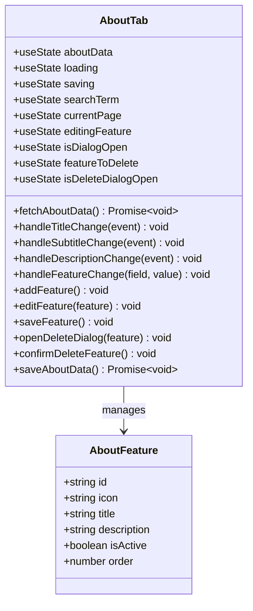
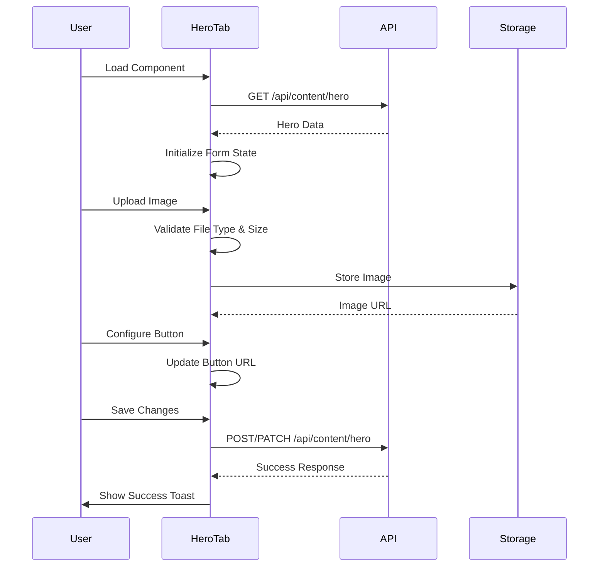
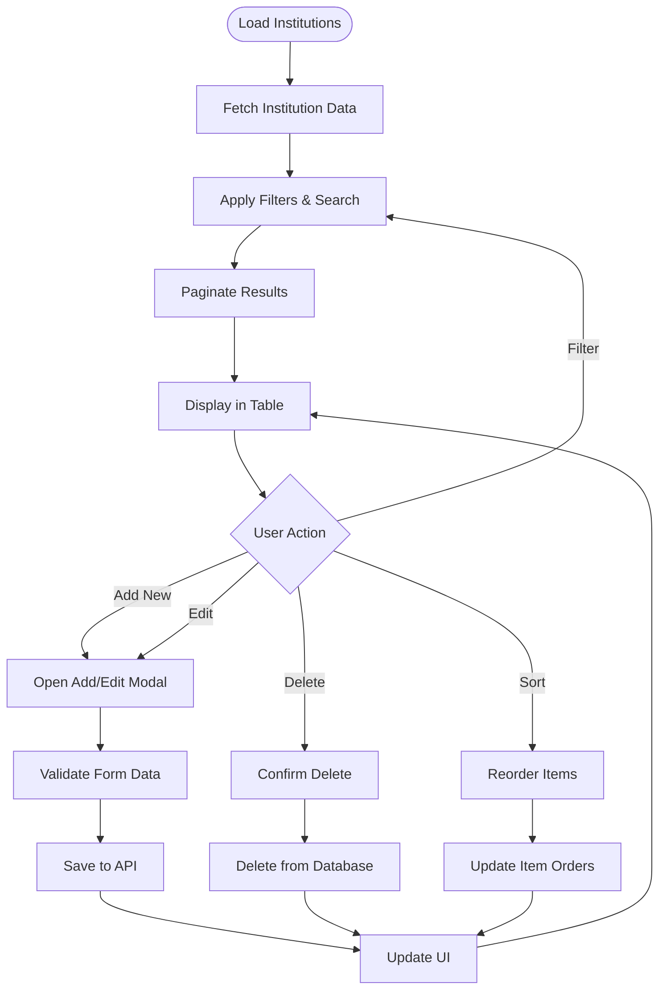
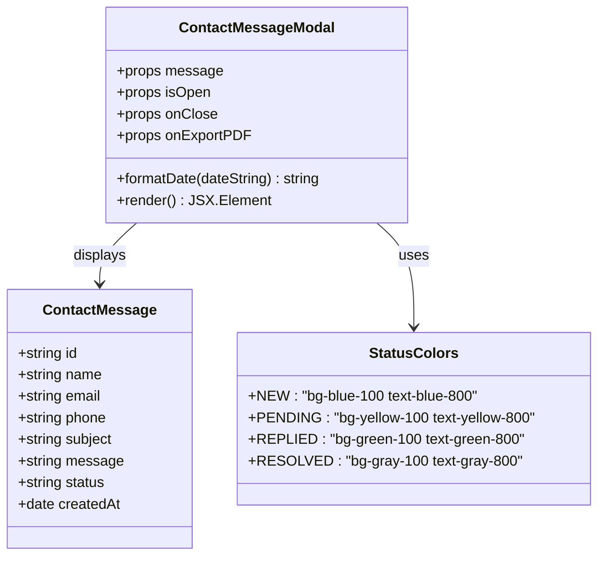
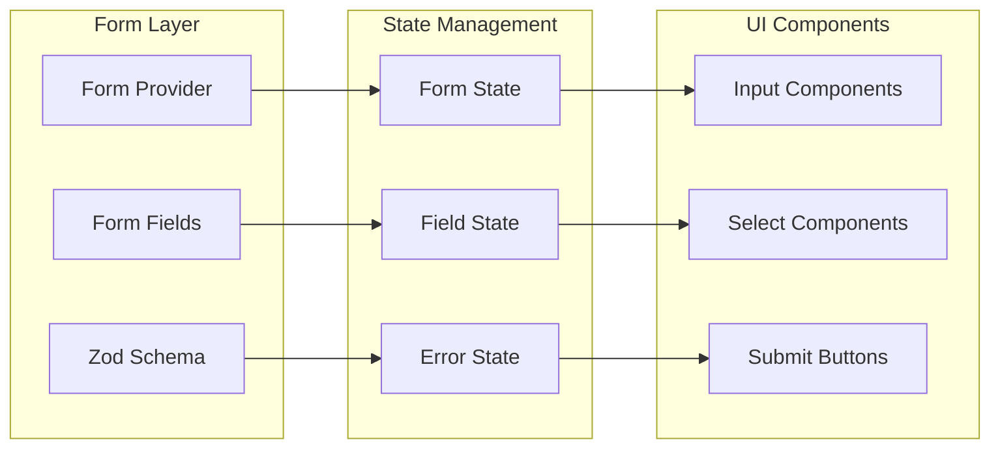
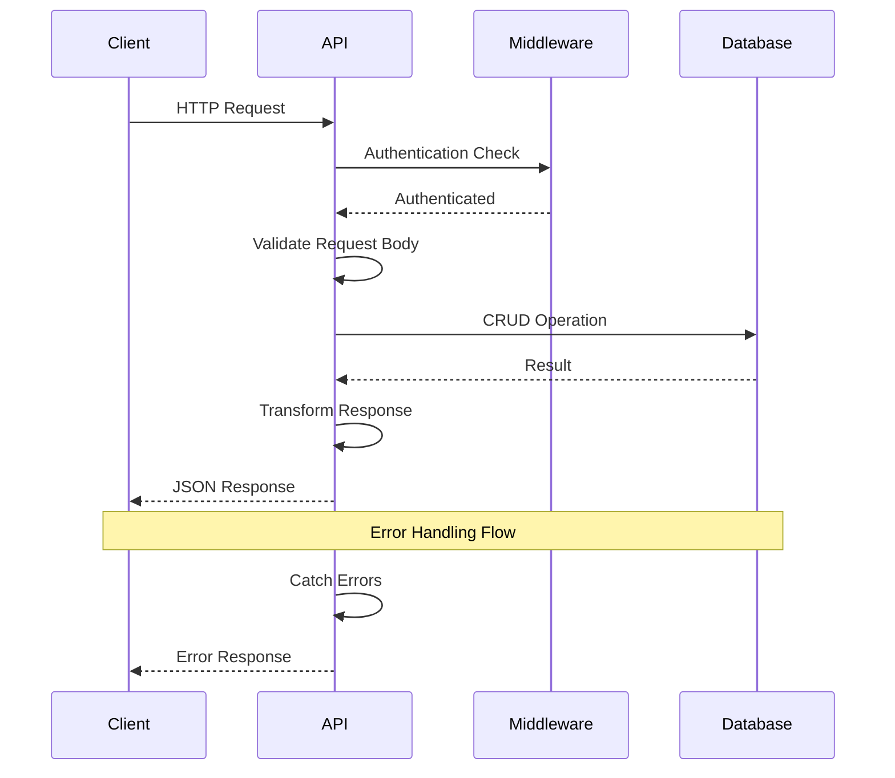
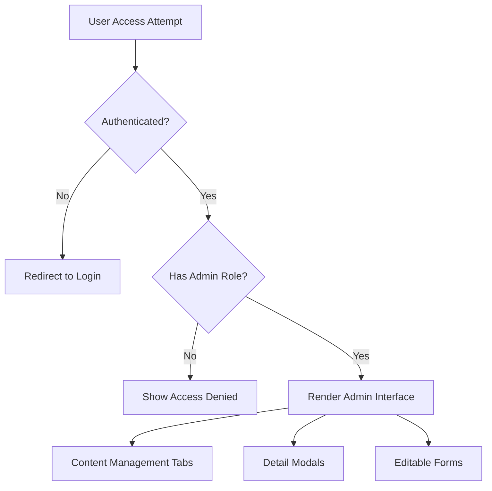
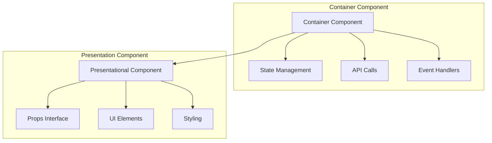

# Admin Interface Components

<cite>
**Referenced Files in This Document**
- [about-tab.tsx](file://src/components/admin/content-tabs/about-tab.tsx)
- [hero-section-tab.tsx](file://src/components/admin/content-tabs/hero-section-tab.tsx)
- [institutions-tab.tsx](file://src/components/admin/content-tabs/institutions-tab.tsx)
- [site-settings-tab.tsx](file://src/components/admin/content-tabs/site-settings-tab.tsx)
- [contact-message-modal.tsx](file://src/components/admin/contact-message-modal.tsx)
- [edit-contact-message-modal.tsx](file://src/components/admin/edit-contact-message-modal.tsx)
- [job-application-modal.tsx](file://src/components/admin/job-application-modal.tsx)
- [quote-request-modal.tsx](file://src/components/admin/quote-request-modal.tsx)
- [page.tsx](file://src/app/admin/content/page.tsx)
- [contact-messages-page.tsx](file://src/app/admin/contact-messages/page.tsx)
- [job-applications-page.tsx](file://src/app/admin/job-applications/page.tsx)
- [quote-requests-page.tsx](file://src/app/admin/quote-requests/page.tsx)
- [form.tsx](file://src/components/ui/form.tsx)
- [about-route.ts](file://src/app/api/content/about/route.ts)
- [hero-route.ts](file://src/app/api/content/hero/route.ts)
- [contact-messages-route.ts](file://src/app/api/contact-messages/route.ts)
</cite>

## Table of Contents
1. [Introduction](#introduction)
2. [Content Management System Architecture](#content-management-system-architecture)
3. [Content Tab Components](#content-tab-components)
4. [Modal Components](#modal-components)
5. [Form Integration and Validation](#form-integration-and-validation)
6. [Data Flow and API Integration](#data-flow-and-api-integration)
7. [Role-Based Visibility and Authentication](#role-based-visibility-and-authentication)
8. [Component Extension Guidelines](#component-extension-guidelines)
9. [Best Practices and Patterns](#best-practices-and-patterns)
10. [Troubleshooting Guide](#troubleshooting-guide)

## Introduction

The smmm-system Admin Interface provides a comprehensive content management solution for website administrators. Built with React, TypeScript, and Next.js, the system offers specialized components for managing various website sections including hero content, about sections, institutional partners, and contact forms. The architecture follows modern React patterns with container/presentation component separation, robust form handling, and seamless API integration.

## Content Management System Architecture

The admin interface is structured around two primary component categories: **Content Tab Components** for website section management and **Modal Components** for detailed record viewing and editing.

```mermaid
graph TB
subgraph "Admin Dashboard"
ContentPage[Content Management Page]
ContactPage[Contact Messages Page]
JobPage[Job Applications Page]
QuotePage[Quote Requests Page]
end
subgraph "Content Tabs"
AboutTab[About Tab]
HeroTab[Hero Section Tab]
InstTab[Institutions Tab]
SiteTab[Site Settings Tab]
ServicesTab[Services Tab]
PricingTab[Pricing Tab]
TestimonialsTab[Testimonials Tab]
TeamTab[Team Tab]
FAQTab[FAQ Tab]
WorkflowTab[Workflow Tab]
end
subgraph "Modal Components"
ContactModal[Contact Message Modal]
EditContactModal[Edit Contact Message Modal]
JobModal[Job Application Modal]
QuoteModal[Quote Request Modal]
EditJobModal[Edit Job Application Modal]
EditQuoteModal[Edit Quote Request Modal]
end
subgraph "API Layer"
ContentAPI[Content API Routes]
ContactAPI[Contact Messages API]
JobAPI[Job Applications API]
QuoteAPI[Quote Requests API]
end
ContentPage --> AboutTab
ContentPage --> HeroTab
ContentPage --> InstTab
ContentPage --> SiteTab
ContentPage --> ServicesTab
ContentPage --> PricingTab
ContentPage --> TestimonialsTab
ContentPage --> TeamTab
ContentPage --> FAQTab
ContentPage --> WorkflowTab
ContactPage --> ContactModal
ContactPage --> EditContactModal
JobPage --> JobModal
JobPage --> EditJobModal
QuotePage --> QuoteModal
QuotePage --> EditQuoteModal
AboutTab --> ContentAPI
HeroTab --> ContentAPI
InstTab --> ContentAPI
SiteTab --> ContentAPI
ContactModal --> ContactAPI
JobModal --> JobAPI
QuoteModal --> QuoteAPI
```

**Diagram sources**
- [page.tsx](file://src/app/admin/content/page.tsx#L1-L134)
- [contact-messages-page.tsx](file://src/app/admin/contact-messages/page.tsx#L1-L466)
- [job-applications-page.tsx](file://src/app/admin/job-applications/page.tsx#L1-L501)
- [quote-requests-page.tsx](file://src/app/admin/quote-requests/page.tsx#L1-L504)

## Content Tab Components

### About Tab Component

The About Tab component manages the "About Us" section with feature management capabilities. It provides a comprehensive interface for editing section metadata and managing feature blocks with icon selection, status controls, and bulk operations.

**Diagram sources**
- [about-tab.tsx](file://src/components/admin/content-tabs/about-tab.tsx#L1-L581)

**Key Features:**
- **Feature Management**: Add, edit, delete, and reorder feature blocks
- **Icon Selection**: Comprehensive icon library with custom SVG support
- **Status Control**: Activate/deactivate features with visual indicators
- **Bulk Operations**: Search, filter, and pagination for efficient management
- **Real-time Validation**: Form validation with immediate feedback
- **Undo Capability**: Safe deletion with confirmation dialogs

**Section sources**
- [about-tab.tsx](file://src/components/admin/content-tabs/about-tab.tsx#L1-L581)

### Hero Section Tab Component

The Hero Section Tab manages the main landing page section with sophisticated form controls for text content, button configurations, and image uploads.

**Diagram sources**
- [hero-section-tab.tsx](file://src/components/admin/content-tabs/hero-section-tab.tsx#L1-L292)

**Key Features:**
- **Rich Text Editing**: Multi-line text areas with character limits
- **Button Configuration**: Dynamic button URL routing with section linking
- **Image Upload**: Secure file upload with validation and preview
- **Responsive Design**: Mobile-friendly form layouts
- **Real-time Feedback**: Loading states and success/error notifications

**Section sources**
- [hero-section-tab.tsx](file://src/components/admin/content-tabs/hero-section-tab.tsx#L1-L292)

### Institutions Tab Component

The Institutions Tab manages partner logos and client displays with advanced sorting, filtering, and bulk management capabilities.

**Diagram sources**
- [institutions-tab.tsx](file://src/components/admin/content-tabs/institutions-tab.tsx#L1-L681)

**Key Features:**
- **Drag-and-Drop Sorting**: Intuitive reordering with visual feedback
- **Advanced Filtering**: Multi-criteria search and status filtering
- **Bulk Operations**: Efficient management of multiple records
- **Image Management**: Sophisticated logo upload with preview
- **Status Management**: Active/inactive toggles with instant updates

**Section sources**
- [institutions-tab.tsx](file://src/components/admin/content-tabs/institutions-tab.tsx#L1-L681)

### Site Settings Tab Component

The Site Settings Tab provides centralized configuration management for global site properties including branding, contact information, and social media links.

**Key Features:**
- **Branding Management**: Favicon and brand icon upload with validation
- **Contact Information**: Centralized contact details management
- **Social Media Integration**: Platform-specific URL management
- **Map Integration**: Google Maps embed configuration
- **Validation**: Comprehensive form validation with real-time feedback

**Section sources**
- [site-settings-tab.tsx](file://src/components/admin/content-tabs/site-settings-tab.tsx#L1-L526)

## Modal Components

### Contact Message Modal

The Contact Message Modal provides detailed viewing capabilities for incoming contact form submissions with status tracking and export functionality.

**Diagram sources**
- [contact-message-modal.tsx](file://src/components/admin/contact-message-modal.tsx#L1-L169)

**Key Features:**
- **Status Tracking**: Visual status indicators with color coding
- **Contact Information**: Comprehensive contact details display
- **Message Content**: Rich text rendering with formatting preservation
- **Export Capabilities**: PDF export functionality
- **Responsive Design**: Mobile-friendly modal layout

**Section sources**
- [contact-message-modal.tsx](file://src/components/admin/contact-message-modal.tsx#L1-L169)

### Edit Contact Message Modal

The Edit Contact Message Modal enables status updates and quick modifications to contact message records.

**Key Features:**
- **Status Updates**: Dropdown selector for status changes
- **Quick Editing**: Minimal form interface for essential updates
- **Validation**: Prevents unnecessary saves with status comparison
- **Real-time Feedback**: Immediate visual confirmation of changes

**Section sources**
- [edit-contact-message-modal.tsx](file://src/components/admin/edit-contact-message-modal.tsx#L1-L155)

### Job Application Modal

The Job Application Modal provides comprehensive viewing capabilities for career applicants with CV download functionality.

**Key Features:**
- **Applicant Details**: Complete personal and professional information
- **CV Management**: Secure CV download with MIME type detection
- **Status Tracking**: Career-specific status management
- **File Handling**: Robust file processing with error handling
- **Legacy Support**: Backward compatibility with older file formats

**Section sources**
- [job-application-modal.tsx](file://src/components/admin/job-application-modal.tsx#L1-L270)

### Quote Request Modal

The Quote Request Modal manages service inquiry requests with detailed client information and request specifics.

**Key Features:**
- **Service Details**: Specific service type and requirement information
- **Company Information**: Business context and organizational details
- **Request Analysis**: Comprehensive request content display
- **Status Management**: Inquiry-specific status tracking
- **Export Functionality**: PDF export for record keeping

**Section sources**
- [quote-request-modal.tsx](file://src/components/admin/quote-request-modal.tsx#L1-L183)

## Form Integration and Validation

### React Hook Form Integration

The system utilizes React Hook Form for robust form management with Zod validation schemas for type-safe validation.

**Diagram sources**
- [form.tsx](file://src/components/ui/form.tsx#L1-L168)

**Key Features:**
- **Type Safety**: Zod schema validation with TypeScript integration
- **Performance**: Optimized re-renders with controlled components
- **Accessibility**: Proper ARIA attributes and keyboard navigation
- **Error Handling**: Comprehensive error messaging and validation
- **Field Dependencies**: Dynamic field validation and conditional logic

**Section sources**
- [form.tsx](file://src/components/ui/form.tsx#L1-L168)

### Validation Patterns

The system implements consistent validation patterns across all forms:

| Validation Type | Implementation | Error Handling |
|----------------|---------------|----------------|
| Required Fields | Zod.required() | Real-time feedback |
| Email Validation | Zod.email() | Format-specific messages |
| File Uploads | Size and type checking | Progress indication |
| Numeric Fields | Zod.number() with min/max | Range validation |
| Text Length | Zod.string().min()/max() | Character count display |

## Data Flow and API Integration

### API Route Architecture

The backend API follows RESTful conventions with comprehensive error handling and data validation.

**Diagram sources**
- [about-route.ts](file://src/app/api/content/about/route.ts#L1-L190)
- [hero-route.ts](file://src/app/api/content/hero/route.ts#L1-L88)
- [contact-messages-route.ts](file://src/app/api/contact-messages/route.ts#L1-L97)

### Data Submission Flow

Each content tab follows a standardized data submission pattern:

1. **Form Validation**: Client-side validation using React Hook Form
2. **API Request**: HTTP POST/PATCH request with JSON payload
3. **Server Validation**: Prisma schema validation and business logic
4. **Database Operation**: Create, update, or delete operation
5. **Response Handling**: Success/failure response with appropriate feedback
6. **UI Update**: State synchronization and user notification

**Section sources**
- [about-route.ts](file://src/app/api/content/about/route.ts#L1-L190)
- [hero-route.ts](file://src/app/api/content/hero/route.ts#L1-L88)
- [contact-messages-route.ts](file://src/app/api/contact-messages/route.ts#L1-L97)

## Role-Based Visibility and Authentication

### Access Control Implementation

The admin interface implements role-based access control through NextAuth.js integration:

**Key Security Features:**
- **Authentication**: NextAuth.js integration with session management
- **Authorization**: Role-based access control for admin features
- **CSRF Protection**: Automatic CSRF token handling
- **Input Sanitization**: Server-side input validation and sanitization
- **Rate Limiting**: API rate limiting for protection against abuse

## Component Extension Guidelines

### Creating New Content Tabs

To create a new content tab following the established patterns:

1. **Component Structure**: Create a new file in `src/components/admin/content-tabs/`
2. **Import Dependencies**: Use the established UI component library
3. **State Management**: Implement loading, saving, and error states
4. **API Integration**: Follow the existing API patterns
5. **Form Handling**: Utilize React Hook Form for consistent validation
6. **Pagination**: Implement pagination for large datasets
7. **Error Handling**: Provide comprehensive error handling
8. **Testing**: Include unit tests for critical functionality

### Container/Presentation Pattern

The system follows the container/presentation pattern for component organization:

**Guidelines for Extension:**
- **Separation of Concerns**: Keep business logic in containers
- **Reusable Presenters**: Create reusable presentational components
- **Prop Drilling**: Minimize prop drilling with context providers
- **Performance**: Implement proper memoization for expensive computations

## Best Practices and Patterns

### Error Handling Patterns

The system implements comprehensive error handling across all components:

| Error Type | Handling Strategy | User Experience |
|-----------|------------------|-----------------|
| Network Errors | Retry mechanism with exponential backoff | Loading indicators with retry buttons |
| Validation Errors | Inline form validation with clear messages | Real-time feedback during typing |
| Database Errors | Graceful degradation with fallback data | Informative error messages |
| Permission Errors | Redirect to login with return URL | Clear access denied messaging |

### Performance Optimization

Key performance optimizations implemented:

- **Code Splitting**: Dynamic imports for lazy loading
- **Memoization**: React.memo for expensive components
- **Virtual Scrolling**: For large lists and tables
- **Debounced Search**: Throttled search functionality
- **Optimized Images**: Responsive image loading with lazy loading

### Accessibility Standards

The interface adheres to WCAG 2.1 AA standards:

- **Keyboard Navigation**: Full keyboard accessibility
- **Screen Reader Support**: Proper ARIA labels and roles
- **Color Contrast**: Sufficient contrast ratios
- **Focus Management**: Logical focus order
- **Alternative Text**: Descriptive alt text for images

## Troubleshooting Guide

### Common Issues and Solutions

**Issue**: Form validation not working
- **Cause**: Missing Zod schema or incorrect field names
- **Solution**: Verify schema definition and field name matching
- **Prevention**: Use TypeScript for compile-time validation

**Issue**: API calls failing silently
- **Cause**: Missing error handling or network issues
- **Solution**: Implement comprehensive error boundaries
- **Prevention**: Add network monitoring and logging

**Issue**: State inconsistencies
- **Cause**: Race conditions or improper state updates
- **Solution**: Use proper async/await patterns
- **Prevention**: Implement state normalization patterns

**Issue**: Performance degradation with large datasets
- **Cause**: Unoptimized rendering or excessive re-renders
- **Solution**: Implement virtual scrolling and memoization
- **Prevention**: Profile components regularly

### Debugging Tools

Recommended debugging approaches:

1. **React DevTools**: Component tree inspection and state viewing
2. **Network Tab**: API call monitoring and response analysis
3. **Console Logging**: Strategic logging for async operations
4. **Error Boundaries**: Comprehensive error catching
5. **Performance Profiling**: React profiler for optimization insights

### Maintenance Guidelines

Regular maintenance tasks:

- **Dependency Updates**: Keep dependencies current with security patches
- **Code Review**: Regular peer review of new components
- **Performance Monitoring**: Track component performance metrics
- **Accessibility Audits**: Regular accessibility testing
- **Security Scanning**: Automated security vulnerability scanning