# Client Portal Components

<cite>
**Referenced Files in This Document**
- [client-logo-carousel.tsx](file://src/components/client/client-logo-carousel.tsx)
- [carousel.tsx](file://src/components/ui/carousel.tsx)
- [page.tsx](file://src/app/client/page.tsx)
- [institutions-section.tsx](file://src/components/landing/institutions-section.tsx)
- [route.ts](file://src/app/api/content/institutions/route.ts)
- [institutions-tab.tsx](file://src/components/admin/content-tabs/institutions-tab.tsx)
- [globals.css](file://src/app/globals.css)
- [components.json](file://components.json)
</cite>

## Table of Contents
1. [Introduction](#introduction)
2. [Component Architecture](#component-architecture)
3. [Core Implementation](#core-implementation)
4. [Props and Configuration](#props-and-configuration)
5. [Responsive Behavior](#responsive-behavior)
6. [Accessibility Features](#accessibility-features)
7. [Integration Examples](#integration-examples)
8. [Styling and Customization](#styling-and-customization)
9. [Performance Considerations](#performance-considerations)
10. [Troubleshooting Guide](#troubleshooting-guide)

## Introduction

The Client Portal UI components in the smmm-system provide a sophisticated carousel solution for displaying partner and institutional logos in the client dashboard. The primary component, `InstitutionLogoCarousel`, leverages Tailwind CSS for styling and integrates seamlessly with the UI library's carousel utility to deliver an engaging user experience across multiple devices.

This component serves as a showcase for client partnerships and institutional affiliations, featuring automatic playback, responsive design, and comprehensive accessibility support. It demonstrates modern web development practices including TypeScript integration, error boundaries, and performance optimization techniques.

## Component Architecture

The client-logo-carousel system follows a modular architecture built around several key components:


**Diagram sources**
- [client-logo-carousel.tsx](file://src/components/client/client-logo-carousel.tsx#L1-L162)
- [carousel.tsx](file://src/components/ui/carousel.tsx#L132-L177)

**Section sources**
- [client-logo-carousel.tsx](file://src/components/client/client-logo-carousel.tsx#L1-L162)
- [carousel.tsx](file://src/components/ui/carousel.tsx#L1-L894)

## Core Implementation

The `InstitutionLogoCarousel` component implements a comprehensive solution for displaying institutional logos with the following key features:

### Data Management and State Handling

The component utilizes React's state management capabilities to handle logo data fetching, loading states, and error conditions:

```typescript
// Type definition for client logos
type ClientLogo = {
  id: string
  name: string
  description: string | null
  logo: string
  url: string | null
  isActive: boolean
  order: number
  createdAt: string
  updatedAt: string
}
```

### API Integration

The component communicates with the backend through a dedicated API endpoint that provides institutional logo data:


**Diagram sources**
- [client-logo-carousel.tsx](file://src/components/client/client-logo-carousel.tsx#L25-L55)
- [route.ts](file://src/app/api/content/institutions/route.ts#L1-L88)

### Loading and Error States

The component implements robust error handling and loading states to ensure a smooth user experience:

- **Loading State**: Displays a spinning animation while fetching data
- **Empty State**: Returns null when no active logos are available
- **Error Handling**: Catches network errors and logs them appropriately

**Section sources**
- [client-logo-carousel.tsx](file://src/components/client/client-logo-carousel.tsx#L56-L162)
- [route.ts](file://src/app/api/content/institutions/route.ts#L1-L88)

## Props and Configuration

The carousel component accepts various configuration options through its props system:

### Core Configuration Props

| Prop | Type | Default | Description |
|------|------|---------|-------------|
| `itemsPerView` | `number \| { sm?: number; md?: number; lg?: number }` | `1` | Number of items visible at once |
| `autoPlay` | `boolean` | `false` | Enable automatic slideshow |
| `autoPlayInterval` | `number` | `5000` | Interval between slides in milliseconds |
| `continuousFlow` | `boolean` | `false` | Enable seamless looping animation |
| `flowSpeed` | `number` | `30` | Speed of continuous flow animation |

### Navigation Control Props

| Prop | Type | Default | Description |
|------|------|---------|-------------|
| `className` | `string` | `""` | Additional CSS classes |
| `onClick` | `() => void` | `undefined` | Custom click handler |
| `disabled` | `boolean` | `false` | Disable navigation |

### Responsive Breakpoint Configuration

The carousel supports responsive breakpoint configuration for optimal display across different screen sizes:

```typescript
// Example responsive configuration
itemsPerView={{
  sm: 2,  // Small screens: 2 items
  md: 4,  // Medium screens: 4 items
  lg: 6   // Large screens: 6 items
}}
```

**Section sources**
- [carousel.tsx](file://src/components/ui/carousel.tsx#L147-L177)
- [client-logo-carousel.tsx](file://src/components/client/client-logo-carousel.tsx#L75-L85)

## Responsive Behavior

The carousel implements sophisticated responsive design patterns to ensure optimal display across all device types:

### Desktop Implementation

On desktop devices (md and larger screens), the carousel provides a rich interactive experience:

```mermaid
flowchart TD
Desktop["Desktop View<br/>(≥768px)"] --> DesktopCarousel["Responsive Carousel"]
DesktopCarousel --> NavigationControls["Navigation Controls"]
DesktopCarousel --> AutoPlay["Auto Play"]
DesktopCarousel --> DragSupport["Drag Support"]
NavigationControls --> PrevNext["Previous/Next Buttons"]
NavigationControls --> Indicators["Slide Indicators"]
```



**Diagram sources**
- [client-logo-carousel.tsx](file://src/components/client/client-logo-carousel.tsx#L75-L120)

### Mobile Implementation

For mobile devices, the carousel automatically switches to a grid layout for improved usability:


**Diagram sources**
- [client-logo-carousel.tsx](file://src/components/client/client-logo-carousel.tsx#L122-L162)

### Breakpoint Detection

The component automatically detects screen size changes and adjusts the number of visible items accordingly:

- **SM (Small)**: 2 items per view
- **MD (Medium)**: 4 items per view  
- **LG (Large)**: 6 items per view

**Section sources**
- [client-logo-carousel.tsx](file://src/components/client/client-logo-carousel.tsx#L75-L162)
- [carousel.tsx](file://src/components/ui/carousel.tsx#L178-L200)

## Accessibility Features

The carousel component implements comprehensive accessibility features to ensure inclusivity for all users:

### Keyboard Navigation

The component supports full keyboard navigation:

- **Arrow Keys**: Navigate between slides
- **Space/Enter**: Activate navigation controls
- **Escape**: Close modal dialogs (if applicable)

### Screen Reader Support

Accessibility features include:


**Diagram sources**
- [carousel.tsx](file://src/components/ui/carousel.tsx#L818-L865)

### ARIA Attributes

The component includes essential ARIA attributes:

- **sr-only spans**: Hidden text for screen readers
- **aria-labels**: Descriptive labels for interactive elements
- **aria-current**: Indicates current slide
- **aria-live**: Live region announcements

### Focus Management

The carousel implements proper focus management:

- Automatic focus restoration
- Focus trapping during interactions
- Logical tab order maintenance

**Section sources**
- [carousel.tsx](file://src/components/ui/carousel.tsx#L773-L823)
- [carousel.tsx](file://src/components/ui/carousel.tsx#L818-L865)

## Integration Examples

The carousel component integrates seamlessly with various parts of the client portal:

### Client Dashboard Integration

The primary integration occurs in the client dashboard page:


**Diagram sources**
- [page.tsx](file://src/app/client/page.tsx#L130-L135)
- [client-logo-carousel.tsx](file://src/components/client/client-logo-carousel.tsx#L1-L162)

### Landing Page Integration

The carousel also appears on the landing page with enhanced features:

- **Continuous Flow**: Seamless looping animation
- **Enhanced Styling**: Gradient backgrounds and hover effects
- **External Links**: Direct links to institutional websites

### Admin Panel Integration

Administrative functionality allows for managing logos through the institutions tab:

- **CRUD Operations**: Create, read, update, delete logos
- **Status Management**: Activate/deactivate logos
- **Order Management**: Reorder logos visually

**Section sources**
- [page.tsx](file://src/app/client/page.tsx#L130-L135)
- [institutions-section.tsx](file://src/components/landing/institutions-section.tsx#L1-L341)
- [institutions-tab.tsx](file://src/components/admin/content-tabs/institutions-tab.tsx#L47-L85)

## Styling and Customization

The carousel leverages Tailwind CSS for comprehensive styling and customization options:

### Theme Integration

The component integrates with the application's theme system:

```css
/* Tailwind CSS theme variables */
:root {
  --background: oklch(1 0 0);
  --foreground: oklch(0.145 0 0);
  --primary: oklch(0.205 0 0);
  --secondary: oklch(0.97 0 0);
  --card: oklch(1 0 0);
  --popover: oklch(1 0 0);
}

.dark {
  --background: oklch(0.145 0 0);
  --foreground: oklch(0.985 0 0);
  --primary: oklch(0.922 0 0);
  --secondary: oklch(0.269 0 0);
}
```

### Customization Options

The component supports extensive customization:

| Aspect | Customization Method | Available Options |
|--------|---------------------|-------------------|
| **Layout** | Tailwind classes | Grid, Flexbox, Custom spacing |
| **Colors** | CSS variables | Theme-aware color schemes |
| **Animations** | CSS transitions | Custom timing and easing |
| **Typography** | Font classes | Responsive typography scales |
| **Spacing** | Margin/padding utilities | Consistent spacing patterns |

### Branding Integration

The carousel supports brand-specific customization:

- **Logo Display**: Support for both image URLs and icon fonts
- **Background Themes**: Gradient backgrounds with brand colors
- **Hover Effects**: Subtle animations for interactivity
- **Responsive Typography**: Scalable text sizing

**Section sources**
- [globals.css](file://src/app/globals.css#L1-L123)
- [client-logo-carousel.tsx](file://src/components/client/client-logo-carousel.tsx#L85-L120)

## Performance Considerations

The carousel component implements several performance optimization techniques:

### Memory Management

- **Cleanup Functions**: Proper cleanup on component unmount
- **Reference Tracking**: Using refs to track component lifecycle
- **Event Listener Management**: Automatic removal of event listeners

### Rendering Optimization

- **Memoization**: Using React.memo for expensive computations
- **Conditional Rendering**: Efficient loading and error state handling
- **Lazy Loading**: Images load only when visible

### Network Optimization

- **Error Boundaries**: Prevent cascade failures
- **Graceful Degradation**: Fallback content for failed requests
- **Retry Logic**: Automatic retry for transient failures

### Animation Performance

- **Hardware Acceleration**: CSS transforms for smooth animations
- **Frame Rate Optimization**: 60fps animation targeting
- **Memory Leak Prevention**: Proper cleanup of animation frames

**Section sources**
- [client-logo-carousel.tsx](file://src/components/client/client-logo-carousel.tsx#L25-L55)
- [carousel.tsx](file://src/components/ui/carousel.tsx#L357-L397)

## Troubleshooting Guide

Common issues and their solutions when working with the client-logo-carousel component:

### Data Loading Issues

**Problem**: Logos not displaying despite successful API calls
**Solution**: Verify that logos have `isActive: true` and check console for API errors

**Problem**: Empty state showing when logos exist
**Solution**: Check the API endpoint response and ensure proper filtering logic

### Styling Problems

**Problem**: Carousel not responsive on mobile devices
**Solution**: Verify Tailwind CSS breakpoints and ensure proper class combinations

**Problem**: Custom styling conflicts
**Solution**: Check CSS specificity and ensure proper class ordering

### Accessibility Issues

**Problem**: Screen reader not announcing slide changes
**Solution**: Verify ARIA attributes and ensure proper live region implementation

**Problem**: Keyboard navigation not working
**Solution**: Check focus management and ensure proper event handlers

### Performance Issues

**Problem**: Slow carousel animations
**Solution**: Optimize image sizes and check for memory leaks

**Problem**: High memory usage
**Solution**: Implement proper cleanup and optimize component structure

**Section sources**
- [client-logo-carousel.tsx](file://src/components/client/client-logo-carousel.tsx#L25-L55)
- [carousel.tsx](file://src/components/ui/carousel.tsx#L1-L894)