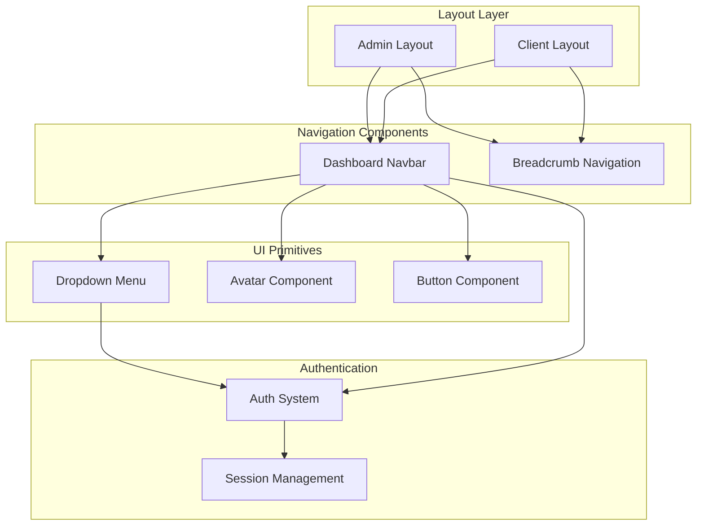
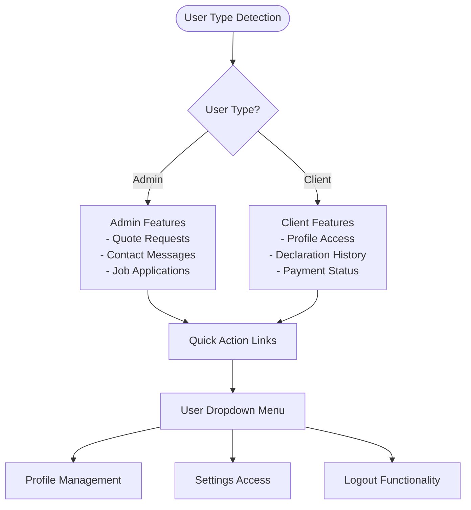
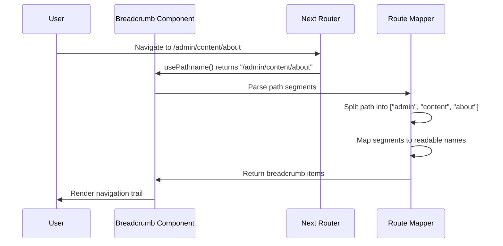
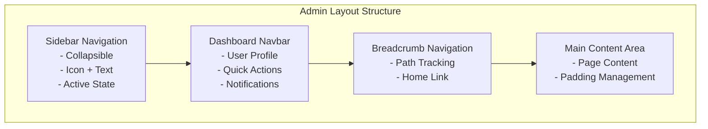

# Dashboard Layout Components

<cite>
**Referenced Files in This Document**
- [navbar.tsx](file://src/components/dashboard/navbar.tsx)
- [breadcrumb.tsx](file://src/components/dashboard/breadcrumb.tsx)
- [admin/layout.tsx](file://src/app/admin/layout.tsx)
- [client/layout.tsx](file://src/app/client/layout.tsx)
- [auth.ts](file://src/lib/auth.ts)
- [globals.css](file://src/app/globals.css)
- [theme-provider.tsx](file://src/components/theme-provider.tsx)
- [dropdown-menu.tsx](file://src/components/ui/dropdown-menu.tsx)
- [avatar.tsx](file://src/components/ui/avatar.tsx)
- [admin/page.tsx](file://src/app/admin/page.tsx)
- [client/page.tsx](file://src/app/client/page.tsx)
</cite>

## Table of Contents
1. [Introduction](#introduction)
2. [Component Architecture](#component-architecture)
3. [Navbar Component](#navbar-component)
4. [Breadcrumb Component](#breadcrumb-component)
5. [Layout Composition](#layout-composition)
6. [Authentication Integration](#authentication-integration)
7. [Responsive Design](#responsive-design)
8. [Dark Mode Compatibility](#dark-mode-compatibility)
9. [Navigation Management](#navigation-management)
10. [Integration Examples](#integration-examples)
11. [Best Practices](#best-practices)

## Introduction

The Dashboard Layout components provide a comprehensive navigation and layout system for both admin and client interfaces in the SMMM system. These components work together to create a cohesive user experience with role-based navigation, responsive design, and seamless integration with the authentication system.

The layout system consists of two primary components:
- **Dashboard Navbar**: Handles user authentication state, quick links, and user profile management
- **Breadcrumb Navigation**: Provides dynamic path tracking and intuitive navigation feedback

Both components are designed with accessibility, responsiveness, and dark mode compatibility in mind, leveraging Tailwind CSS for styling and Radix UI primitives for interactive elements.

## Component Architecture

The Dashboard Layout system follows a modular architecture where components are designed for reusability and separation of concerns:



**Diagram sources**
- [admin/layout.tsx](file://src/app/admin/layout.tsx#L1-L144)
- [client/layout.tsx](file://src/app/client/layout.tsx#L1-L133)
- [navbar.tsx](file://src/components/dashboard/navbar.tsx#L1-L252)
- [breadcrumb.tsx](file://src/components/dashboard/breadcrumb.tsx#L1-L78)

## Navbar Component

The Dashboard Navbar serves as the primary navigation header for both admin and client interfaces. It provides user authentication state management, role-based menu items, and responsive hamburger menu functionality.

### Core Features

#### Role-Based Menu Rendering
The navbar dynamically renders menu items based on the user's role (admin or client):



**Diagram sources**
- [navbar.tsx](file://src/components/dashboard/navbar.tsx#L15-L252)

#### Authentication State Management
The navbar integrates with the authentication system to display user-specific information and manage session state:

- **User Profile Loading**: Fetches user data from `/api/profile` endpoint
- **Role Detection**: Automatically determines admin vs. client based on user type
- **Real-time Updates**: Periodic refresh of notification counts (every 30 seconds)
- **Secure Logout**: Full page reload to prevent React DOM reconciliation issues

#### Responsive Hamburger Menu
The navbar implements a responsive hamburger menu system that adapts to different screen sizes:

- **Mobile Detection**: Automatic responsive behavior on smaller screens
- **Toggle Animation**: Smooth transitions for opening/closing the menu
- **Accessibility**: Proper ARIA attributes and keyboard navigation support

#### Quick Action Links
For admin users, the navbar provides instant access to frequently used administrative functions:

- **Notification Counts**: Real-time display of new items requiring attention
- **Visual Indicators**: Red badges for unread notifications
- **Direct Navigation**: Clickable icons for immediate access to relevant sections

**Section sources**
- [navbar.tsx](file://src/components/dashboard/navbar.tsx#L1-L252)

### Implementation Details

#### Active Link Detection
The navbar uses Next.js's `usePathname()` hook to detect the current route and highlight active navigation items. This ensures that users always know their current position within the application hierarchy.

#### Hover States and Transitions
All interactive elements implement smooth hover states and transitions:
- **Background Color Changes**: Subtle color transitions on hover
- **Icon Animations**: Smooth scaling and rotation effects
- **Focus Indicators**: Clear visual feedback for keyboard navigation

#### Dark Mode Compatibility
The navbar automatically adapts to dark mode themes through Tailwind CSS utilities and CSS custom properties. All color schemes are defined in the global CSS file and automatically adjust based on the user's theme preference.

## Breadcrumb Component

The Breadcrumb component provides intuitive navigation feedback by displaying the current path within the application hierarchy. It generates dynamic breadcrumbs based on the URL structure and provides easy navigation back to parent pages.

### Dynamic Path Generation

The breadcrumb system intelligently parses the URL path and converts it into human-readable navigation labels:



**Diagram sources**
- [breadcrumb.tsx](file://src/components/dashboard/breadcrumb.tsx#L10-L40)

### Accessibility Markup

The breadcrumb component implements comprehensive accessibility features:

- **Semantic HTML**: Proper use of `<nav>` and `<ol>` elements
- **ARIA Labels**: Descriptive labels for screen readers
- **Keyboard Navigation**: Full keyboard accessibility support
- **Focus Management**: Clear focus indicators and logical tab order

### Styling and Visual Design

The breadcrumb follows the application's design system with consistent spacing, typography, and color schemes:

- **Tailwind CSS Integration**: Utilizes utility classes for consistent styling
- **Visual Hierarchy**: Distinct styling for current vs. navigable items
- **Spacing Consistency**: Uniform spacing between breadcrumb items
- **Hover Effects**: Subtle hover states for navigable items

**Section sources**
- [breadcrumb.tsx](file://src/components/dashboard/breadcrumb.tsx#L1-L78)

## Layout Composition

The layout system demonstrates how the navbar and breadcrumb components integrate within the broader application structure. Both admin and client layouts share common patterns while maintaining role-specific functionality.

### Admin Layout Structure

The admin layout provides a comprehensive dashboard interface with extensive navigation capabilities:



**Diagram sources**
- [admin/layout.tsx](file://src/app/admin/layout.tsx#L50-L144)

### Client Layout Structure

The client layout offers a streamlined interface focused on user-specific functionality:

- **Simplified Navigation**: Reduced number of main navigation items
- **Personalized Experience**: Focus on user-centric features
- **Consistent Branding**: Maintains SMMM branding throughout

### Responsive Behavior

Both layouts implement responsive design principles:

- **Mobile Adaptation**: Automatic layout adjustments for smaller screens
- **Collapsible Sidebar**: Ability to collapse navigation for better mobile experience
- **Touch-Friendly**: Larger touch targets and improved mobile interactions

**Section sources**
- [admin/layout.tsx](file://src/app/admin/layout.tsx#L1-L144)
- [client/layout.tsx](file://src/app/client/layout.tsx#L1-L133)

## Authentication Integration

The Dashboard Layout components are deeply integrated with the authentication system, providing seamless user experience across different roles and states.

### Session Management

The authentication system manages user sessions through JWT tokens and maintains state across layout components:

- **Automatic Login Detection**: Components detect authentication state without manual intervention
- **Role-Based Access**: Navigation items are conditionally rendered based on user roles
- **Secure Logout**: Comprehensive logout handling with proper cleanup

### User Data Integration

Components fetch and display user-specific information:

- **Profile Information**: Name, email, and role display in the navbar
- **Avatar Management**: Dynamic avatar loading with fallback initials
- **Notification Counts**: Role-specific counts for admin users

### Security Considerations

The authentication integration includes several security measures:

- **Token Validation**: JWT token validation for all protected routes
- **Session Expiry**: Automatic handling of expired sessions
- **Cross-Site Request Forgery (CSRF) Protection**: Built-in CSRF protection through NextAuth

**Section sources**
- [auth.ts](file://src/lib/auth.ts#L1-L87)
- [navbar.tsx](file://src/components/dashboard/navbar.tsx#L40-L80)

## Responsive Design

The Dashboard Layout components implement comprehensive responsive design patterns to ensure optimal user experience across all device types.

### Breakpoint Management

The layout system uses Tailwind CSS's responsive utilities to adapt to different screen sizes:

- **Mobile First**: Base styles optimized for mobile devices
- **Progressive Enhancement**: Additional features for larger screens
- **Flexible Grid**: Adaptive grid systems for content areas

### Touch Interaction

Special considerations for touch devices:

- **Touch Targets**: Minimum 44px touch targets for all interactive elements
- **Gesture Support**: Swipe gestures for sidebar navigation on mobile
- **Scroll Behavior**: Optimized scrolling experiences for mobile browsers

### Mobile Navigation

The hamburger menu system provides mobile-optimized navigation:

- **Off-Canvas**: Sidebar slides in from the side on mobile
- **Overlay**: Dimmed background when menu is open
- **Animation**: Smooth transitions for opening and closing

## Dark Mode Compatibility

The Dashboard Layout components fully support dark mode through the theme system integration.

### Theme System Integration

The theme system provides automatic dark mode support:

- **CSS Custom Properties**: Dynamic color values based on theme
- **Automatic Detection**: System preference detection and user override
- **Smooth Transitions**: Animated theme switching with CSS transitions

### Color Adaptation

All components automatically adapt their colors based on the current theme:

- **Background Colors**: Light and dark variants for all surfaces
- **Text Colors**: High contrast text for readability in both themes
- **Interactive Elements**: Theme-aware hover and focus states

### Visual Consistency

The theme system ensures visual consistency across all components:

- **Color Palette**: Shared color definitions across all components
- **Typography**: Consistent font sizes and weights across themes
- **Spacing**: Uniform spacing and padding values

**Section sources**
- [globals.css](file://src/app/globals.css#L1-L123)
- [theme-provider.tsx](file://src/components/theme-provider.tsx#L1-L12)

## Navigation Management

The Dashboard Layout components implement sophisticated navigation management that handles routing, state persistence, and user experience optimization.

### Route State Management

Components maintain navigation state across route changes:

- **Active State Tracking**: Automatic highlighting of current route
- **State Persistence**: Navigation state maintained during page transitions
- **Deep Linking**: Support for direct navigation to specific application sections

### Sidebar State Management

The sidebar implements complex state management for different display modes:

- **Open/Collapsed/Hidden**: Three distinct states with smooth transitions
- **State Persistence**: User preferences saved across sessions
- **Responsive Behavior**: Automatic state changes based on screen size

### Navigation Patterns

The layout system implements several navigation patterns:

- **Hierarchical Navigation**: Clear parent-child relationships in navigation
- **Quick Access**: Direct shortcuts to frequently used sections
- **Contextual Navigation**: Navigation options change based on current context

## Integration Examples

### Adding New Routes to Navigation

To add new routes to the navigation system, follow these steps:

1. **Update Navigation Array**: Add new navigation items to the appropriate layout file
2. **Define Icons**: Import and use appropriate Lucide icons
3. **Set Permissions**: Ensure proper role-based access control
4. **Test Responsiveness**: Verify mobile and desktop behavior

Example integration for a new admin feature:

```typescript
// Add to admin/layout.tsx navigation array
const navigation = [
  // ... existing items
  { 
    name: "Yeni Özellik", 
    href: "/admin/new-feature", 
    icon: NewFeatureIcon 
  }
]
```

### Customizing Breadcrumb Behavior

The breadcrumb system can be customized for specific use cases:

- **Custom Route Names**: Override default route name mappings
- **Conditional Display**: Hide breadcrumbs for specific pages
- **Custom Icons**: Add icons to breadcrumb items

### Extending Navbar Functionality

The navbar can be extended with additional features:

- **Custom Quick Links**: Add new quick action buttons
- **Notification Types**: Extend notification system for new features
- **User Actions**: Add custom user profile actions

## Best Practices

### Performance Optimization

- **Code Splitting**: Use React.lazy for large components
- **Memoization**: Implement React.memo for expensive computations
- **Efficient Re-renders**: Minimize unnecessary component re-renders

### Accessibility Standards

- **ARIA Labels**: Provide descriptive labels for all interactive elements
- **Keyboard Navigation**: Ensure full keyboard accessibility
- **Screen Reader Support**: Implement proper semantic HTML structure

### Security Considerations

- **Input Validation**: Validate all user inputs
- **XSS Prevention**: Sanitize all dynamic content
- **CSRF Protection**: Implement CSRF tokens for state-changing operations

### Maintainability

- **Component Reusability**: Design components for maximum reusability
- **Clear APIs**: Provide clear and consistent component APIs
- **Documentation**: Maintain comprehensive component documentation

### Testing Strategies

- **Unit Tests**: Test individual component functionality
- **Integration Tests**: Test component interactions
- **End-to-End Tests**: Test complete user workflows