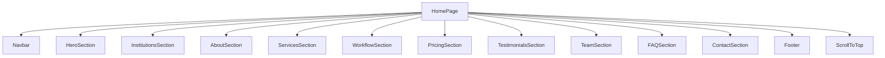
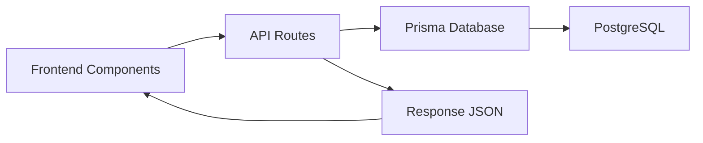
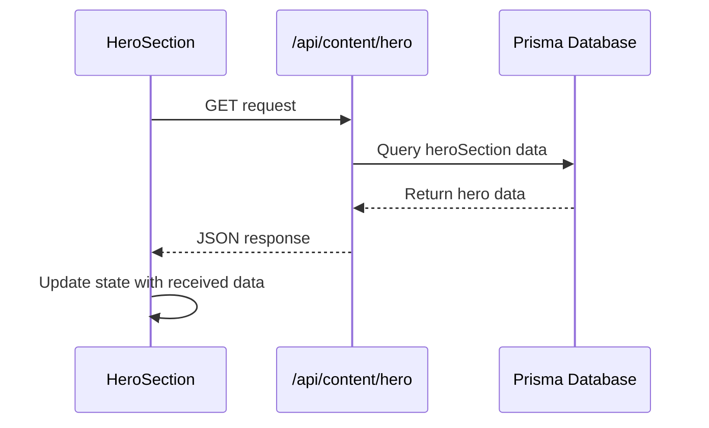
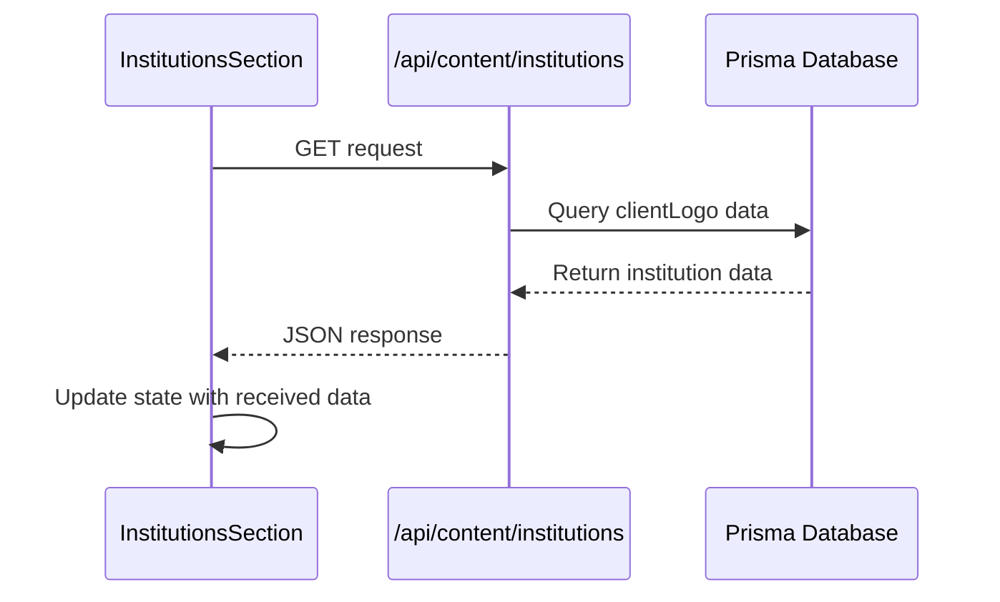
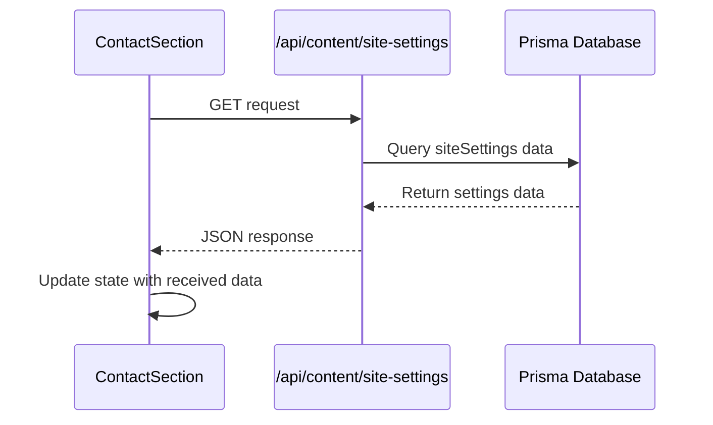
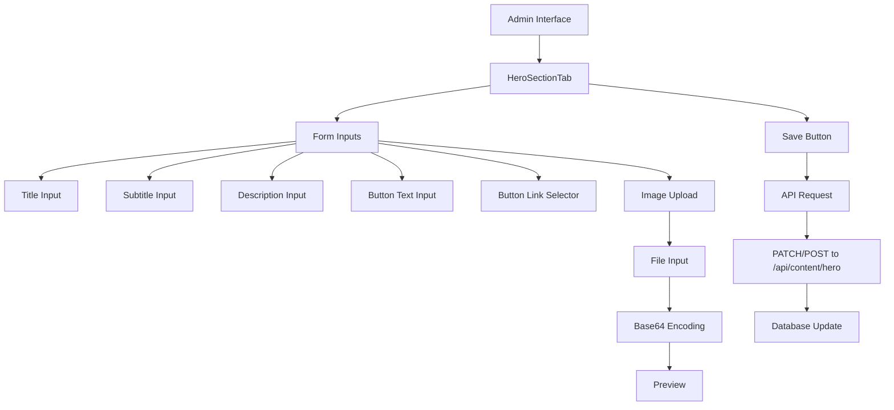
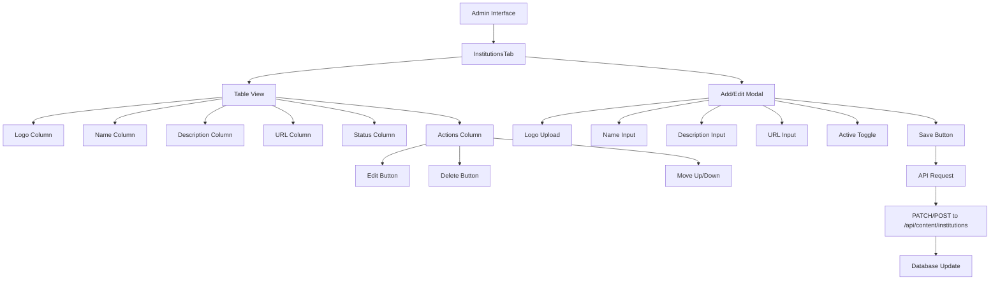
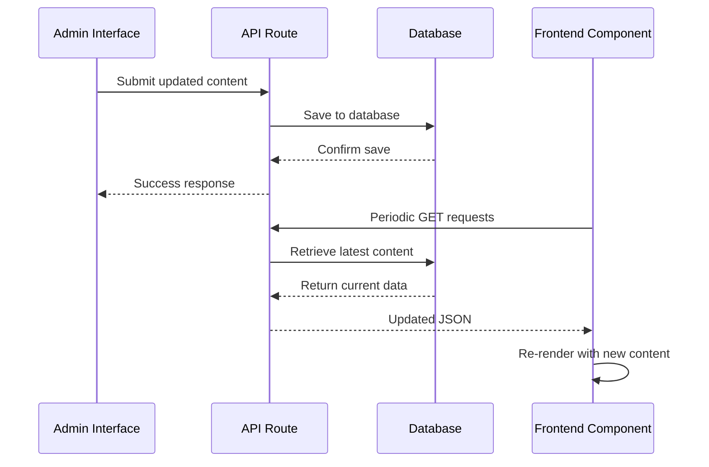

# Landing Page Sections

<cite>
**Referenced Files in This Document**   
- [page.tsx](file://src/app/(public)/page.tsx)
- [hero-section.tsx](file://src/components/landing/hero-section.tsx)
- [services-section.tsx](file://src/components/landing/services-section.tsx)
- [pricing-section.tsx](file://src/components/landing/pricing-section.tsx)
- [team-section.tsx](file://src/components/landing/team-section.tsx)
- [testimonials-section.tsx](file://src/components/landing/testimonials-section.tsx)
- [faq-section.tsx](file://src/components/landing/faq-section.tsx)
- [contact-section.tsx](file://src/components/landing/contact-section.tsx)
- [institutions-section.tsx](file://src/components/landing/institutions-section.tsx)
- [workflow-section.tsx](file://src/components/landing/workflow-section.tsx)
- [footer.tsx](file://src/components/landing/footer.tsx)
- [route.ts](file://src/app/api/content/hero/route.ts)
- [route.ts](file://src/app/api/content/institutions/route.ts)
- [route.ts](file://src/app/api/content/site-settings/route.ts)
- [hero-section-tab.tsx](file://src/components/admin/content-tabs/hero-section-tab.tsx)
- [institutions-tab.tsx](file://src/components/admin/content-tabs/institutions-tab.tsx)
</cite>

## Table of Contents
1. [Introduction](#introduction)
2. [Component Composition](#component-composition)
3. [Hero Section](#hero-section)
4. [Services Section](#services-section)
5. [Pricing Section](#pricing-section)
6. [Team Section](#team-section)
7. [Testimonials Section](#testimonials-section)
8. [FAQ Section](#faq-section)
9. [Contact Section](#contact-section)
10. [Institutions Section](#institutions-section)
11. [Workflow Section](#workflow-section)
12. [Footer](#footer)
13. [Data Fetching and CMS Integration](#data-fetching-and-cms-integration)
14. [Content Authoring and Admin Interface](#content-authoring-and-admin-interface)
15. [Design Language and Best Practices](#design-language-and-best-practices)

## Introduction
The landing page of the smmm-system website is composed of multiple sections that collectively present the company's services, team, pricing, and contact information. Each section is implemented as a standalone React component that follows a consistent design language while serving a specific purpose in the user journey. The components are designed with responsive layouts, interactive elements, and accessibility features to provide an optimal user experience across devices. Data for dynamic content is fetched from a CMS through API routes, allowing non-technical users to update content through an admin interface.

## Component Composition
The landing page is composed of multiple sections that are imported and rendered sequentially in the main page component. Each section is implemented as a separate component with its own styling and functionality.

**Diagram sources**
- [page.tsx](file://src/app/(public)/page.tsx)

**Section sources**
- [page.tsx](file://src/app/(public)/page.tsx)

## Hero Section
The Hero Section serves as the primary introduction to the website, featuring a prominent headline, subheading, call-to-action buttons, and a hero image. It uses a split layout with text content on the left and an image on the right.

### Visual Layout
The section uses a two-column grid layout on larger screens, collapsing to a single column on mobile devices. The left column contains the headline, subheading, and CTA buttons, while the right column displays a hero image with subtle animations.

### Content Structure
The hero section displays:
- A primary headline with gradient text styling
- A subheading with supporting text
- Two CTA buttons (primary and secondary)
- A statistics section showing key metrics
- A floating card with additional information

### Interaction Patterns
The hero section implements several interactive elements:
- Fade-in and slide-in animations for text content
- Bounce animation for the hero image
- Floating animation for the image with a subtle up-down movement
- Hover effects on buttons with shadow enhancement

### Responsive Design
On mobile devices, the layout changes to a single column with the image displayed below the text content. Font sizes and spacing are adjusted to maintain readability on smaller screens.

### Animation Effects
The section uses Framer Motion for animations:
- Text content animates in from the left with fade-in effect
- Hero image animates in from the right with fade-in effect
- Image has a continuous subtle bounce animation
- Floating card animates in with a delay after other elements

### Accessibility Features
The section includes proper semantic HTML structure, keyboard navigation support, and appropriate ARIA attributes for interactive elements.

**Section sources**
- [hero-section.tsx](file://src/components/landing/hero-section.tsx)

## Services Section
The Services Section presents the company's service offerings in a grid layout with visual icons and feature lists.

### Visual Layout
The section uses a responsive grid layout with cards that display service information. On desktop, three cards are displayed per row, while on tablet and mobile, the layout adjusts to two and one card per row respectively.

### Content Structure
Each service card contains:
- A colored icon with gradient background
- Service title and description
- List of specific features with checkmark indicators
- Hover effects that enhance the visual presentation

### Interaction Patterns
The section implements:
- Fade-in and slide-up animations as the user scrolls into view
- Hover effects on cards that include shadow enhancement, border color change, and slight upward translation
- Consistent spacing and alignment across all cards

### Responsive Design
The grid layout adapts to different screen sizes:
- Desktop: 3 columns
- Tablet: 2 columns
- Mobile: 1 column
Card padding and font sizes are adjusted based on screen size to maintain readability.

### Animation Effects
The section uses Framer Motion for scroll-triggered animations:
- Each card animates in sequentially with a small delay between cards
- Animation includes fade-in and slight upward movement
- Viewport detection ensures animations only trigger when cards are visible

**Section sources**
- [services-section.tsx](file://src/components/landing/services-section.tsx)

## Pricing Section
The Pricing Section displays service packages with tiered pricing and feature comparisons.

### Visual Layout
The section features a responsive grid of pricing cards with a highlighted "popular" package. Each card displays pricing information, features, and a call-to-action button.

### Content Structure
Each pricing card includes:
- Package name and icon
- Price and billing period
- List of included features with checkmark indicators
- "Request Quote" button that opens a modal
- Special indicator for the popular package

### Interaction Patterns
The section implements:
- Click interaction on the "Request Quote" button that opens a modal form
- Hover effects on cards that include enhanced shadows and scaling
- Visual highlighting of the popular package with a banner and increased size
- Modal dialog for quote requests that captures user information

### Responsive Design
On mobile devices, the layout adjusts to a single column with cards taking full width. The popular package indicator is positioned above the card, and font sizes are reduced to fit the available space.

### Animation Effects
The section uses Framer Motion for:
- Sequential fade-in and slide-up animations for pricing cards
- Smooth transitions for the quote request modal
- Viewport-triggered animations that activate as the user scrolls

**Section sources**
- [pricing-section.tsx](file://src/components/landing/pricing-section.tsx)

## Team Section
The Team Section showcases the company's professional staff with individual profiles.

### Visual Layout
The section uses a responsive grid layout to display team member profiles. Each profile card contains a photo/avatar, name, role, description, and contact information.

### Content Structure
Each team member card includes:
- Circular avatar with initials or image
- Name and professional role
- Brief description of expertise and experience
- Contact information (email and phone)
- Social media links (LinkedIn, Twitter, Facebook, Instagram)

### Interaction Patterns
The section implements:
- Hover effects on cards that include enhanced shadows and border color changes
- Clickable email and phone links that trigger native applications
- External links to social media profiles that open in new tabs
- Modal dialog for career opportunities that opens when clicking the CTA button

### Responsive Design
The grid layout adapts to screen size:
- Desktop: 3 columns
- Tablet: 2 columns
- Mobile: 1 column
Avatar sizes and font scales are adjusted for optimal display on different devices.

### Animation Effects
The section uses Framer Motion for:
- Sequential fade-in and slide-up animations as the user scrolls
- Viewport detection to trigger animations only when cards are visible
- Smooth transitions for the career opportunities modal

**Section sources**
- [team-section.tsx](file://src/components/landing/team-section.tsx)

## Testimonials Section
The Testimonials Section displays customer feedback through a carousel interface.

### Visual Layout
The section features a responsive carousel that displays one testimonial at a time on all screen sizes. Navigation arrows and pagination indicators allow users to browse through testimonials.

### Content Structure
Each testimonial includes:
- Customer name, role, and company
- Star rating (5 stars for all testimonials)
- Testimonial text in quotation format
- Customer avatar with initials
- Company information

### Interaction Patterns
The section implements:
- Touch and mouse drag support for carousel navigation
- Previous/next navigation buttons
- Clickable pagination indicators to jump to specific testimonials
- Auto-advancing carousel that pauses on hover
- Swipe gestures on touch devices

### Responsive Design
The carousel adapts to different screen sizes with consistent layout. On mobile devices, the navigation arrows are positioned outside the main content area to prevent interference with touch gestures.

### Animation Effects
The section uses Framer Motion for:
- Drag and swipe gestures with momentum-based transitions
- Smooth sliding animations between testimonials
- Fade-in and slide-up animations for the section header
- Scale animations for active pagination indicators

**Section sources**
- [testimonials-section.tsx](file://src/components/landing/testimonials-section.tsx)

## FAQ Section
The FAQ Section provides answers to common questions through an interactive accordion interface.

### Visual Layout
The section features categorized FAQs with filterable content. Users can filter by category and date range, with questions displayed in an accordion format.

### Content Structure
The section includes:
- Category filters (All, General, Services, Pricing, Processes, Technical)
- Date range filter with calendar input
- Accordion-style questions and answers
- Visual indicators for open/closed states
- Contact CTA at the bottom

### Interaction Patterns
The section implements:
- Click interaction to expand/collapse answers
- Category filtering that updates the displayed questions
- Date filtering that shows only questions from a selected date onward
- Smooth animations for accordion expansion and collapse
- Hover effects on filter buttons

### Responsive Design
The layout adapts to screen size with filters stacked vertically on mobile devices. The accordion format works consistently across all devices, with touch targets sized appropriately for mobile interaction.

### Animation Effects
The section uses Framer Motion and React animation libraries for:
- Smooth height transitions when expanding/collapsing answers
- Fade-in and slide-up animations for questions as they appear
- Rotation animation for the chevron icon when toggling answers
- Viewport-triggered animations for section elements

**Section sources**
- [faq-section.tsx](file://src/components/landing/faq-section.tsx)

## Contact Section
The Contact Section provides a form for users to send messages and displays company contact information.

### Visual Layout
The section uses a two-column layout on desktop (form on left, contact details on right) that stacks vertically on mobile devices.

### Content Structure
The section includes:
- Contact form with fields for name, email, phone, subject, and message
- Company contact information (address, phone, email)
- Google Maps iframe for location
- Form validation and submission feedback

### Interaction Patterns
The section implements:
- Form submission with loading state and success/error feedback
- Real-time form validation
- Clickable contact information that triggers native applications
- Interactive map that opens in Google Maps when clicked
- Toast notifications for form submission status

### Responsive Design
On mobile devices, the layout changes to a single column with the form above contact details. Form fields are full-width, and contact information is displayed in a stacked format.

### Animation Effects
The section uses subtle animations for:
- Form submission loading state
- Success/error toast notifications
- Hover effects on contact information links

**Section sources**
- [contact-section.tsx](file://src/components/landing/contact-section.tsx)

## Institutions Section
The Institutions Section displays logos of government institutions and official bodies the company works with.

### Visual Layout
The section features a responsive carousel on larger screens that switches to a grid layout on mobile devices. Each institution is displayed with its logo, name, and full name.

### Content Structure
Each institution card includes:
- Institution logo (emoji or uploaded image)
- Short name and full name
- External link indicator for clickable institutions
- Hover effects that reveal the link

### Interaction Patterns
The section implements:
- Auto-advancing carousel with manual navigation controls
- Previous/next navigation buttons
- Clickable institution cards that open external links in new tabs
- Hover effects that reveal link icons
- Error boundary handling for carousel failures

### Responsive Design
The component uses a responsive carousel that adapts to screen size:
- Desktop: 4 items per view with navigation controls
- Tablet: 2 items per view
- Mobile: Grid layout as fallback
The carousel switches to a static grid on mobile devices for better usability.

### Animation Effects
The section uses Framer Motion for:
- Auto-advancing carousel with smooth transitions
- Fade-in and slide-up animations for the section header
- Hover animations for institution cards
- Error boundary fallback with static display

**Section sources**
- [institutions-section.tsx](file://src/components/landing/institutions-section.tsx)

## Workflow Section
The Workflow Section illustrates the company's service process through a step-by-step visualization.

### Visual Layout
The section uses a horizontal timeline on desktop (with connecting arrows) and a vertical list on mobile devices. Each step is represented by a numbered card with an icon.

### Content Structure
Each workflow step includes:
- Step number (01, 02, 03, 04)
- Icon representing the step
- Step title and description
- Connecting arrows between steps (desktop)

### Interaction Patterns
The section implements:
- Responsive layout that changes from horizontal to vertical based on screen size
- Consistent visual hierarchy across steps
- Call-to-action at the bottom encouraging users to contact the company

### Responsive Design
The layout adapts significantly between desktop and mobile:
- Desktop: Horizontal layout with connecting arrows
- Mobile: Vertical layout with downward-pointing arrows between steps
Card sizes and font scales are adjusted for optimal readability.

### Animation Effects
The section uses Framer Motion for:
- Sequential fade-in and slide-up animations for each step
- Delayed animations for connecting arrows
- Viewport-triggered animations that activate as the user scrolls

**Section sources**
- [workflow-section.tsx](file://src/components/landing/workflow-section.tsx)

## Footer
The Footer component provides site navigation, contact information, and legal links.

### Visual Layout
The footer uses a multi-column layout on desktop that stacks vertically on mobile devices. It includes:
- Company information and description
- Navigation links organized by category
- Contact information
- Social media links
- Legal links (privacy policy, terms, etc.)

### Content Structure
The footer is organized into sections:
- Brand section with company name and description
- Navigation sections (Company, Services, Legal)
- Contact information
- Social media links
- Copyright notice

### Interaction Patterns
The footer implements:
- Clickable navigation links
- Social media icons that open in new tabs
- Responsive layout that reorganizes content on smaller screens

### Responsive Design
On mobile devices, the multi-column layout collapses into a single column with clear section separation. Navigation links are spaced appropriately for touch interaction.

### Accessibility Features
The footer includes proper semantic structure, keyboard navigation support, and appropriate ARIA labels for interactive elements.

**Section sources**
- [footer.tsx](file://src/components/landing/footer.tsx)

## Data Fetching and CMS Integration
The landing page components dynamically fetch data from the CMS through API routes, enabling content updates without code changes.

### API Routes
The system uses Next.js API routes to serve content from the database:

**Diagram sources**
- [route.ts](file://src/app/api/content/hero/route.ts)
- [route.ts](file://src/app/api/content/institutions/route.ts)
- [route.ts](file://src/app/api/content/site-settings/route.ts)

### Hero Section Data Flow
The Hero Section fetches its content from `/api/content/hero`:

**Diagram sources**
- [hero-section.tsx](file://src/components/landing/hero-section.tsx)
- [route.ts](file://src/app/api/content/hero/route.ts)

### Institutions Section Data Flow
The Institutions Section fetches data from `/api/content/institutions`:

**Diagram sources**
- [institutions-section.tsx](file://src/components/landing/institutions-section.tsx)
- [route.ts](file://src/app/api/content/institutions/route.ts)

### Contact Section Data Flow
The Contact Section fetches site settings from `/api/content/site-settings`:

**Diagram sources**
- [contact-section.tsx](file://src/components/landing/contact-section.tsx)
- [route.ts](file://src/app/api/content/site-settings/route.ts)

### Error Handling and Fallbacks
Components implement robust error handling:
- Loading states during data fetching
- Error states with user-friendly messages
- Default/fallback content when data cannot be retrieved
- Proper cleanup to prevent memory leaks

## Content Authoring and Admin Interface
The system provides an admin interface for non-technical users to update content through form-based editors.

### Hero Section Admin Interface
The Hero Section can be edited through the admin interface at `/admin/content`:

**Diagram sources**
- [hero-section-tab.tsx](file://src/components/admin/content-tabs/hero-section-tab.tsx)
- [route.ts](file://src/app/api/content/hero/route.ts)

### Institutions Section Admin Interface
The Institutions Section is managed through a comprehensive admin interface:

**Diagram sources**
- [institutions-tab.tsx](file://src/components/admin/content-tabs/institutions-tab.tsx)
- [route.ts](file://src/app/api/content/institutions/route.ts)

### Content Propagation
When content is updated in the admin interface, changes propagate to the public site:

**Diagram sources**
- [hero-section-tab.tsx](file://src/components/admin/content-tabs/hero-section-tab.tsx)
- [institutions-tab.tsx](file://src/components/admin/content-tabs/institutions-tab.tsx)
- [route.ts](file://src/app/api/content/hero/route.ts)
- [route.ts](file://src/app/api/content/institutions/route.ts)

## Design Language and Best Practices
The landing page components follow a consistent design language and implementation best practices.

### Visual Design System
The components share a common visual language:
- Consistent color palette with blue and cyan gradients
- Uniform card styling with shadows and hover effects
- Standardized typography with clear hierarchy
- Coordinated icon usage across sections
- Harmonious spacing and layout patterns

### Responsive Design Principles
The components follow responsive design best practices:
- Mobile-first approach with progressive enhancement
- Flexible grid layouts using CSS Grid and Flexbox
- Appropriate breakpoints for different device sizes
- Touch-friendly interactive elements
- Optimized performance on mobile networks

### Accessibility Implementation
The components prioritize accessibility:
- Semantic HTML structure
- Proper heading hierarchy
- Sufficient color contrast
- Keyboard navigation support
- ARIA attributes for interactive elements
- Screen reader compatibility

### Performance Optimization
The components implement performance best practices:
- Code splitting and lazy loading
- Efficient state management
- Optimized image loading
- Debounced and throttled event handlers
- Memoized components to prevent unnecessary re-renders

### Component Composition Best Practices
The implementation follows React best practices:
- Single responsibility principle for components
- Reusable UI components from the design system
- Proper separation of concerns between presentation and logic
- Consistent naming conventions
- Comprehensive error boundaries
- Proper cleanup of side effects

### Animation Guidelines
Animations are used purposefully:
- Subtle transitions that enhance user experience
- Performance-optimized animations using CSS transforms
- Reduced motion preferences respected
- Animations that provide meaningful feedback
- Consistent timing and easing functions