# Modal Dialogs

<cite>
**Referenced Files in This Document**
- [src/components/ui/dialog.tsx](file://src/components/ui/dialog.tsx)
- [src/components/modals/quote-request-modal.tsx](file://src/components/modals/quote-request-modal.tsx)
- [src/components/modals/kvkk-modal.tsx](file://src/components/modals/kvkk-modal.tsx)
- [src/components/modals/privacy-policy-modal.tsx](file://src/components/modals/privacy-policy-modal.tsx)
- [src/components/modals/terms-modal.tsx](file://src/components/modals/terms-modal.tsx)
- [src/components/modals/career-modal.tsx](file://src/components/modals/career-modal.tsx)
- [src/components/admin/quote-request-modal.tsx](file://src/components/admin/quote-request-modal.tsx)
- [src/components/admin/contact-message-modal.tsx](file://src/components/admin/contact-message-modal.tsx)
- [src/components/landing/footer.tsx](file://src/components/landing/footer.tsx)
- [src/components/landing/team-section.tsx](file://src/components/landing/team-section.tsx)
- [src/app/api/quote-requests/route.ts](file://src/app/api/quote-requests/route.ts)
</cite>

## Table of Contents
1. [Introduction](#introduction)
2. [Architecture Overview](#architecture-overview)
3. [Radix UI Dialog Implementation](#radix-ui-dialog-implementation)
4. [Functional Modals](#functional-modals)
5. [Informational/Legal Modals](#informationallegal-modals)
6. [Accessibility Standards](#accessibility-standards)
7. [State Management](#state-management)
8. [Animation and Transitions](#animation-and-transitions)
9. [Responsive Behavior](#responsive-behavior)
10. [Integration Patterns](#integration-patterns)
11. [Best Practices](#best-practices)
12. [Creating New Modals](#creating-new-modals)

## Introduction

The SMMM system implements a comprehensive modal dialog framework built on Radix UI's Dialog primitive, providing both functional forms and informational/legal content displays. The modal system serves two primary purposes: collecting user data through interactive forms and presenting regulatory/compliance information in an accessible, user-friendly manner.

The implementation follows modern React patterns with TypeScript, ensuring type safety, accessibility compliance, and consistent user experience across all modal types. The system supports both public-facing interfaces for customer interactions and administrative interfaces for internal management tasks.

## Architecture Overview

The modal dialog system is structured around a hierarchical component architecture that separates concerns between presentation, functionality, and state management.

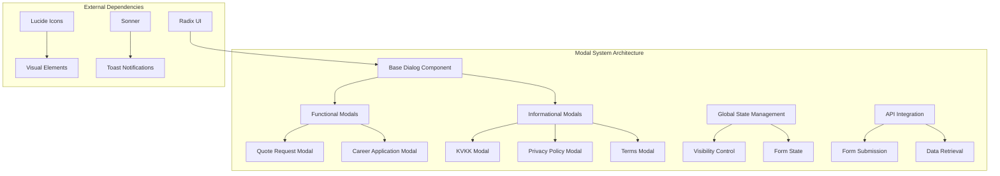

**Diagram sources**
- [src/components/ui/dialog.tsx](file://src/components/ui/dialog.tsx#L1-L159)
- [src/components/modals/quote-request-modal.tsx](file://src/components/modals/quote-request-modal.tsx#L1-L195)

**Section sources**
- [src/components/ui/dialog.tsx](file://src/components/ui/dialog.tsx#L1-L159)
- [src/components/modals/quote-request-modal.tsx](file://src/components/modals/quote-request-modal.tsx#L1-L195)

## Radix UI Dialog Implementation

The foundation of the modal system is built upon Radix UI's Dialog primitive, which provides robust accessibility features and flexible composition patterns.

### Core Dialog Components

The system exports a comprehensive set of dialog components that wrap Radix UI primitives with Tailwind CSS styling and custom enhancements:

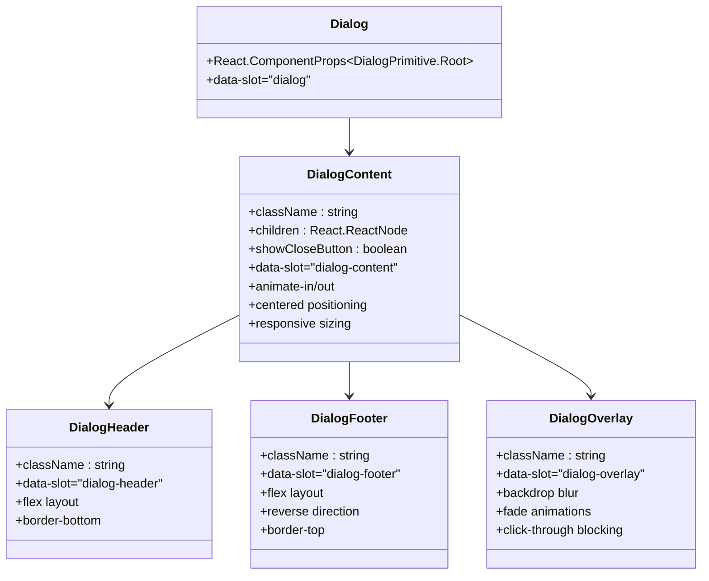

**Diagram sources**
- [src/components/ui/dialog.tsx](file://src/components/ui/dialog.tsx#L10-L159)

### Portal and Mounting Strategy

The dialog system implements sophisticated portal mounting to ensure proper z-index stacking and DOM isolation:

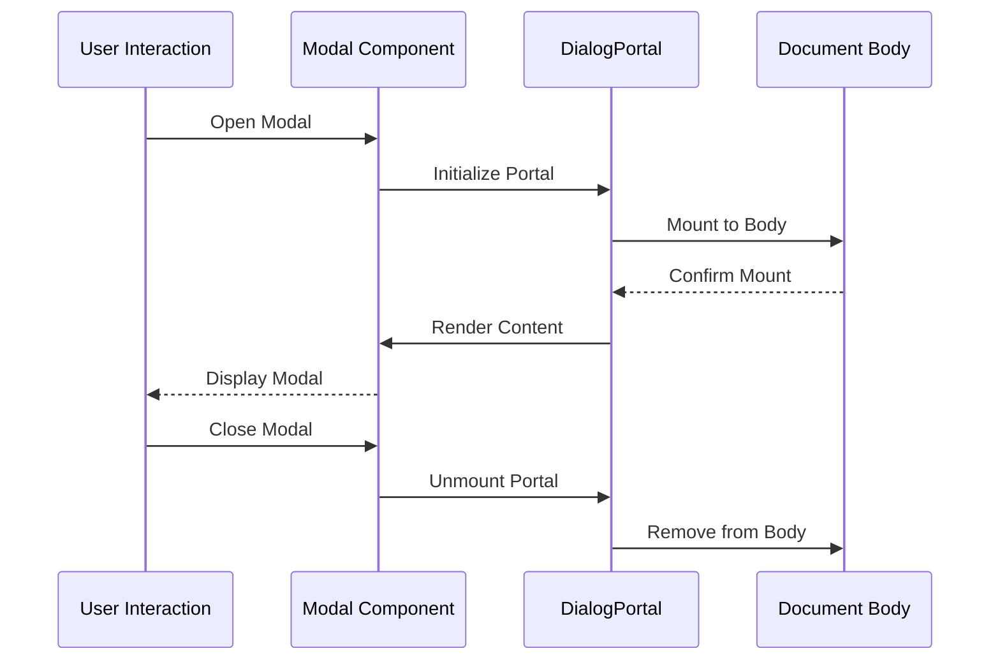

**Diagram sources**
- [src/components/ui/dialog.tsx](file://src/components/ui/dialog.tsx#L20-L45)

**Section sources**
- [src/components/ui/dialog.tsx](file://src/components/ui/dialog.tsx#L1-L159)

## Functional Modals

Functional modals serve interactive purposes, primarily collecting user data through form submissions with comprehensive validation and API integration.

### Quote Request Modal

The Quote Request Modal represents the primary functional modal, enabling users to request service quotes with comprehensive form validation and submission handling.

#### Form Structure and Validation

The modal implements a sophisticated form structure with multi-field validation:

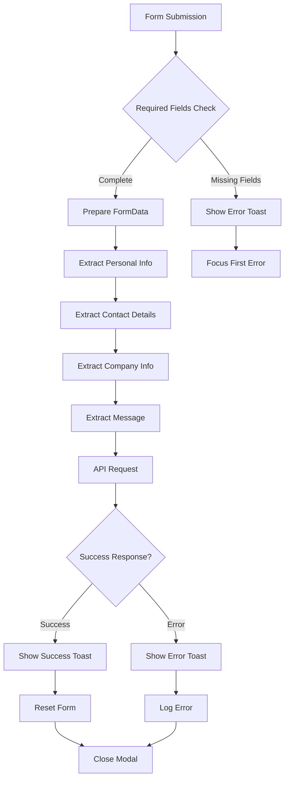

**Diagram sources**
- [src/components/modals/quote-request-modal.tsx](file://src/components/modals/quote-request-modal.tsx#L20-L50)
- [src/app/api/quote-requests/route.ts](file://src/app/api/quote-requests/route.ts#L20-L47)

#### API Integration Pattern

The modal demonstrates a standardized API integration pattern with comprehensive error handling:

| Feature | Implementation | Purpose |
|---------|---------------|---------|
| FormData Collection | `new FormData(form)` | Efficient form data extraction |
| Data Transformation | Object construction | API-compatible payload |
| Error Handling | Try-catch with toast feedback | User-friendly error reporting |
| Loading States | `isSubmitting` state | Prevent duplicate submissions |
| Form Reset | `form.reset()` | Clean state after submission |

**Section sources**
- [src/components/modals/quote-request-modal.tsx](file://src/components/modals/quote-request-modal.tsx#L1-L195)
- [src/app/api/quote-requests/route.ts](file://src/app/api/quote-requests/route.ts#L1-L47)

### Career Application Modal

The Career Application Modal extends functional capabilities with file upload handling and consent management.

#### File Upload Validation

The modal implements comprehensive file validation with size and type restrictions:

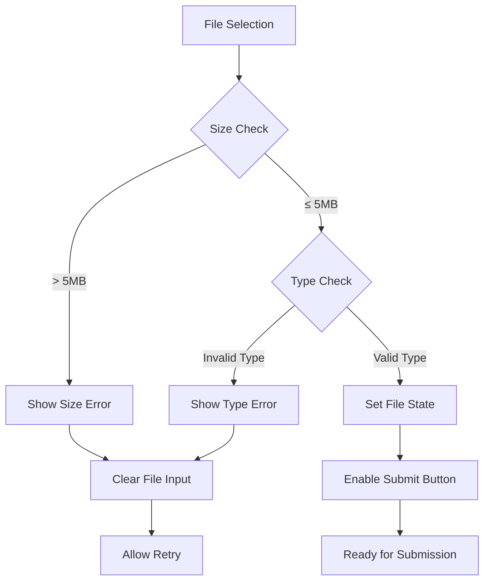

**Diagram sources**
- [src/components/modals/career-modal.tsx](file://src/components/modals/career-modal.tsx#L30-L50)

#### Consent Management Integration

The modal integrates with the KVKK Modal for comprehensive consent management:

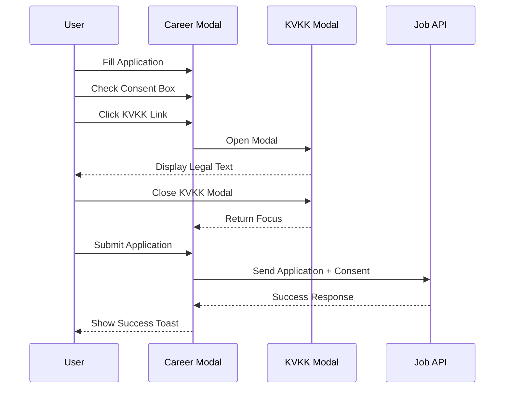

**Diagram sources**
- [src/components/modals/career-modal.tsx](file://src/components/modals/career-modal.tsx#L11-L13)
- [src/components/modals/career-modal.tsx](file://src/components/modals/career-modal.tsx#L299-L302)

**Section sources**
- [src/components/modals/career-modal.tsx](file://src/components/modals/career-modal.tsx#L1-L303)

## Informational/Legal Modals

Informational modals present static content with legal compliance requirements, focusing on accessibility and readability.

### Content Structure and Organization

Legal modals follow a structured content organization pattern:

| Section | Purpose | Accessibility Features |
|---------|---------|----------------------|
| Header | Title and Description | Semantic heading hierarchy |
| Content Area | Detailed Information | Scrollable container |
| Navigation | Close button | Keyboard accessible |
| Footer | Action buttons | Clear call-to-action |

### Responsive Design Implementation

All informational modals implement responsive design with maximum dimensions:

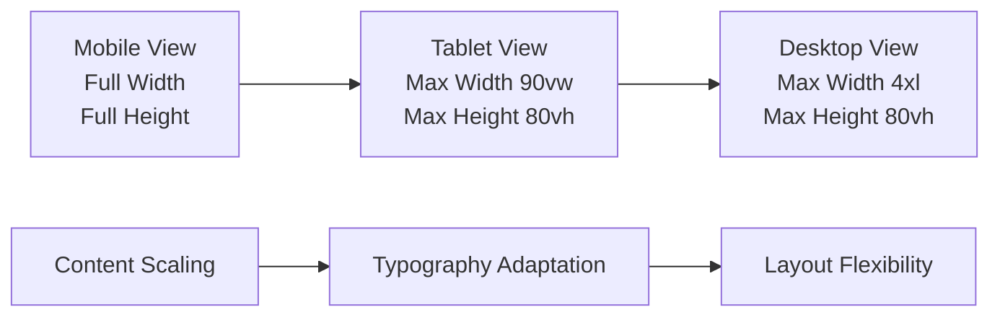

**Diagram sources**
- [src/components/modals/kvkk-modal.tsx](file://src/components/modals/kvkk-modal.tsx#L10-L15)
- [src/components/modals/privacy-policy-modal.tsx](file://src/components/modals/privacy-policy-modal.tsx#L10-L15)

**Section sources**
- [src/components/modals/kvkk-modal.tsx](file://src/components/modals/kvkk-modal.tsx#L1-L228)
- [src/components/modals/privacy-policy-modal-modal.tsx](file://src/components/modals/privacy-policy-modal-modal.tsx#L1-L155)
- [src/components/modals/terms-modal.tsx](file://src/components/modals/terms-modal.tsx#L1-L182)

## Accessibility Standards

The modal system implements comprehensive accessibility features following WCAG guidelines and ARIA best practices.

### Focus Management

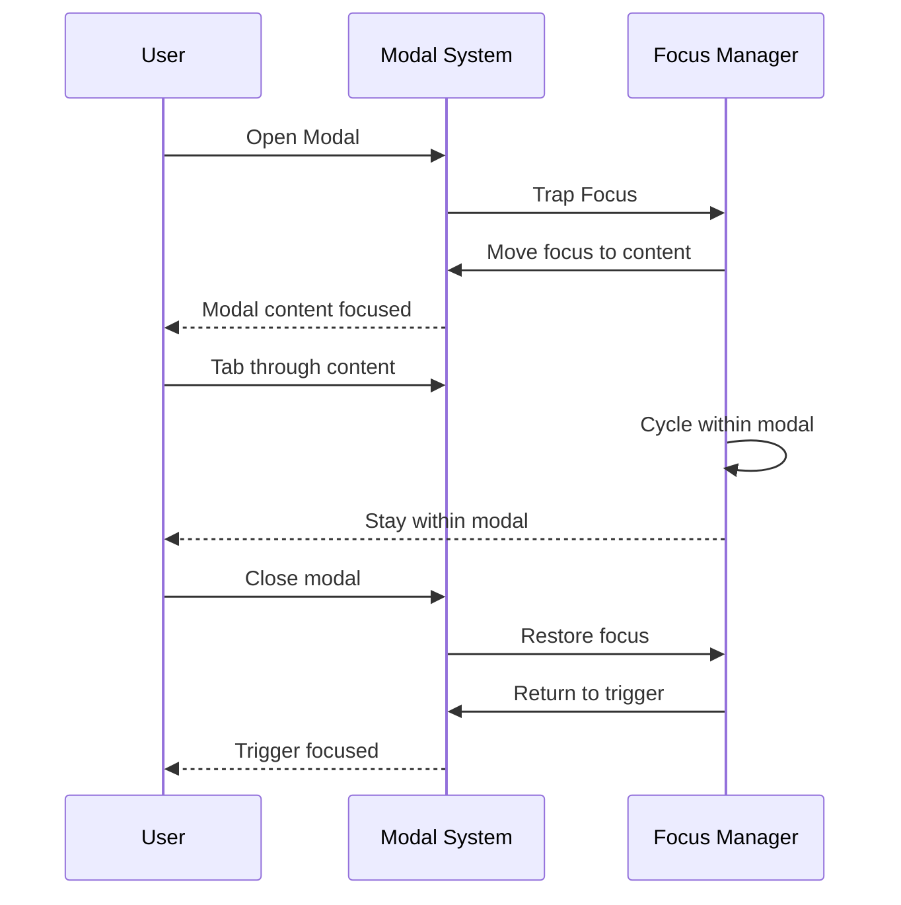

**Diagram sources**
- [src/components/ui/dialog.tsx](file://src/components/ui/dialog.tsx#L64-L96)

### ARIA Roles and Attributes

The system implements proper ARIA semantics:

| Element | ARIA Role | Purpose |
|---------|-----------|---------|
| Dialog Root | `role="dialog"` | Semantic dialog identification |
| Overlay | `aria-hidden="true"` | Background element exclusion |
| Close Button | `aria-label="Close"` | Screen reader announcement |
| Title | `aria-labelledby` | Content association |
| Description | `aria-describedby` | Additional context |

### Keyboard Navigation

Complete keyboard navigation support is implemented:

- **Escape**: Close modal
- **Tab**: Navigate within modal
- **Shift+Tab**: Reverse tab order
- **Enter/Space**: Activate buttons

**Section sources**
- [src/components/ui/dialog.tsx](file://src/components/ui/dialog.tsx#L1-L159)

## State Management

The modal system employs a centralized state management approach using React's controlled component pattern.

### Visibility Control Pattern

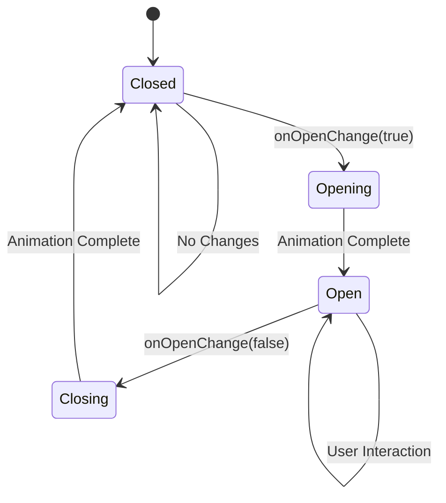

**Diagram sources**
- [src/components/modals/quote-request-modal.tsx](file://src/components/modals/quote-request-modal.tsx#L15-L17)

### Global State Integration

The system integrates with global state management for complex workflows:

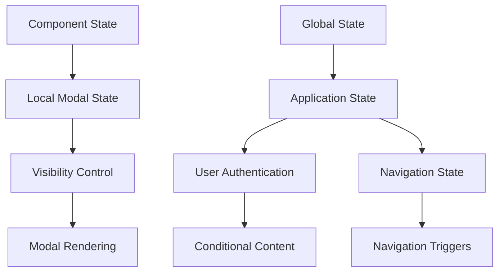

**Diagram sources**
- [src/components/landing/footer.tsx](file://src/components/landing/footer.tsx#L50-L55)

**Section sources**
- [src/components/modals/quote-request-modal.tsx](file://src/components/modals/quote-request-modal.tsx#L15-L17)
- [src/components/landing/footer.tsx](file://src/components/landing/footer.tsx#L50-L55)

## Animation and Transitions

The modal system implements smooth animations using CSS transitions and Radix UI's animation primitives.

### Transition Effects

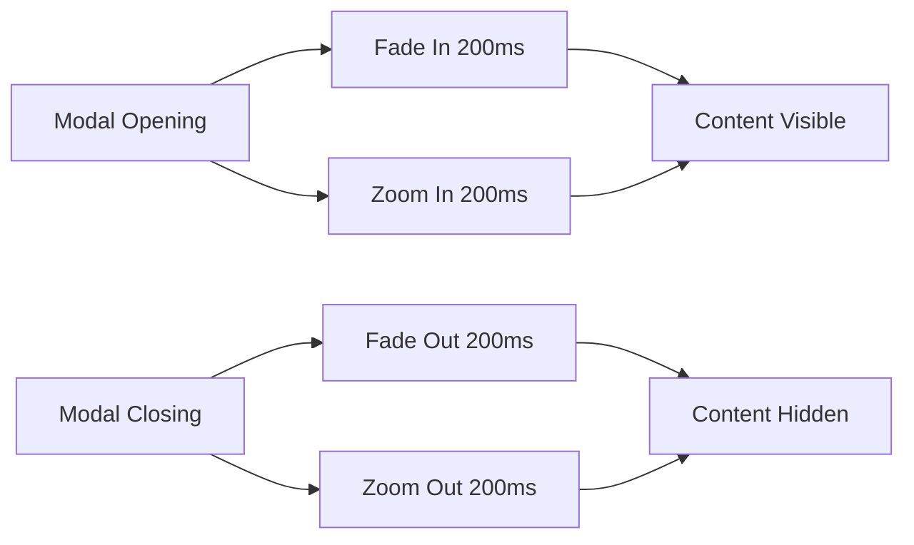

**Diagram sources**
- [src/components/ui/dialog.tsx](file://src/components/ui/dialog.tsx#L64-L96)

### Animation Configuration

The system uses Radix UI's animation system with custom timing:

| State | Animation | Duration | Easing |
|-------|-----------|----------|--------|
| Enter | `fade-in`, `zoom-in` | 200ms | Default |
| Exit | `fade-out`, `zoom-out` | 200ms | Default |
| Overlay | `fade-in` | 200ms | Default |
| Overlay | `fade-out` | 200ms | Default |

**Section sources**
- [src/components/ui/dialog.tsx](file://src/components/ui/dialog.tsx#L64-L96)

## Responsive Behavior

The modal system adapts to various screen sizes with responsive design principles.

### Breakpoint Strategy

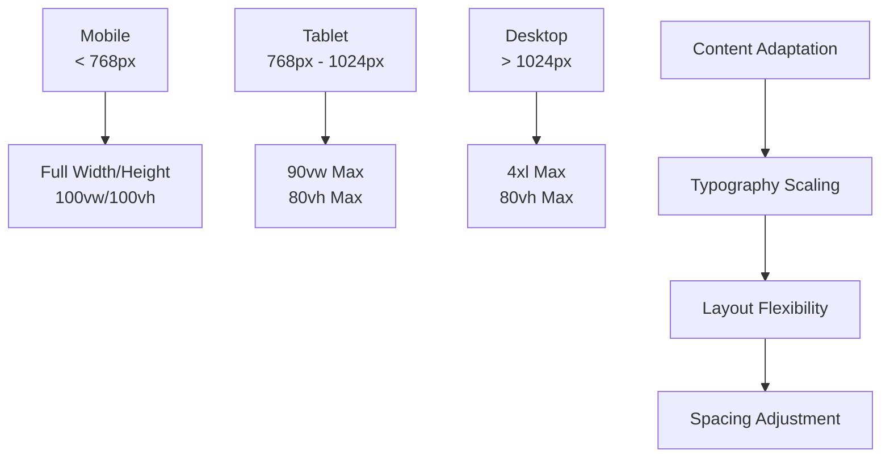

**Diagram sources**
- [src/components/ui/dialog.tsx](file://src/components/ui/dialog.tsx#L75-L85)

### Touch and Gesture Support

The system provides touch-friendly interactions:

- **Touch Targets**: Minimum 44px touch targets
- **Gesture Support**: Swipe-to-dismiss on mobile
- **Viewport Awareness**: Safe area considerations

**Section sources**
- [src/components/ui/dialog.tsx](file://src/components/ui/dialog.tsx#L75-L85)

## Integration Patterns

The modal system demonstrates several integration patterns used throughout the application.

### Public Interface Integration

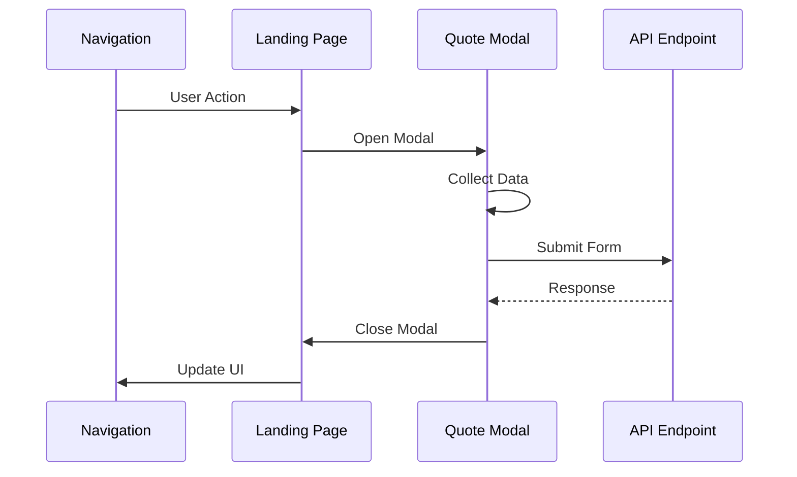

**Diagram sources**
- [src/components/landing/pricing-section.tsx](file://src/components/landing/pricing-section.tsx#L195-L222)

### Administrative Interface Integration

Administrative modals demonstrate data-driven content presentation:

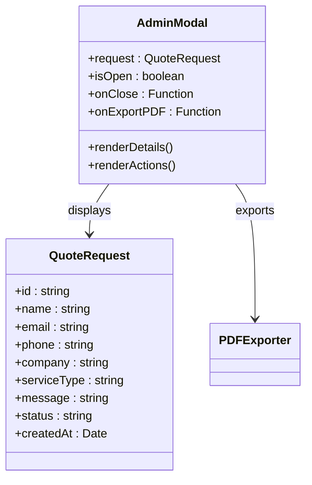

**Diagram sources**
- [src/components/admin/quote-request-modal.tsx](file://src/components/admin/quote-request-modal.tsx#L10-L20)

**Section sources**
- [src/components/landing/pricing-section.tsx](file://src/components/landing/pricing-section.tsx#L195-L222)
- [src/components/admin/quote-request-modal.tsx](file://src/components/admin/quote-request-modal.tsx#L1-L183)

## Best Practices

### Component Design Principles

1. **Single Responsibility**: Each modal focuses on one primary function
2. **Type Safety**: Comprehensive TypeScript interfaces
3. **Accessibility**: Full ARIA compliance and keyboard navigation
4. **Performance**: Lazy loading and efficient re-rendering
5. **Maintainability**: Consistent naming and structure patterns

### Error Handling Guidelines

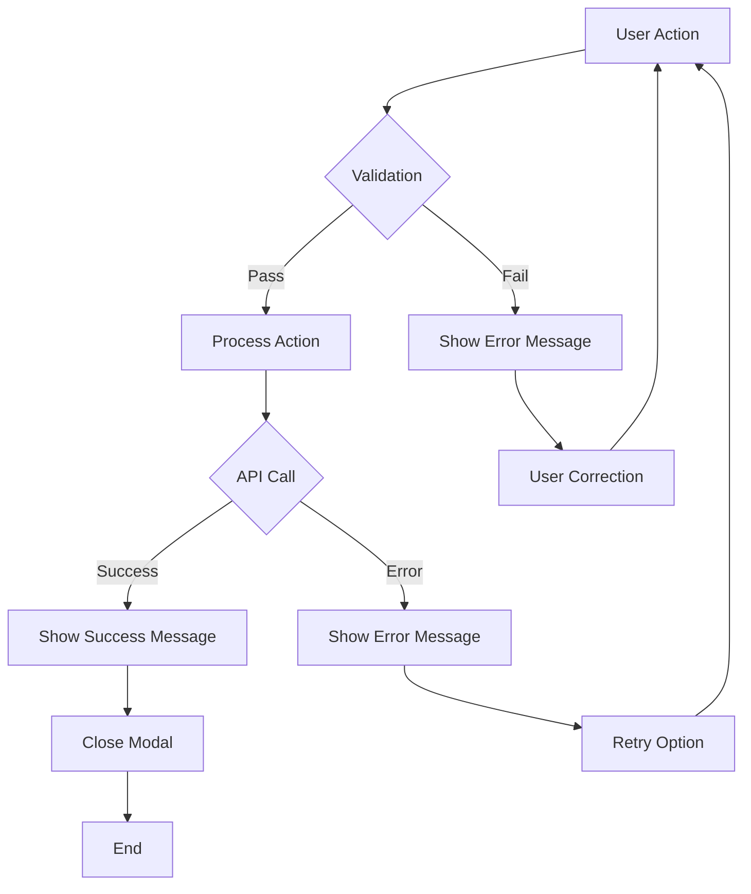

### Performance Optimization

- **Code Splitting**: Modal components loaded on demand
- **Memory Management**: Proper cleanup of event listeners
- **Rendering Optimization**: Minimal re-renders through controlled components
- **Bundle Size**: Tree shaking of unused components

## Creating New Modals

### Step-by-Step Implementation Guide

#### 1. Component Structure

```typescript
// Basic modal template
export function NewModal({ open, onOpenChange }: ModalProps) {
  return (
    <Dialog open={open} onOpenChange={onOpenChange}>
      <DialogContent className="max-w-2xl max-h-[90vh] flex flex-col">
        <DialogHeader>
          <DialogTitle>Title</DialogTitle>
          <DialogDescription>Description</DialogDescription>
        </DialogHeader>
        
        <div className="flex-1 overflow-y-auto p-6">
          {/* Modal content */}
        </div>
        
        <DialogFooter>
          <Button variant="outline" onClick={() => onOpenChange(false)}>
            Cancel
          </Button>
          <Button type="submit" form="form-id">
            Submit
          </Button>
        </DialogFooter>
      </DialogContent>
    </Dialog>
  )
}
```

#### 2. Integration Pattern

```typescript
// Usage in parent component
const [modalOpen, setModalOpen] = useState(false)

return (
  <>
    <Button onClick={() => setModalOpen(true)}>
      Open Modal
    </Button>
    
    <NewModal 
      open={modalOpen} 
      onOpenChange={setModalOpen} 
    />
  </>
)
```

#### 3. API Integration Template

```typescript
const handleSubmit = async (e: React.FormEvent<HTMLFormElement>) => {
  e.preventDefault()
  
  try {
    const formData = new FormData(e.currentTarget)
    const data = {
      // Extract and transform form data
    }
    
    const response = await fetch('/api/new-endpoint', {
      method: 'POST',
      headers: { 'Content-Type': 'application/json' },
      body: JSON.stringify(data),
    })
    
    if (response.ok) {
      toast.success('Success message')
      onOpenChange(false)
    } else {
      throw new Error('Submission failed')
    }
  } catch (error) {
    toast.error('Error message')
  }
}
```

### Naming Conventions

- **Component Names**: `{Feature}Modal` (e.g., `QuoteRequestModal`)
- **Props Interfaces**: `{ComponentName}Props`
- **State Variables**: `{componentName}Open`
- **Handler Functions**: `handle{Action}`

### Styling Guidelines

- **Max Dimensions**: Use `max-w-2xl` and `max-h-[90vh]` for consistency
- **Padding**: Standard `p-6` padding for content areas
- **Spacing**: Use Tailwind spacing utilities consistently
- **Responsive**: Implement responsive breakpoints

### Accessibility Checklist

- [ ] Proper ARIA roles and attributes
- [ ] Keyboard navigation support
- [ ] Screen reader compatibility
- [ ] Focus management
- [ ] Color contrast compliance
- [ ] Semantic HTML structure

**Section sources**
- [src/components/modals/quote-request-modal.tsx](file://src/components/modals/quote-request-modal.tsx#L1-L195)
- [src/components/ui/dialog.tsx](file://src/components/ui/dialog.tsx#L1-L159)