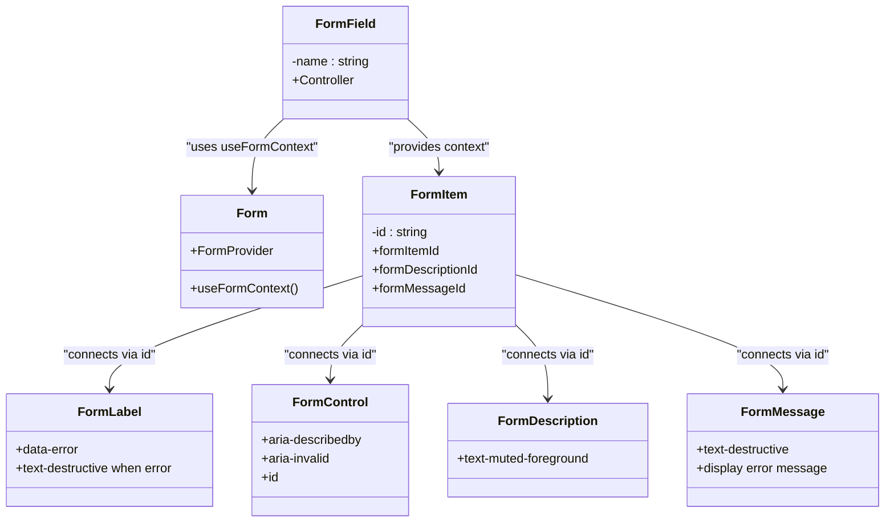
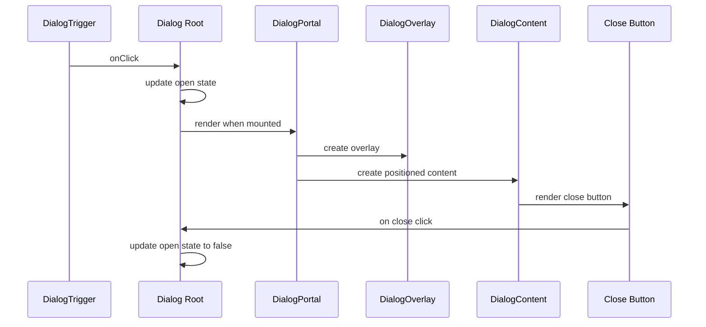

# UI Component Library

<cite>
**Referenced Files in This Document**   
- [button.tsx](file://src/components/ui/button.tsx)
- [card.tsx](file://src/components/ui/card.tsx)
- [form.tsx](file://src/components/ui/form.tsx)
- [input.tsx](file://src/components/ui/input.tsx)
- [textarea.tsx](file://src/components/ui/textarea.tsx)
- [label.tsx](file://src/components/ui/label.tsx)
- [select.tsx](file://src/components/ui/select.tsx)
- [dialog.tsx](file://src/components/ui/dialog.tsx)
- [tabs.tsx](file://src/components/ui/tabs.tsx)
- [table.tsx](file://src/components/ui/table.tsx)
- [badge.tsx](file://src/components/ui/badge.tsx)
- [avatar.tsx](file://src/components/ui/avatar.tsx)
- [separator.tsx](file://src/components/ui/separator.tsx)
- [contact-message-modal.tsx](file://src/components/admin/contact-message-modal.tsx)
- [quote-request-modal.tsx](file://src/components/modals/quote-request-modal.tsx)
- [theme-provider.tsx](file://src/components/theme-provider.tsx)
</cite>

## Table of Contents
1. [Introduction](#introduction)
2. [Core Components](#core-components)
3. [Form Components and Validation](#form-components-and-validation)
4. [Modal and Dialog Components](#modal-and-dialog-components)
5. [Data Display Components](#data-display-components)
6. [Theming and Styling System](#theming-and-styling-system)
7. [Usage Examples](#usage-examples)
8. [Best Practices and Guidelines](#best-practices-and-guidelines)

## Introduction
This document provides comprehensive documentation for the UI Component Library used in the application. The library is built on top of Radix UI primitives and enhanced with Tailwind CSS for styling. It follows a wrapper pattern to provide consistent design system implementation across the application. The components are designed to be accessible, responsive, and easily customizable while maintaining design integrity.

The component library is organized in the `src/components/ui/` directory and includes primitive components such as Button, Card, Form, Table, Tabs, Dialog, and others. These components are then used to build higher-level components in various feature directories like admin, modals, and landing pages.

**Section sources**
- [button.tsx](file://src/components/ui/button.tsx#L1-L60)
- [card.tsx](file://src/components/ui/card.tsx#L1-L92)

## Core Components

### Button Component
The Button component is a wrapper around Radix UI's primitive that provides multiple variants and sizes through Tailwind CSS classes. It uses `class-variance-authority` (cva) to define variants and supports the `asChild` prop to render different underlying elements while maintaining consistent styling.

Key features:
- Variants: default, destructive, outline, secondary, ghost, link
- Sizes: default, sm, lg, icon, icon-sm, icon-lg
- Accessibility: focus states, disabled states, ARIA-invalid handling
- Responsive: consistent behavior across device sizes

The component applies consistent focus and hover states, with special attention to accessibility requirements including proper focus visibility and keyboard navigation.

**Section sources**
- [button.tsx](file://src/components/ui/button.tsx#L1-L60)

### Card Component
The Card component provides a container for grouping related content with a consistent visual treatment. It includes several sub-components for structured content layout:

- Card: Main container with border, shadow, and padding
- CardHeader: Top section for titles and actions
- CardTitle: Primary heading within the card
- CardDescription: Secondary text providing context
- CardAction: Right-aligned action element in the header
- CardContent: Main content area
- CardFooter: Bottom section for additional actions

The card uses a grid layout in the header to support both title/description and action elements, with responsive behavior through Tailwind's container queries.

**Section sources**
- [card.tsx](file://src/components/ui/card.tsx#L1-L92)

### Input and Textarea Components
The Input and Textarea components provide styled form controls with consistent styling and accessibility features. Both components include:

- Focus states with visible indicators
- Error states with visual feedback
- Disabled states with reduced opacity
- Proper spacing and typography
- Support for accessibility attributes

The styling ensures consistent appearance across different browsers and includes special handling for selection states and placeholder text. The components respond to the `aria-invalid` attribute to provide visual feedback for validation errors.

**Section sources**
- [input.tsx](file://src/components/ui/input.tsx#L1-L21)
- [textarea.tsx](file://src/components/ui/textarea.tsx#L1-L18)

## Form Components and Validation

### Form Component Architecture
The form components are built to integrate seamlessly with React Hook Form and provide a structured approach to form handling. The implementation includes:

- Form: Wrapper component that provides context for form state
- FormField: Connects individual fields to React Hook Form's controller
- FormItem: Groups related form elements (label, control, description, message)
- FormLabel: Accessible label with error state handling
- FormControl: Wrapper for form inputs that manages accessibility attributes
- FormDescription: Helper text for additional context
- FormMessage: Displays validation errors and other messages

The form system uses React context to propagate field state (including errors) from FormField to the associated FormLabel, FormControl, FormDescription, and FormMessage components.

**Diagram sources**
- [form.tsx](file://src/components/ui/form.tsx#L1-L167)

### Select Component
The Select component is a comprehensive wrapper around Radix UI's select primitive with multiple configuration options. Key features include:

- Multiple positioning strategies: popper and item-aligned
- Scroll buttons for long lists
- Custom item indicators with SVG checkmarks
- Portal rendering to avoid z-index and overflow issues
- Accessibility: keyboard navigation, ARIA attributes, focus management

The component provides several export variants for different use cases:
- SelectContent: Default popper positioning
- SelectContentItemAligned: Alternative positioning
- SelectContentPopper: Explicit popper positioning
- Various separator and item variants for different contexts

**Section sources**
- [select.tsx](file://src/components/ui/select.tsx#L1-L308)

## Modal and Dialog Components

### Dialog Component
The Dialog component provides a modal interface with several sub-components:

- Dialog: Root component managing open state
- DialogTrigger: Element that opens the dialog
- DialogPortal: Renders content into document body
- DialogOverlay: Semi-transparent overlay behind the dialog
- DialogContent: Main dialog container with positioning
- DialogHeader: Top section with title and description
- DialogFooter: Bottom section for actions
- DialogTitle: Primary heading
- DialogDescription: Secondary text

The implementation includes a mount state check to prevent server-client mismatch issues and ensure proper portal rendering. The dialog has a close button with proper screen reader accessibility (sr-only text) and supports custom close behavior.

**Diagram sources**
- [dialog.tsx](file://src/components/ui/dialog.tsx#L1-L158)

### Usage in Modals
The dialog components are used extensively in modal implementations throughout the application. Two examples demonstrate different use cases:

#### Contact Message Modal
Used in the admin interface to display detailed information about contact messages. Features include:
- Structured data display with icons
- Status badges with color coding
- PDF export functionality
- Responsive layout with scrollable content

#### Quote Request Modal
Used in the client interface for service inquiries. Features include:
- Form integration with client-side submission
- Loading states during submission
- Toast notifications for feedback
- Gradient styling for visual appeal

**Section sources**
- [contact-message-modal.tsx](file://src/components/admin/contact-message-modal.tsx#L1-L168)
- [quote-request-modal.tsx](file://src/components/modals/quote-request-modal.tsx#L1-L194)

## Data Display Components

### Table Component
The Table component provides a styled wrapper for tabular data with several sub-components:

- Table: Main container with responsive overflow
- TableHeader: Header row container
- TableBody: Body row container
- TableFooter: Footer row container
- TableHead: Header cells
- TableRow: Row container
- TableCell: Data cells
- TableCaption: Table caption

The implementation includes responsive behavior with horizontal scrolling on smaller screens. Table rows have hover states and selection states for interactive tables. The component uses data attributes for styling rather than class names, allowing for consistent styling through the data-slot attribute.

**Section sources**
- [table.tsx](file://src/components/ui/table.tsx#L1-L116)

### Tabs Component
The Tabs component provides a navigation interface for switching between content panels. Features include:

- Keyboard navigation support
- Visual indication of active tab
- Consistent focus states
- Responsive layout
- Smooth transitions between states

The tabs use a segmented control style with a subtle background for inactive tabs and a solid background for the active tab. The component handles focus visibility and provides proper ARIA attributes for screen readers.

**Section sources**
- [tabs.tsx](file://src/components/ui/tabs.tsx#L1-L66)

### Badge and Avatar Components
The Badge component provides small status indicators with several variants:
- Default: Primary color
- Secondary: Secondary color
- Destructive: Error/warning state
- Outline: Border-only style

Badges support anchor elements with hover states and can contain icons.

The Avatar component provides user/profile images with fallback text when images are unavailable. It includes:
- Avatar: Container with rounded shape
- AvatarImage: Image element
- AvatarFallback: Fallback text/content

Both components are designed to be accessible and responsive.

**Section sources**
- [badge.tsx](file://src/components/ui/badge.tsx#L1-L46)
- [avatar.tsx](file://src/components/ui/avatar.tsx#L1-L53)

## Theming and Styling System

### Theme Provider
The application uses a theme provider to manage color schemes and ensure consistency across components. The theme is implemented using CSS variables that are defined for both light and dark modes. Components access these variables through Tailwind's theme configuration.

The theme provider handles:
- Dark mode toggling
- Persistent theme preference storage
- System preference detection
- Consistent color application

### Styling Approach
The styling system combines several approaches:
- **Tailwind CSS**: Utility-first approach for rapid development
- **Class Variance Authority (CVA)**: For component variants and states
- **CSS Variables**: For theme colors and spacing
- **Data Attributes**: For styling based on component state

The `cn` utility function is used throughout components to merge class names safely, handling conditional classes and preventing duplication.

### Responsive Behavior
All components are designed to be responsive by default:
- Mobile-first approach
- Breakpoints at standard Tailwind thresholds
- Touch-friendly target sizes
- Appropriate spacing on all device sizes

Components use relative units and flexible layouts to adapt to different screen sizes. Container queries are used in some components (like CardHeader) to adjust layout based on available space rather than viewport width.

**Section sources**
- [theme-provider.tsx](file://src/components/theme-provider.tsx)
- [button.tsx](file://src/components/ui/button.tsx)
- [card.tsx](file://src/components/ui/card.tsx)

## Usage Examples

### Form Integration Example
The Quote Request Modal demonstrates form integration with React Hook Form patterns:

1. Form element with handleSubmit handler
2. Input components with proper labeling
3. Client-side form submission with loading states
4. Error handling and user feedback
5. Form reset after successful submission

The form uses native HTML form behavior with proper accessibility attributes and keyboard navigation.

### Data Display Example
The Contact Message Modal shows structured data display:

1. Dialog for modal presentation
2. Header with title and description
3. Scrollable content area
4. Structured information with icons
5. Footer with action buttons
6. Badge components for status display

The layout uses a consistent spacing system and visual hierarchy to make information easily scannable.

**Section sources**
- [quote-request-modal.tsx](file://src/components/modals/quote-request-modal.tsx#L1-L194)
- [contact-message-modal.tsx](file://src/components/admin/contact-message-modal.tsx#L1-L168)

## Best Practices and Guidelines

### Consuming Components
When using components from the library:

1. Import from the UI directory: `@/components/ui/[component]`
2. Use appropriate variants for context
3. Provide accessible labels and descriptions
4. Handle loading and error states
5. Ensure keyboard navigability

### Extending Components
To extend components while maintaining design system integrity:

1. Create new components in feature directories rather than modifying base components
2. Use composition over inheritance when possible
3. Maintain consistent spacing and typography
4. Follow the same accessibility patterns
5. Use the same theme tokens for colors and spacing

### Accessibility Requirements
All components must meet the following accessibility standards:

- Keyboard navigable
- Screen reader friendly
- Sufficient color contrast
- Focus visible
- Proper ARIA attributes
- Semantic HTML structure

### Dark Mode Support
Components automatically support dark mode through:
- CSS variables for colors
- Prefers-color-scheme media queries
- Data attributes for state-based styling
- Consistent contrast ratios in both modes

The theme system ensures that all components adapt appropriately to the current color scheme without requiring component-level changes.

**Section sources**
- [button.tsx](file://src/components/ui/button.tsx)
- [form.tsx](file://src/components/ui/form.tsx)
- [dialog.tsx](file://src/components/ui/dialog.tsx)
- [theme-provider.tsx](file://src/components/theme-provider.tsx)