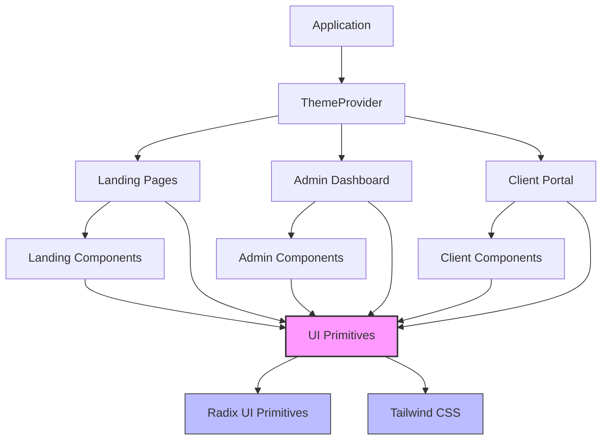
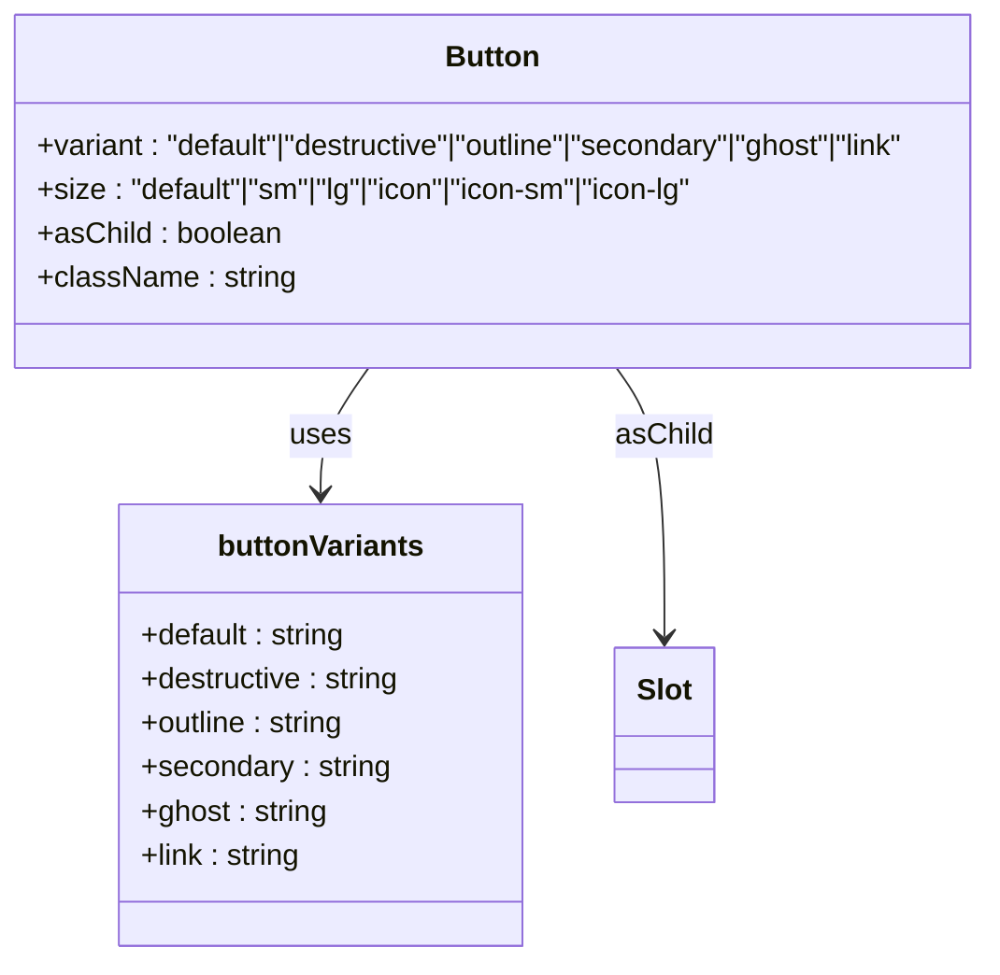
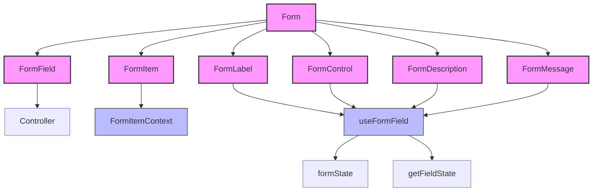
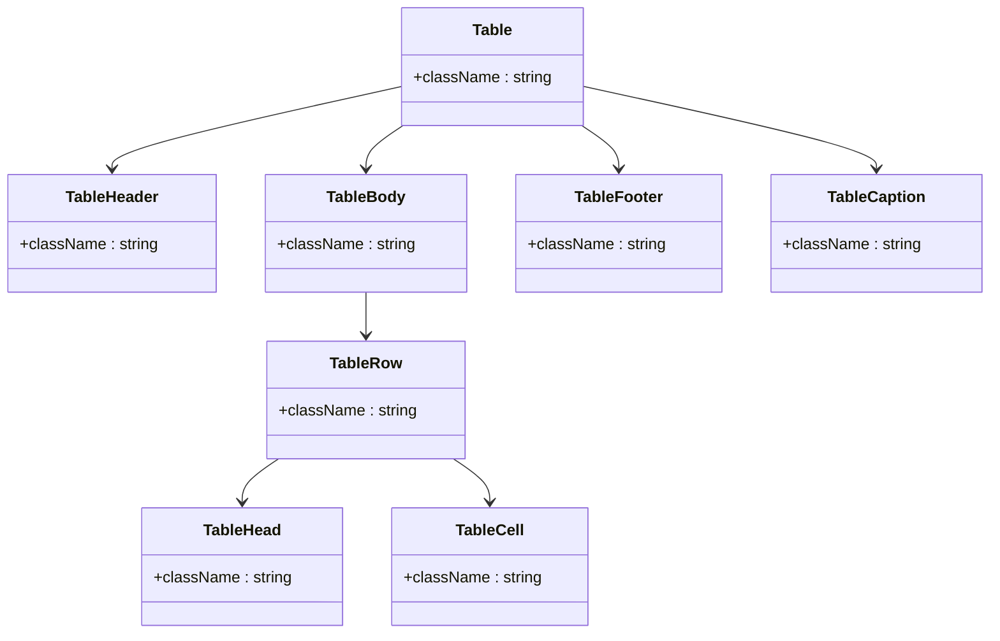
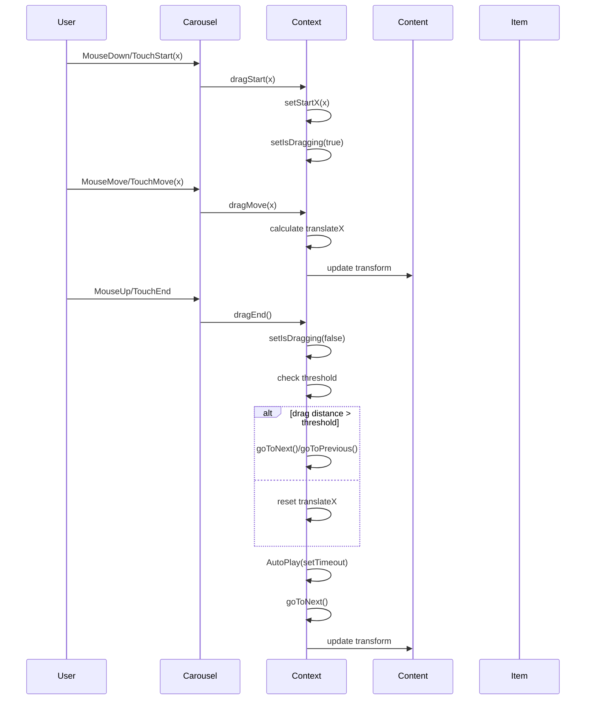
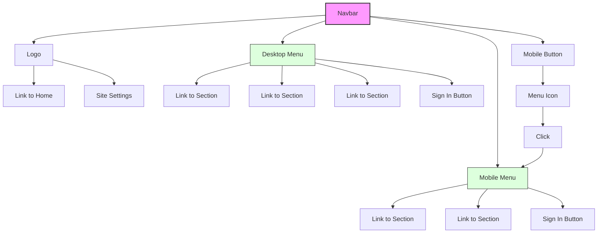
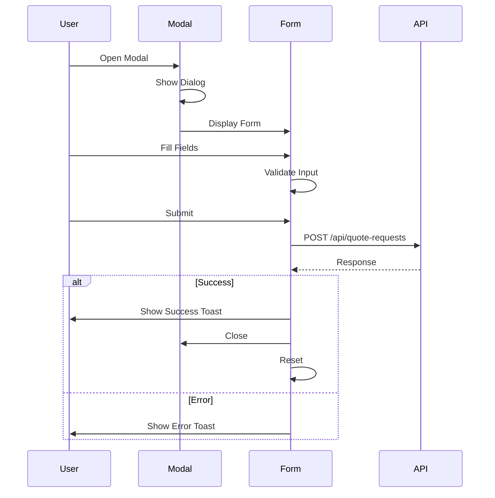
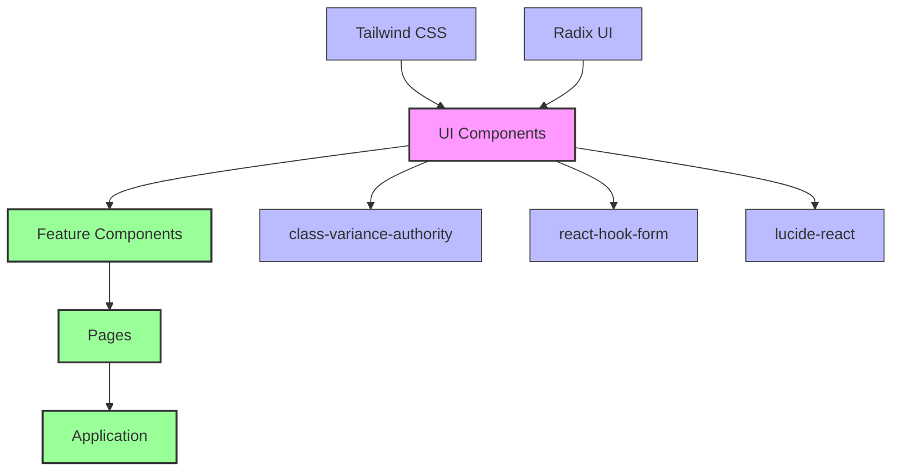

# User Interfaces

<cite>
**Referenced Files in This Document**   
- [button.tsx](file://src/components/ui/button.tsx)
- [card.tsx](file://src/components/ui/card.tsx)
- [form.tsx](file://src/components/ui/form.tsx)
- [table.tsx](file://src/components/ui/table.tsx)
- [carousel.tsx](file://src/components/ui/carousel.tsx)
- [theme-provider.tsx](file://src/components/theme-provider.tsx)
- [dialog.tsx](file://src/components/ui/dialog.tsx)
- [input.tsx](file://src/components/ui/input.tsx)
- [select.tsx](file://src/components/ui/select.tsx)
- [switch.tsx](file://src/components/ui/switch.tsx)
- [navbar.tsx](file://src/components/landing/navbar.tsx)
- [about-tab.tsx](file://src/components/admin/content-tabs/about-tab.tsx)
- [client-logo-carousel.tsx](file://src/components/client/client-logo-carousel.tsx)
- [quote-request-modal.tsx](file://src/components/modals/quote-request-modal.tsx)
- [layout.tsx](file://src/app/layout.tsx)
</cite>

## Table of Contents
1. [Introduction](#introduction)
2. [Project Structure](#project-structure)
3. [Core Components](#core-components)
4. [Architecture Overview](#architecture-overview)
5. [Detailed Component Analysis](#detailed-component-analysis)
6. [Dependency Analysis](#dependency-analysis)
7. [Performance Considerations](#performance-considerations)
8. [Troubleshooting Guide](#troubleshooting-guide)
9. [Conclusion](#conclusion)

## Introduction
The smmm-system UI component system is a comprehensive design system built on modern React practices, Tailwind CSS, and Radix UI primitives. The system is organized by feature areas (admin, client, landing, modals, ui) and provides a consistent, accessible, and responsive user interface across the application. This documentation details the organization, implementation, and usage guidelines for the various UI components, with a focus on design patterns, accessibility, and theming.

## Project Structure

The UI components are organized in a feature-based structure within the `src/components` directory:

```mermaid
graph TD
A[components/] --> B[admin/]
A --> C[client/]
A --> D[dashboard/]
A --> E[landing/]
A --> F[modals/]
A --> G[ui/]
A --> H[theme-provider.tsx]
A --> I[dom-error-boundary.tsx]
A --> J[scroll-to-top.tsx]
A --> K[dynamic-favicon.tsx]
G --> G1[button.tsx]
G --> G2[card.tsx]
G --> G3[form.tsx]
G --> G4[table.tsx]
G --> G5[carousel.tsx]
G --> G6[dialog.tsx]
G --> G7[input.tsx]
G --> G8[select.tsx]
G --> G9[switch.tsx]
B --> B1[content-tabs/]
B --> B2[contact-message-modal.tsx]
B --> B3[edit-job-application-modal.tsx]
E --> E1[about-section.tsx]
E --> E2[contact-section.tsx]
E --> E3[hero-section.tsx]
E --> E4[institutions-section.tsx]
E --> E5[navbar.tsx]
E --> E6[services-section.tsx]
F --> F1[career-modal.tsx]
F --> F2[kvkk-modal.tsx]
F --> F3[quote-request-modal.tsx]
F --> F4[terms-modal.tsx]
```

**Diagram sources**
- [src/components/admin](file://src/components/admin)
- [src/components/client](file://src/components/client)
- [src/components/landing](file://src/components/landing)
- [src/components/modals](file://src/components/modals)
- [src/components/ui](file://src/components/ui)

**Section sources**
- [src/components](file://src/components)

## Core Components

The UI component system is built around a set of core components in the `src/components/ui` directory that serve as the foundation for the entire application's user interface. These components are based on Radix UI primitives and styled with Tailwind CSS, providing a consistent, accessible, and customizable design system. The core components include buttons, cards, forms, tables, carousels, dialogs, inputs, selects, and switches, each designed with accessibility, responsiveness, and theming in mind.

**Section sources**
- [src/components/ui/button.tsx](file://src/components/ui/button.tsx)
- [src/components/ui/card.tsx](file://src/components/ui/card.tsx)
- [src/components/ui/form.tsx](file://src/components/ui/form.tsx)
- [src/components/ui/table.tsx](file://src/components/ui/table.tsx)

## Architecture Overview

The UI architecture follows a layered approach with atomic design principles, where primitive components in the `ui` directory are composed into more complex feature-specific components. The system leverages React's composition model, context API, and hooks to provide a flexible and maintainable component system. Theming is handled through the `theme-provider.tsx` component, which wraps the entire application and provides theme context to all components.

**Diagram sources**
- [src/components/theme-provider.tsx](file://src/components/theme-provider.tsx)
- [src/app/layout.tsx](file://src/app/layout.tsx)
- [src/components/ui](file://src/components/ui)

## Detailed Component Analysis

### Button Component Analysis
The Button component is a versatile UI primitive that supports multiple variants, sizes, and states. It uses the `class-variance-authority` (cva) library to define variants and the `Slot` component from Radix UI to support the `asChild` prop for seamless integration with other components.

**Diagram sources**
- [src/components/ui/button.tsx](file://src/components/ui/button.tsx)

**Section sources**
- [src/components/ui/button.tsx](file://src/components/ui/button.tsx)

### Form Component Analysis
The Form component is built on `react-hook-form` and provides a structured way to handle form state, validation, and submission. It uses React context to manage form field state and provides accessible labels, descriptions, and error messages.

**Diagram sources**
- [src/components/ui/form.tsx](file://src/components/ui/form.tsx)

**Section sources**
- [src/components/ui/form.tsx](file://src/components/ui/form.tsx)

### Table Component Analysis
The Table component provides a responsive and accessible table implementation with support for headers, footers, and pagination. It wraps the native table element with a scrollable container and applies consistent styling.

**Diagram sources**
- [src/components/ui/table.tsx](file://src/components/ui/table.tsx)

**Section sources**
- [src/components/ui/table.tsx](file://src/components/ui/table.tsx)

### Carousel Component Analysis
The Carousel component is a complex, interactive component that supports touch gestures, keyboard navigation, autoplay, and continuous flow. It uses React context to manage state and provides error boundaries for robustness.

**Diagram sources**
- [src/components/ui/carousel.tsx](file://src/components/ui/carousel.tsx)

**Section sources**
- [src/components/ui/carousel.tsx](file://src/components/ui/carousel.tsx)

### Navigation Bar Analysis
The landing page navigation bar is a responsive component that adapts to different screen sizes, showing a horizontal menu on desktop and a collapsible menu on mobile devices.

**Diagram sources**
- [src/components/landing/navbar.tsx](file://src/components/landing/navbar.tsx)

**Section sources**
- [src/components/landing/navbar.tsx](file://src/components/landing/navbar.tsx)

### Modal Component Analysis
The quote request modal demonstrates the use of the Dialog component for collecting user information with form validation and submission handling.

**Diagram sources**
- [src/components/modals/quote-request-modal.tsx](file://src/components/modals/quote-request-modal.tsx)

**Section sources**
- [src/components/modals/quote-request-modal.tsx](file://src/components/modals/quote-request-modal.tsx)

## Dependency Analysis

The UI component system has a clear dependency hierarchy, with primitive components depending on Radix UI and Tailwind CSS, and feature components depending on the primitive components.

**Diagram sources**
- [package.json](file://package.json)
- [src/components/ui](file://src/components/ui)

**Section sources**
- [package.json](file://package.json)
- [src/components/ui](file://src/components/ui)

## Performance Considerations
The UI components are optimized for performance through several techniques:
- Use of React.memo for components that don't need to re-render frequently
- Proper cleanup of event listeners and timeouts in useEffect hooks
- Efficient state management with React context and useState
- Lazy loading of images in the carousel component
- Debouncing and throttling for expensive operations
- Proper handling of component unmounting to prevent memory leaks

The carousel component, in particular, implements several performance optimizations including requestAnimationFrame for smooth animations, proper cleanup of timeouts and animation frames, and memoization of expensive calculations.

## Troubleshooting Guide

Common issues and solutions for the UI components:

1. **Component not rendering**: Ensure the component is properly imported and the required dependencies are installed.
2. **Styling issues**: Check that Tailwind CSS is properly configured and the class names are correct.
3. **Accessibility problems**: Verify that all interactive elements have proper ARIA attributes and keyboard navigation works.
4. **Form validation not working**: Ensure react-hook-form is properly configured and the form components are correctly set up.
5. **Theme not applying**: Check that the ThemeProvider wraps the entire application and the theme attributes are correctly set.

For debugging, use the browser's developer tools to inspect the component hierarchy, check for console errors, and verify the applied CSS classes.

**Section sources**
- [src/components/ui](file://src/components/ui)
- [src/components/theme-provider.tsx](file://src/components/theme-provider.tsx)

## Conclusion
The smmm-system UI component system provides a robust, accessible, and maintainable foundation for the application's user interface. By following atomic design principles and leveraging modern React patterns, the system enables consistent and efficient UI development across different feature areas. The combination of Tailwind CSS for styling and Radix UI for accessible primitives ensures a high-quality user experience, while the theming system allows for easy customization and dark mode support.