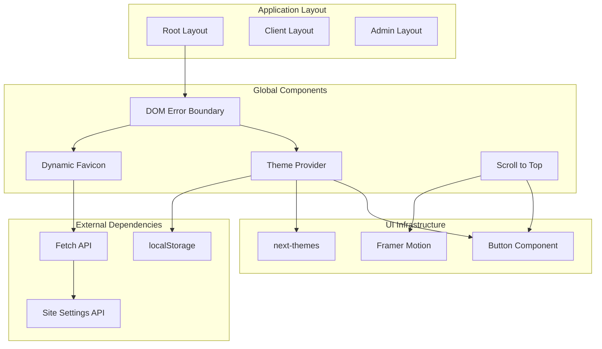
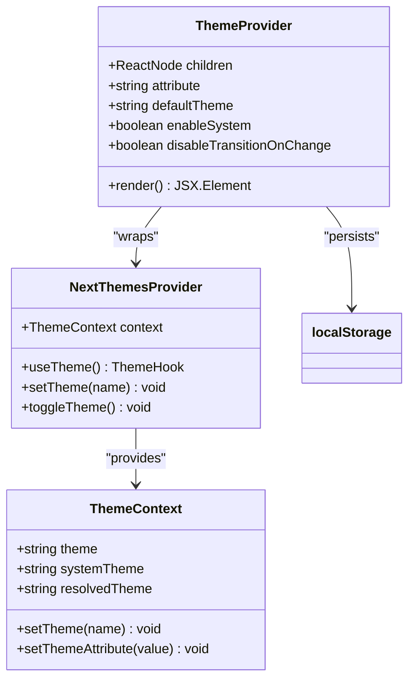
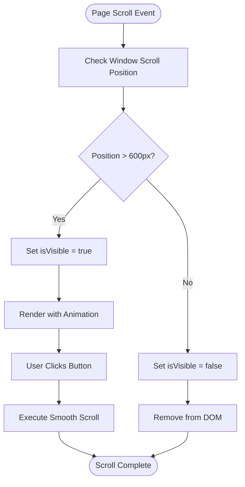
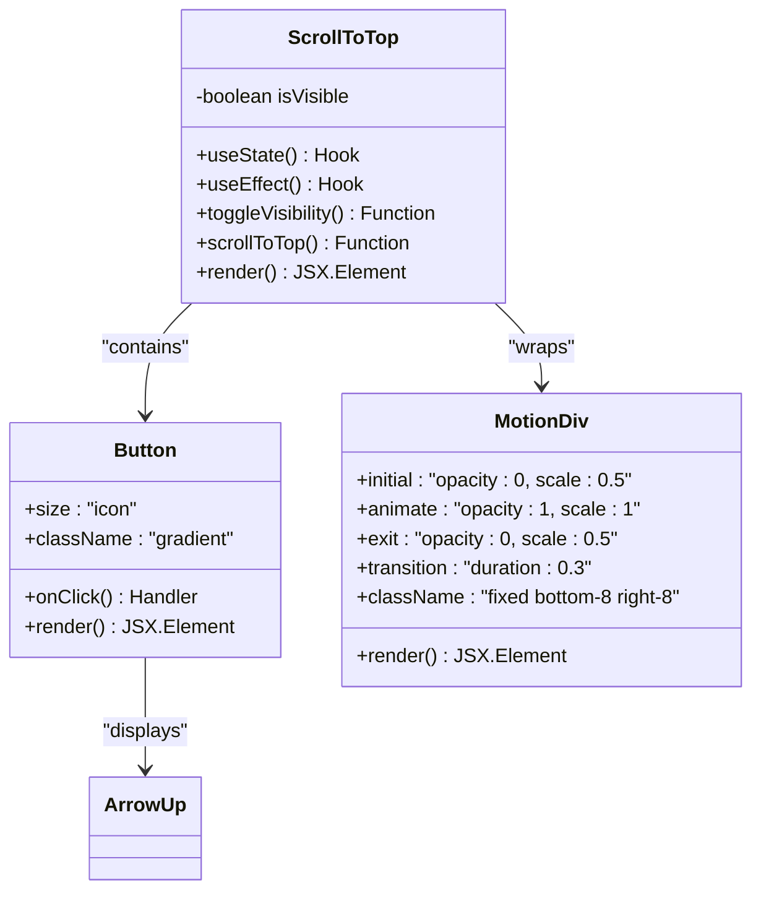
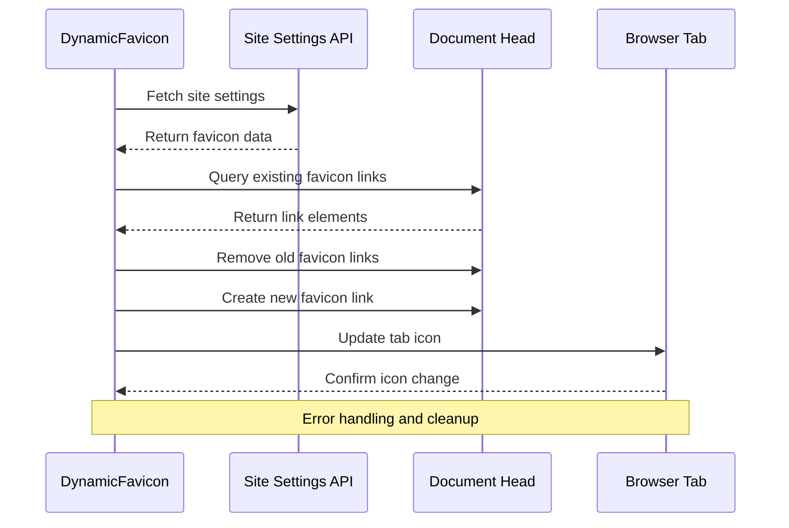
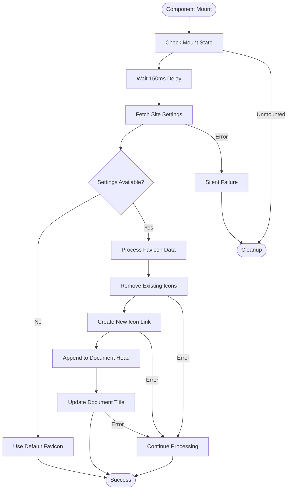
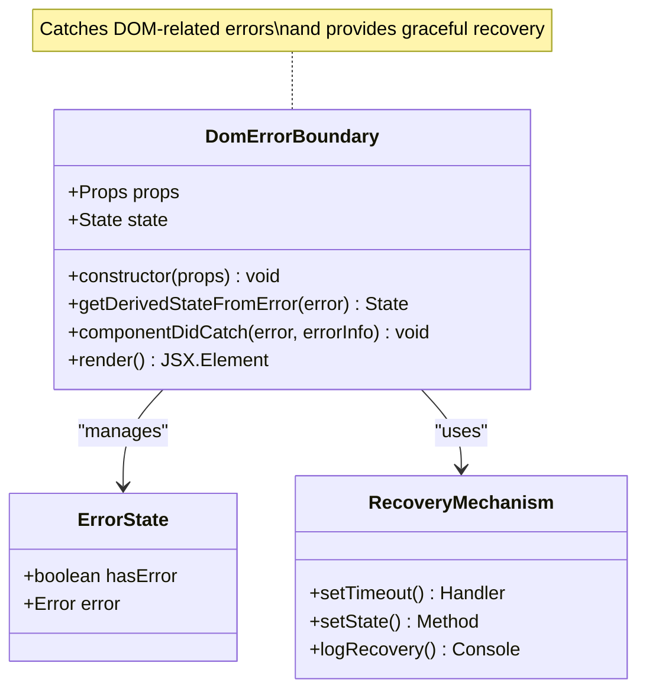
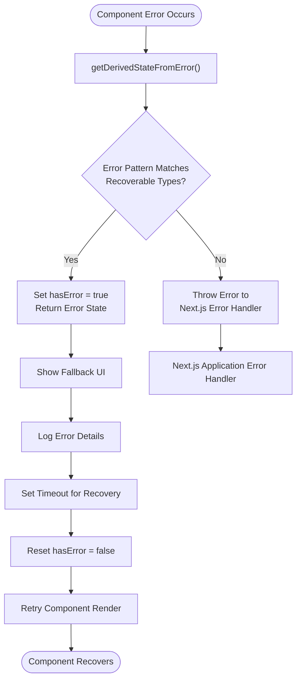
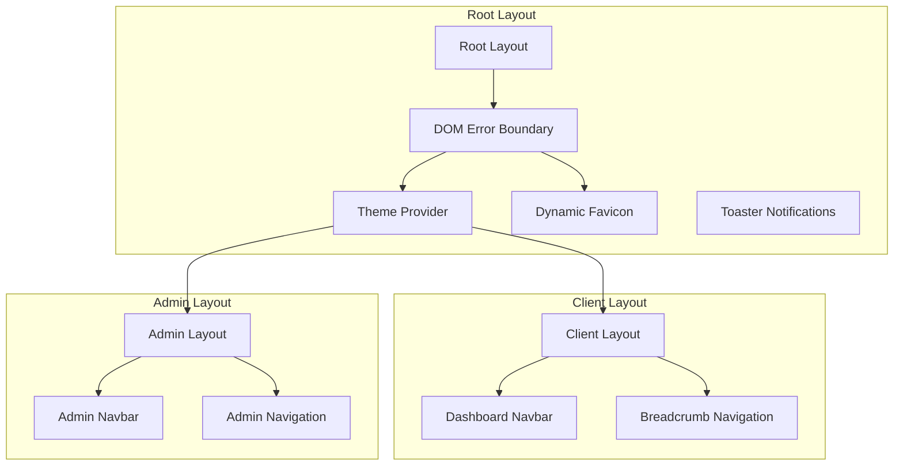

# Utility and Global Components

<cite>
**Referenced Files in This Document**
- [theme-provider.tsx](file://src/components/theme-provider.tsx)
- [scroll-to-top.tsx](file://src/components/scroll-to-top.tsx)
- [dynamic-favicon.tsx](file://src/components/dynamic-favicon.tsx)
- [dom-error-boundary.tsx](file://src/components/dom-error-boundary.tsx)
- [layout.tsx](file://src/app/layout.tsx)
- [client/layout.tsx](file://src/app/client/layout.tsx)
- [admin/layout.tsx](file://src/app/admin/layout.tsx)
- [button.tsx](file://src/components/ui/button.tsx)
- [globals.css](file://src/app/globals.css)
- [site-settings/route.ts](file://src/app/api/content/site-settings/route.ts)
- [package.json](file://package.json)
</cite>

## Table of Contents
1. [Introduction](#introduction)
2. [Component Architecture Overview](#component-architecture-overview)
3. [Theme Provider Component](#theme-provider-component)
4. [Scroll to Top Component](#scroll-to-top-component)
5. [Dynamic Favicon Component](#dynamic-favicon-component)
6. [DOM Error Boundary Component](#dom-error-boundary-component)
7. [Integration Patterns](#integration-patterns)
8. [Performance Considerations](#performance-considerations)
9. [Troubleshooting Guide](#troubleshooting-guide)
10. [Best Practices](#best-practices)

## Introduction

The utility and global components in this Next.js application provide essential functionality for enhancing user experience and application stability. These components work together to create a cohesive, responsive, and resilient web application that adapts to user preferences while maintaining robust error handling and performance optimization.

The four core utility components include:
- **Theme Provider**: Manages dark/light mode switching with localStorage persistence
- **Scroll to Top**: Provides intuitive navigation with smooth scrolling behavior
- **Dynamic Favicon**: Automatically updates the browser tab icon based on theme and content
- **DOM Error Boundary**: Isolates component-level errors to prevent application crashes

These components demonstrate modern React patterns including context providers, custom hooks, lifecycle management, and error boundaries, serving as excellent examples of utility-first development approaches.

## Component Architecture Overview

The utility components are designed with a modular architecture that promotes reusability and maintainability. Each component serves a specific purpose while integrating seamlessly with the broader application ecosystem.

**Diagram sources**
- [layout.tsx](file://src/app/layout.tsx#L25-L40)
- [theme-provider.tsx](file://src/components/theme-provider.tsx#L1-L12)
- [dom-error-boundary.tsx](file://src/components/dom-error-boundary.tsx#L1-L64)
- [dynamic-favicon.tsx](file://src/components/dynamic-favicon.tsx#L1-L115)
- [scroll-to-top.tsx](file://src/components/scroll-to-top.tsx#L1-L57)

## Theme Provider Component

The Theme Provider component serves as the central hub for managing application-wide theme preferences, enabling seamless transitions between light and dark modes with persistent storage capabilities.

### Implementation Architecture

The Theme Provider leverages the `next-themes` library to provide a robust theming solution that handles both system preference detection and manual theme switching.

**Diagram sources**
- [theme-provider.tsx](file://src/components/theme-provider.tsx#L6-L11)

### Key Features

#### Context-Based Theme Management
The component utilizes React context to provide theme state throughout the application hierarchy, ensuring consistent theme application across all components without prop drilling.

#### Persistent Storage Integration
Theme preferences are automatically persisted to `localStorage`, allowing users to maintain their preferred theme across sessions and browser restarts.

#### System Theme Detection
The provider intelligently detects the user's system theme preference and offers automatic switching between light and dark modes based on system settings.

#### Smooth Transitions
CSS transitions are disabled during theme changes to prevent visual artifacts, ensuring clean theme switches without flickering effects.

### Configuration Options

| Option | Type | Default | Description |
|--------|------|---------|-------------|
| `attribute` | string | `"class"` | HTML attribute to apply theme classes |
| `defaultTheme` | string | `"light"` | Default theme when no preference is set |
| `enableSystem` | boolean | `true` | Enable system theme detection |
| `disableTransitionOnChange` | boolean | `true` | Disable CSS transitions during theme changes |

**Section sources**
- [theme-provider.tsx](file://src/components/theme-provider.tsx#L1-L12)
- [layout.tsx](file://src/app/layout.tsx#L32-L36)

## Scroll to Top Component

The Scroll to Top component enhances user navigation by providing an intuitive way to return to the top of long pages, featuring sophisticated visibility logic and smooth scrolling behavior.

### Visibility Logic Implementation

The component implements intelligent visibility detection based on scroll position thresholds and viewport awareness.

**Diagram sources**
- [scroll-to-top.tsx](file://src/components/scroll-to-top.tsx#L8-L20)

### Technical Implementation Details

#### Scroll Position Detection
The component uses a threshold of 600 pixels to determine when the scroll-to-top button should become visible, balancing usability with minimal interface clutter.

#### Animation Integration
Framer Motion provides smooth entrance and exit animations with configurable timing and easing functions, enhancing the user experience with subtle visual feedback.

#### Memory Management
Event listeners are properly cleaned up using the `useEffect` cleanup function, preventing memory leaks in long-running applications.

### Component Structure

**Diagram sources**
- [scroll-to-top.tsx](file://src/components/scroll-to-top.tsx#L22-L56)
- [button.tsx](file://src/components/ui/button.tsx#L1-L61)

### Styling and Animation Features

The component features a gradient background transitioning from blue to cyan on hover, with shadow enhancements for depth perception. The animation system provides smooth scaling and opacity transitions, creating a polished user experience.

**Section sources**
- [scroll-to-top.tsx](file://src/components/scroll-to-top.tsx#L1-L57)
- [button.tsx](file://src/components/ui/button.tsx#L1-L61)

## Dynamic Favicon Component

The Dynamic Favicon component provides intelligent favicon management by dynamically updating the browser tab icon based on theme preferences and content settings, ensuring visual consistency across different application states.

### Advanced Favicon Management Architecture

The component implements a sophisticated favicon update system with error handling, mounting state management, and safe DOM manipulation practices.

**Diagram sources**
- [dynamic-favicon.tsx](file://src/components/dynamic-favicon.tsx#L15-L114)
- [site-settings/route.ts](file://src/app/api/content/site-settings/route.ts#L1-L118)

### Safety and Reliability Features

#### Mount State Management
The component uses a ref-based mounting state to prevent DOM modifications after component unmounting, avoiding potential memory leaks and browser warnings.

#### Graceful Error Handling
Multiple layers of error handling ensure that favicon updates don't crash the application, with silent failure modes for network errors and DOM manipulation failures.

#### Safe DOM Operations
The component implements defensive programming practices, checking for DOM availability and element existence before attempting modifications.

### Favicon Update Process

**Diagram sources**
- [dynamic-favicon.tsx](file://src/components/dynamic-favicon.tsx#L15-L114)

### Content Delivery Optimization

The component implements intelligent caching strategies by appending timestamps to favicon URLs, ensuring browsers fetch the latest version while minimizing unnecessary requests.

**Section sources**
- [dynamic-favicon.tsx](file://src/components/dynamic-favicon.tsx#L1-L115)
- [site-settings/route.ts](file://src/app/api/content/site-settings/route.ts#L1-L118)

## DOM Error Boundary Component

The DOM Error Boundary component provides robust error isolation and recovery mechanisms for component-level failures, preventing cascading errors and maintaining application stability.

### Error Boundary Architecture

The component implements a sophisticated error handling system that distinguishes between recoverable DOM errors and critical application errors.

**Diagram sources**
- [dom-error-boundary.tsx](file://src/components/dom-error-boundary.tsx#L8-L63)

### Error Classification and Recovery

#### Recoverable Error Patterns
The component specifically targets common DOM manipulation errors that occur during React hydration and rendering, including:
- `removeChild` operation failures
- `appendChild` operation failures  
- `insertBefore` operation failures
- Null reference errors (`Cannot read properties of null`)
- `NotFoundError` exceptions
- `TypeError` exceptions

#### Recovery Strategy
When recoverable errors are detected, the component implements a soft recovery mechanism that:
1. Logs the error for debugging purposes
2. Temporarily displays a fallback UI
3. Attempts to reset the component state
4. Retries rendering after a brief delay

### Error Handling Flow

**Diagram sources**
- [dom-error-boundary.tsx](file://src/components/dom-error-boundary.tsx#L15-L45)

### Fallback UI Design

The component provides a customizable fallback UI that displays a loading message while attempting recovery. The default fallback includes proper styling for consistent visual appearance.

**Section sources**
- [dom-error-boundary.tsx](file://src/components/dom-error-boundary.tsx#L1-L64)

## Integration Patterns

The utility components are strategically integrated into the application layout to maximize their effectiveness while maintaining clean separation of concerns.

### Layout Integration Strategy

**Diagram sources**
- [layout.tsx](file://src/app/layout.tsx#L25-L40)
- [client/layout.tsx](file://src/app/client/layout.tsx#L1-L133)
- [admin/layout.tsx](file://src/app/admin/layout.tsx#L1-L144)

### Component Placement Guidelines

#### Theme Provider Integration
The Theme Provider wraps the entire application content, ensuring theme context is available throughout the component tree. It's positioned immediately after the Dynamic Favicon component to maintain proper initialization order.

#### Error Boundary Positioning
The DOM Error Boundary serves as the outermost wrapper, catching errors from all child components and providing graceful degradation. It's placed at the root level to intercept errors from any part of the application.

#### Dynamic Favicon Setup
The Dynamic Favicon component is placed inside the Error Boundary to ensure favicon updates don't cause application crashes. It runs during component initialization to establish the proper favicon state early in the rendering process.

### Responsive Design Considerations

All utility components are designed with responsive principles in mind, adapting their behavior and appearance based on screen size and user interaction patterns.

**Section sources**
- [layout.tsx](file://src/app/layout.tsx#L25-L40)
- [client/layout.tsx](file://src/app/client/layout.tsx#L1-L133)
- [admin/layout.tsx](file://src/app/admin/layout.tsx#L1-L144)

## Performance Considerations

The utility components are optimized for performance with careful attention to memory management, event handling, and rendering efficiency.

### Memory Management Strategies

#### Event Listener Cleanup
The Scroll to Top component implements proper event listener cleanup using the `useEffect` cleanup function, preventing memory leaks in long-running applications.

#### Mount State Tracking
The Dynamic Favicon component uses ref-based mount state tracking to prevent DOM modifications after component unmounting, avoiding potential memory leaks and browser warnings.

#### Lazy Loading Implementation
Components are marked with `"use client"` directives to enable React's built-in lazy loading capabilities, reducing initial bundle sizes and improving startup performance.

### Rendering Optimization

#### Conditional Rendering
The Scroll to Top component uses conditional rendering with `AnimatePresence` to efficiently manage DOM elements, only rendering the button when needed.

#### Debounced Operations
The Dynamic Favicon component implements a 150ms delay before processing favicon updates, reducing the frequency of API calls and DOM manipulations.

#### Efficient State Updates
All components use efficient state update patterns, minimizing unnecessary re-renders and maintaining optimal performance under various load conditions.

### Bundle Size Optimization

The components leverage external libraries efficiently:
- `next-themes` for theme management (minimal footprint)
- `framer-motion` for animations (tree-shaken for unused features)
- `lucide-react` for icons (single icon imports for smaller bundles)

**Section sources**
- [scroll-to-top.tsx](file://src/components/scroll-to-top.tsx#L8-L20)
- [dynamic-favicon.tsx](file://src/components/dynamic-favicon.tsx#L5-L10)

## Troubleshooting Guide

Common issues and their solutions for the utility components, along with diagnostic approaches and preventive measures.

### Theme Provider Issues

#### Problem: Theme Not Persisting
**Symptoms:** Theme selection resets after page refresh
**Solution:** Verify `localStorage` is enabled in the browser and check for storage quota limitations
**Prevention:** Implement fallback storage mechanisms for environments with restricted storage access

#### Problem: System Theme Not Detected
**Symptoms:** Manual theme selection only works, system preference ignored
**Solution:** Check browser support for `prefers-color-scheme` media queries and ensure proper CSS variable definitions
**Prevention:** Test theme functionality across different browsers and devices

### Scroll to Top Component Problems

#### Problem: Button Appears Too Early/Late
**Symptoms:** Scroll-to-top button appears at inappropriate scroll positions
**Solution:** Adjust the 600px threshold in the visibility logic to match your page structure
**Prevention:** Consider page-specific configurations or dynamic threshold calculation based on viewport size

#### Problem: Smooth Scrolling Not Working
**Symptoms:** Instant jumps to top instead of smooth animation
**Solution:** Verify browser support for `behavior: 'smooth'` in `window.scrollTo()` and check for CSS conflicts
**Prevention:** Implement feature detection for smooth scrolling support

### Dynamic Favicon Issues

#### Problem: Favicon Not Updating
**Symptoms:** Browser tab icon remains unchanged despite content updates
**Solution:** Check API endpoint accessibility and verify favicon data format in site settings
**Prevention:** Implement error logging and fallback mechanisms for API failures

#### Problem: Multiple Favicon Links
**Symptoms:** Multiple favicon links appear in the document head
**Solution:** Review DOM manipulation logic and ensure proper cleanup of existing favicon elements
**Prevention:** Implement comprehensive DOM query and removal strategies

### DOM Error Boundary Problems

#### Problem: Errors Not Being Caught
**Symptoms:** Application crashes despite having error boundary in place
**Solution:** Verify the error boundary is positioned correctly in the component tree and check for errors in the boundary itself
**Prevention:** Implement comprehensive testing for error boundary functionality

#### Problem: Excessive Error Recovery Attempts
**Symptoms:** Component continuously attempts recovery without success
**Solution:** Review error classification logic and adjust recovery timeout intervals
**Prevention:** Implement exponential backoff strategies for repeated recovery attempts

**Section sources**
- [theme-provider.tsx](file://src/components/theme-provider.tsx#L1-L12)
- [scroll-to-top.tsx](file://src/components/scroll-to-top.tsx#L1-L57)
- [dynamic-favicon.tsx](file://src/components/dynamic-favicon.tsx#L1-L115)
- [dom-error-boundary.tsx](file://src/components/dom-error-boundary.tsx#L1-L64)

## Best Practices

Guidelines and recommendations for effectively utilizing and extending the utility components in your own projects.

### Theme Provider Best Practices

#### Configuration Management
- Use consistent theme configuration across all components
- Implement theme-aware styling for custom components
- Consider adding theme-specific animations and transitions

#### Accessibility Considerations
- Ensure sufficient color contrast in theme variations
- Provide alternative indicators for theme changes
- Test theme functionality with assistive technologies

### Scroll to Top Component Recommendations

#### User Experience Enhancements
- Customize the scroll threshold based on page content density
- Implement smooth scrolling with appropriate easing functions
- Consider adding keyboard accessibility for screen readers

#### Performance Optimizations
- Debounce scroll events for improved performance on mobile devices
- Implement virtual scrolling for very long pages
- Consider lazy loading for the scroll-to-top button on mobile devices

### Dynamic Favicon Implementation Guidelines

#### Content Strategy
- Maintain consistent favicon design across different themes
- Use meaningful icons that represent your brand or application
- Consider favicon variations for different application states

#### Technical Implementation
- Implement proper caching strategies for favicon assets
- Monitor favicon update performance and optimize API calls
- Ensure favicon accessibility for users with visual impairments

### Error Boundary Design Principles

#### Error Classification
- Implement comprehensive error categorization for different failure scenarios
- Provide meaningful fallback UIs that maintain user context
- Log errors appropriately for debugging without exposing sensitive information

#### Recovery Strategies
- Implement graceful degradation for non-critical functionality
- Provide clear user feedback during error recovery processes
- Consider implementing retry mechanisms for transient failures

### General Component Integration

#### Testing Strategies
- Implement comprehensive unit tests for all utility components
- Test component behavior across different browsers and devices
- Verify proper cleanup and memory management in long-running applications

#### Monitoring and Analytics
- Track component performance metrics and user interactions
- Monitor error rates and recovery success for error boundaries
- Collect user feedback on theme and navigation experiences

**Section sources**
- [theme-provider.tsx](file://src/components/theme-provider.tsx#L1-L12)
- [scroll-to-top.tsx](file://src/components/scroll-to-top.tsx#L1-L57)
- [dynamic-favicon.tsx](file://src/components/dynamic-favicon.tsx#L1-L115)
- [dom-error-boundary.tsx](file://src/components/dom-error-boundary.tsx#L1-L64)
- [layout.tsx](file://src/app/layout.tsx#L25-L40)