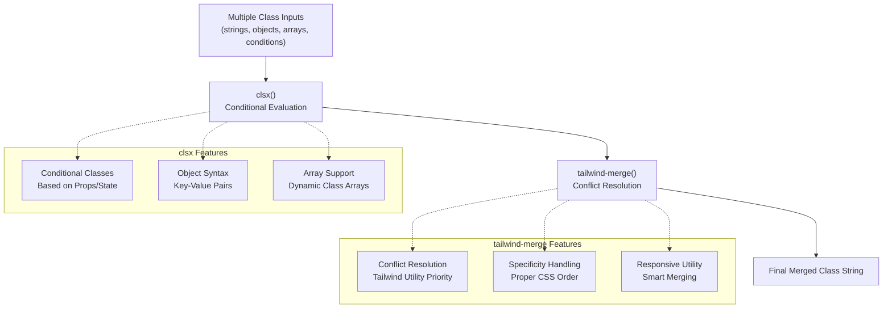
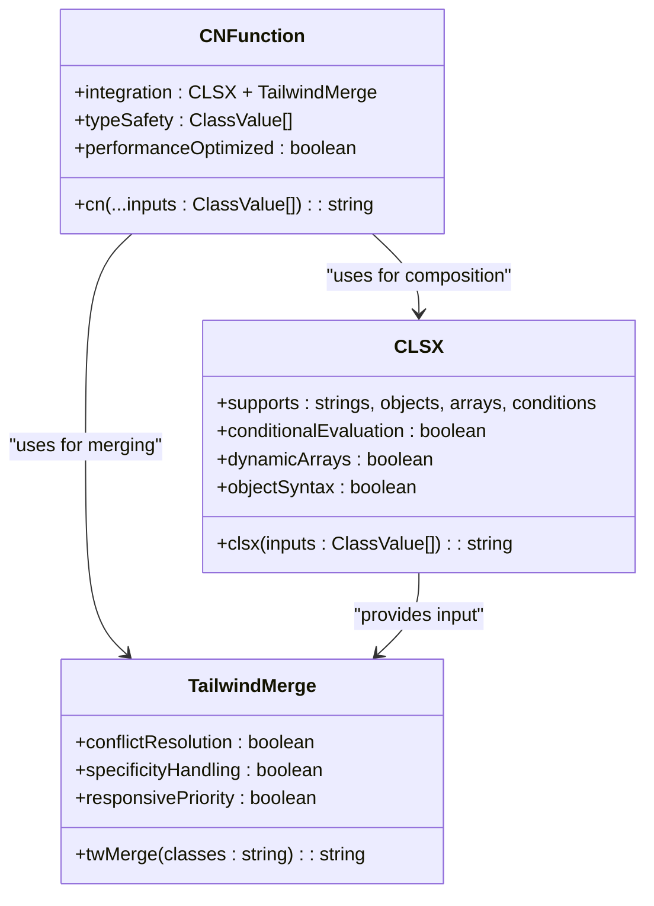
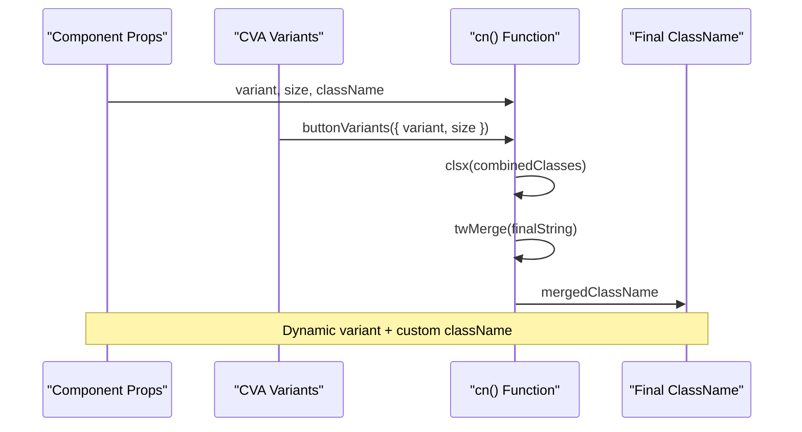
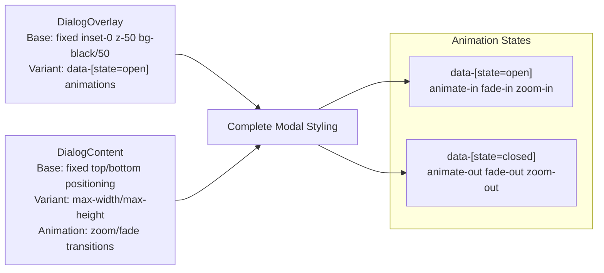
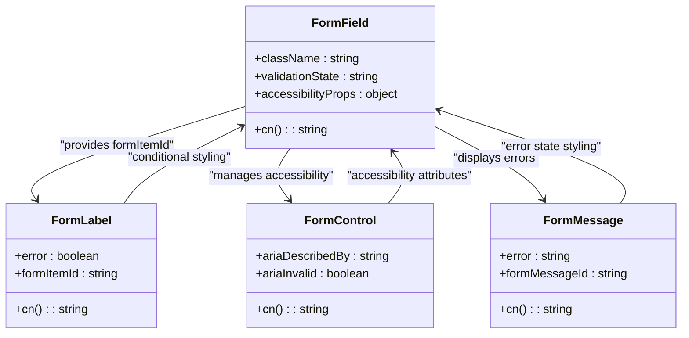
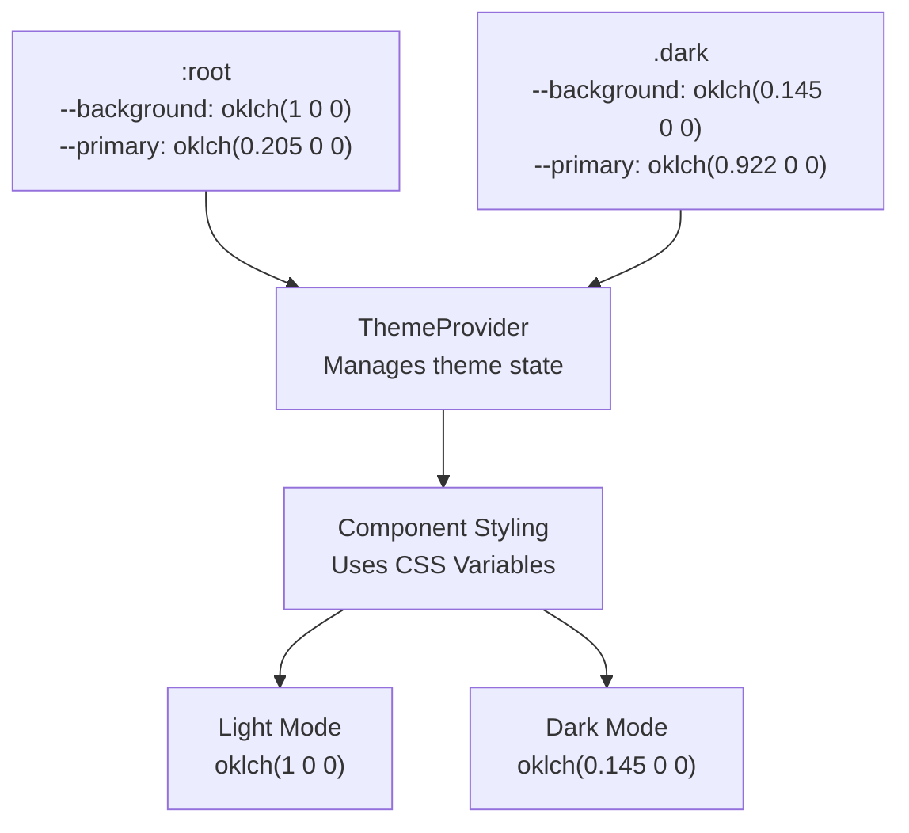
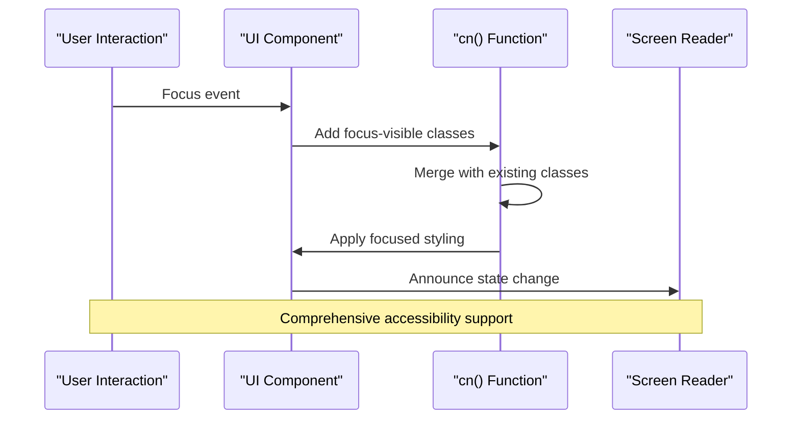

# Helper Utilities

<cite>
**Referenced Files in This Document**
- [utils.ts](file://src/lib/utils.ts)
- [button.tsx](file://src/components/ui/button.tsx)
- [card.tsx](file://src/components/ui/card.tsx)
- [dialog.tsx](file://src/components/ui/dialog.tsx)
- [form.tsx](file://src/components/ui/form.tsx)
- [badge.tsx](file://src/components/ui/badge.tsx)
- [avatar.tsx](file://src/components/ui/avatar.tsx)
- [select.tsx](file://src/components/ui/select.tsx)
- [quote-request-modal.tsx](file://src/components/modals/quote-request-modal.tsx)
- [theme-provider.tsx](file://src/components/theme-provider.tsx)
- [globals.css](file://src/app/globals.css)
- [package.json](file://package.json)
</cite>

## Table of Contents
1. [Introduction](#introduction)
2. [The cn() Function Architecture](#the-cn-function-architecture)
3. [Technical Implementation Details](#technical-implementation-details)
4. [Usage Patterns Across Components](#usage-patterns-across-components)
5. [Advanced Styling Scenarios](#advanced-styling-scenarios)
6. [Theme-Aware Component Design](#theme-aware-component-design)
7. [Accessibility and Responsive Design](#accessibility-and-responsive-design)
8. [Performance Considerations](#performance-considerations)
9. [Common Issues and Solutions](#common-issues-and-solutions)
10. [Best Practices and Guidelines](#best-practices-and-guidelines)
11. [Troubleshooting Guide](#troubleshooting-guide)
12. [Conclusion](#conclusion)

## Introduction

The helper utilities in this component library serve as the foundation for dynamic CSS class composition, with the `cn()` function standing out as the primary utility for safely concatenating Tailwind CSS class names. This utility combines the power of `clsx` for conditional class evaluation with `tailwind-merge` for intelligent conflict resolution, providing developers with a robust solution for building reusable UI components that maintain design system consistency while allowing for flexible customization.

The `cn()` function addresses critical challenges in modern React applications: managing complex class compositions, preventing CSS conflicts, ensuring proper specificity handling, and maintaining accessibility standards. By leveraging both libraries, it creates a seamless development experience that scales from simple components to complex interactive systems.

## The cn() Function Architecture

The `cn()` function represents a carefully engineered solution for class name composition in the component library. Its architecture demonstrates a thoughtful integration of two specialized tools, each addressing distinct aspects of class management.



**Diagram sources**
- [utils.ts](file://src/lib/utils.ts#L1-L6)

The function signature accepts a spread of `ClassValue[]` inputs, enabling flexible composition of classes from various sources including static strings, conditional evaluations, object-based class maps, and dynamic arrays. This design allows for sophisticated class composition patterns while maintaining type safety through TypeScript's `ClassValue` type.

**Section sources**
- [utils.ts](file://src/lib/utils.ts#L1-L6)

## Technical Implementation Details

The `cn()` function's implementation showcases elegant simplicity combined with powerful functionality. At its core, it leverages `clsx` for initial class composition and `tailwind-merge` for intelligent conflict resolution.

### clsx Integration for Conditional Class Evaluation

The `clsx` library provides the foundation for conditional class evaluation, supporting multiple input types and complex logical combinations. This enables developers to create components that adapt their styling based on props, state, and contextual conditions.



**Diagram sources**
- [utils.ts](file://src/lib/utils.ts#L1-L6)

### tailwind-merge for Intelligent Conflict Resolution

The `tailwind-merge` library handles the critical task of resolving conflicts between Tailwind utility classes. This ensures that when multiple classes target the same CSS property, the most appropriate one is selected based on Tailwind's utility priority system.

The merge process follows Tailwind's built-in precedence rules, automatically resolving conflicts between:
- **Size utilities** (e.g., `w-1`, `w-2`, `w-full`)
- **Color utilities** (e.g., `bg-red-500`, `bg-blue-500`)
- **Spacing utilities** (e.g., `p-4`, `py-2`)
- **Layout utilities** (e.g., `flex`, `grid`)
- **Responsive utilities** (e.g., `md:w-1/2`, `lg:w-1/3`)

**Section sources**
- [utils.ts](file://src/lib/utils.ts#L1-L6)

## Usage Patterns Across Components

The `cn()` function appears consistently across the component library, demonstrating its versatility and importance in maintaining design system consistency while enabling customization.

### Button Component Pattern

The Button component exemplifies the most common usage pattern, combining variant-based styling with prop-driven customization:



**Diagram sources**
- [button.tsx](file://src/components/ui/button.tsx#L25-L59)

### Card Component Composition

Card components demonstrate hierarchical class composition, where parent components define base styles and child components contribute specialized styling:

| Component | Base Classes | Additional Classes | Purpose |
|-----------|-------------|-------------------|---------|
| Card | `bg-card text-card-foreground flex flex-col gap-6 rounded-xl border py-6 shadow-sm` | `{className}` | Main card container |
| CardHeader | `@container/card-header grid auto-rows-min grid-rows-[auto_auto] items-start gap-2 px-6 has-data-[slot=card-action]:grid-cols-[1fr_auto] [.border-b]:pb-6` | `{className}` | Card header section |
| CardTitle | `leading-none font-semibold` | `{className}` | Card title text |
| CardContent | `px-6` | `{className}` | Card content area |

**Section sources**
- [card.tsx](file://src/components/ui/card.tsx#L5-L85)

### Modal and Dialog Integration

Modal components showcase advanced usage patterns, combining multiple layers of styling with conditional visibility and animation classes:



**Diagram sources**
- [dialog.tsx](file://src/components/ui/dialog.tsx#L50-L158)

**Section sources**
- [dialog.tsx](file://src/components/ui/dialog.tsx#L50-L158)

## Advanced Styling Scenarios

The `cn()` function excels in complex styling scenarios where multiple sources of styling need to be intelligently composed.

### Form Component Integration

Form components demonstrate sophisticated class composition involving validation states, error handling, and accessibility features:



**Diagram sources**
- [form.tsx](file://src/components/ui/form.tsx#L80-L167)

### Select Component Complexity

Select components illustrate the most complex usage patterns, combining multiple interactive states with sophisticated positioning and animation:

| State | Classes Applied | Purpose |
|-------|----------------|---------|
| Default | `h-8 w-full items-center justify-between rounded-xs border bg-background` | Base styling |
| Focused | `focus:ring-2 focus:ring-offset-2 focus:ring-ring` | Focus indication |
| Disabled | `disabled:cursor-not-allowed disabled:opacity-50` | Disabled state |
| Open | `data-[state=open]:animate-in data-[state=closed]:animate-out` | Animation states |
| Position Popper | `data-[side=bottom]:translate-y-1` | Positioning logic |

**Section sources**
- [select.tsx](file://src/components/ui/select.tsx#L30-L308)

## Theme-Aware Component Design

The component library's theme-aware design demonstrates how the `cn()` function integrates with the Tailwind CSS custom theme system and Next.js theme provider.

### Dark Mode Integration

The theme system uses CSS custom properties with Tailwind's `@custom-variant dark` to enable automatic dark mode support:



**Diagram sources**
- [globals.css](file://src/app/globals.css#L30-L122)
- [theme-provider.tsx](file://src/components/theme-provider.tsx#L1-L11)

### Color System Consistency

The color system maintains consistency across components through CSS custom properties and Tailwind's color palette integration:

| Color Variable | Light Value | Dark Value | Usage |
|---------------|-------------|------------|-------|
| `--background` | `oklch(1 0 0)` | `oklch(0.145 0 0)` | Page background |
| `--primary` | `oklch(0.205 0 0)` | `oklch(0.922 0 0)` | Primary actions |
| `--card` | `oklch(1 0 0)` | `oklch(0.205 0 0)` | Card backgrounds |
| `--destructive` | `oklch(0.577 0.245 27.325)` | `oklch(0.704 0.191 22.216)` | Error states |

**Section sources**
- [globals.css](file://src/app/globals.css#L30-L122)

## Accessibility and Responsive Design

The `cn()` function plays a crucial role in implementing accessibility features and responsive design patterns throughout the component library.

### Accessibility Feature Implementation

Components incorporate accessibility features through carefully composed class names that handle focus states, screen reader support, and keyboard navigation:



### Responsive Design Patterns

The utility enables sophisticated responsive design through Tailwind's responsive prefixes and breakpoint-aware class composition:

| Breakpoint | Prefix | Common Usage | Example Classes |
|------------|--------|--------------|-----------------|
| Mobile | None | Base mobile styles | `p-4`, `text-sm` |
| Tablet | `md:` | Medium screens | `md:p-6 md:text-base` |
| Desktop | `lg:` | Large screens | `lg:p-8 lg:text-lg` |
| Wide | `xl:` | Extra large screens | `xl:p-10 xl:text-xl` |

**Section sources**
- [quote-request-modal.tsx](file://src/components/modals/quote-request-modal.tsx#L40-L194)

## Performance Considerations

The `cn()` function is designed with performance in mind, optimizing for both development experience and runtime efficiency.

### Optimization Strategies

The function employs several optimization strategies to minimize overhead:

- **Lazy Evaluation**: Classes are only processed when needed
- **Memoization Opportunities**: Can be easily memoized for expensive computations
- **Minimal DOM Manipulation**: Efficient class string generation
- **TypeScript Integration**: Compile-time error detection reduces runtime checks

### Memory Management

The utility avoids memory leaks through careful handling of dynamic class compositions and supports efficient cleanup in component lifecycle scenarios.

## Common Issues and Solutions

Understanding common pitfalls helps developers avoid issues when working with the `cn()` function and the component library.

### Class Ordering Conflicts

**Problem**: Conflicting Tailwind utilities override each other unexpectedly
**Solution**: The `tailwind-merge` library automatically resolves these conflicts based on Tailwind's priority system

### Responsive Utility Overrides

**Problem**: Responsive classes don't override correctly on smaller screens
**Solution**: Proper use of breakpoint prefixes and understanding Tailwind's cascade behavior

### Theme Switching Issues

**Problem**: Classes don't update when theme changes
**Solution**: Ensure components use CSS custom properties and theme-aware class composition

### Conditional Class Logic Errors

**Problem**: Complex conditional logic produces unexpected results
**Solution**: Use `clsx`'s object syntax for clearer conditional logic and test edge cases

## Best Practices and Guidelines

Following established patterns ensures consistent and maintainable code across the component library.

### Component Design Principles

1. **Separation of Concerns**: Base styles in components, customization via props
2. **Progressive Enhancement**: Start with minimal styling, enhance with variants
3. **Accessibility First**: Include focus states, screen reader support, and keyboard navigation
4. **Theme Compatibility**: Use CSS custom properties and theme-aware utilities

### Class Composition Patterns

```typescript
// Recommended: Clear variant-based composition
className={cn(
  "base-class",
  variantClasses,
  conditionalClasses,
  additionalClasses
)}

// Avoid: Complex nested ternaries
className={condition1 ? (condition2 ? "class1" : "class2") : "class3"}
```

### Testing Strategies

- Test component variants with different prop combinations
- Verify theme switching behavior
- Validate accessibility attributes and states
- Test responsive behavior across breakpoints

## Troubleshooting Guide

Common issues and their solutions help developers quickly resolve problems when working with the utility functions.

### Debugging Class Composition

When classes aren't applying as expected:

1. **Check the generated class string** using browser developer tools
2. **Verify Tailwind configuration** includes all used utilities
3. **Test with simplified classes** to isolate the issue
4. **Review specificity conflicts** using CSS inspector

### Theme-Related Issues

For theme-related problems:

1. **Ensure theme provider is properly configured**
2. **Verify CSS custom properties are defined**
3. **Check for conflicting manual class assignments**
4. **Test theme switching functionality**

### Performance Issues

If experiencing performance problems:

1. **Profile component rendering** to identify bottlenecks
2. **Consider memoizing expensive class compositions**
3. **Optimize Tailwind configuration** to reduce bundle size
4. **Use React DevTools Profiler** to identify unnecessary re-renders

**Section sources**
- [utils.ts](file://src/lib/utils.ts#L1-L6)

## Conclusion

The helper utilities in this component library, particularly the `cn()` function, represent a sophisticated approach to class composition in modern React applications. By combining `clsx` for conditional class evaluation with `tailwind-merge` for intelligent conflict resolution, the utility provides developers with a powerful tool for building maintainable, accessible, and theme-aware components.

The implementation demonstrates how thoughtful abstraction can simplify complex styling scenarios while maintaining flexibility and performance. The consistent usage patterns across components show how the utility scales from simple button components to complex modal dialogs, form controls, and interactive elements.

As the component library continues to evolve, the `cn()` function serves as a solid foundation for future enhancements, ensuring that the design system remains cohesive while accommodating new requirements and design patterns. Its integration with the theme system, accessibility features, and responsive design capabilities makes it an essential tool for building modern, user-friendly web applications.

The utility's success lies in its balance of simplicity and power, providing developers with the tools they need to create beautiful, functional interfaces without sacrificing code quality or maintainability. Through careful consideration of real-world usage patterns and common challenges, the helper utilities establish a strong foundation for the entire component library ecosystem.