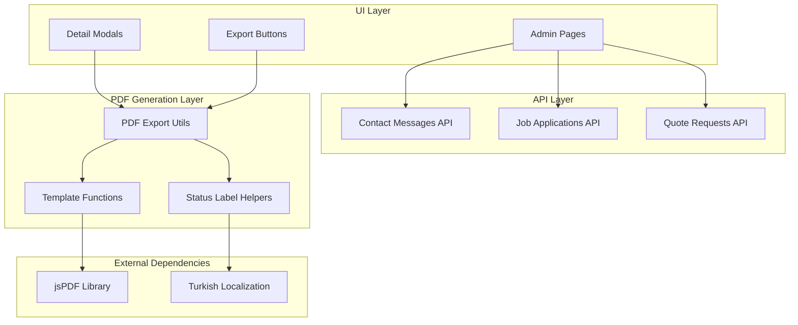
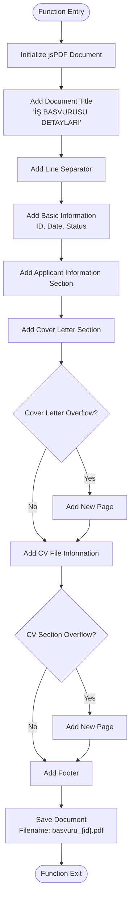
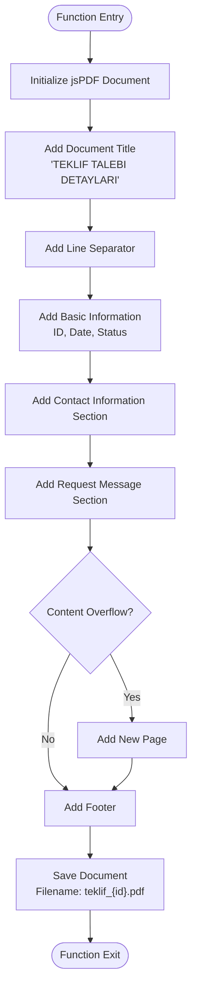
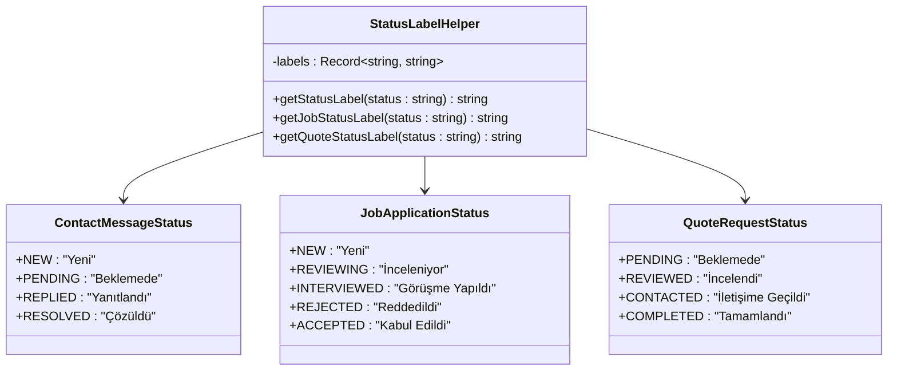
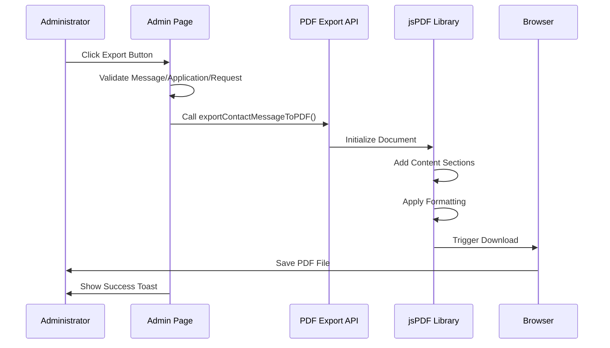
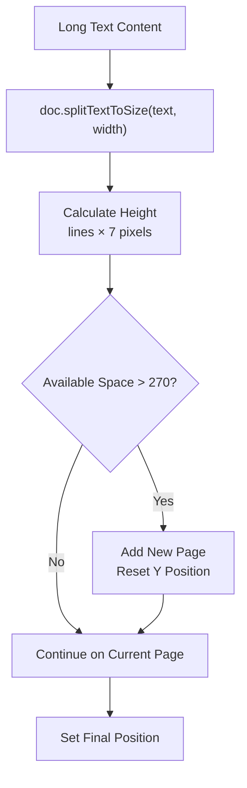
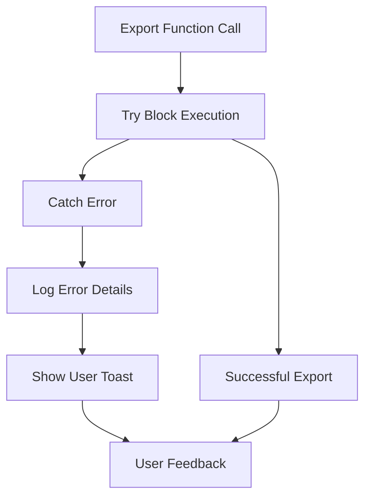

# PDF Export Utilities

<cite>
**Referenced Files in This Document**
- [pdf-export.ts](file://src/lib/pdf-export.ts)
- [contact-messages/route.ts](file://src/app/api/contact-messages/route.ts)
- [job-applications/route.ts](file://src/app/api/job-applications/route.ts)
- [quote-requests/route.ts](file://src/app/api/quote-requests/route.ts)
- [contact-messages/page.tsx](file://src/app/admin/contact-messages/page.tsx)
- [job-applications/page.tsx](file://src/app/admin/job-applications/page.tsx)
- [quote-requests/page.tsx](file://src/app/admin/quote-requests/page.tsx)
- [contact-message-modal.tsx](file://src/components/admin/contact-message-modal.tsx)
- [job-application-modal.tsx](file://src/components/admin/job-application-modal.tsx)
- [quote-request-modal.tsx](file://src/components/admin/quote-request-modal.tsx)
- [package.json](file://package.json)
</cite>

## Table of Contents
1. [Introduction](#introduction)
2. [Architecture Overview](#architecture-overview)
3. [Core PDF Export Functions](#core-pdf-export-functions)
4. [Status Label Translation System](#status-label-translation-system)
5. [Integration with Admin Pages](#integration-with-admin-pages)
6. [Dynamic Content Handling](#dynamic-content-handling)
7. [Error Handling and Performance](#error-handling-and-performance)
8. [Extending Templates](#extending-templates)
9. [Best Practices](#best-practices)
10. [Troubleshooting Guide](#troubleshooting-guide)

## Introduction

The PDF export functionality in this system provides standardized document generation capabilities for three primary business entities: contact messages, job applications, and quote requests. Built on the jsPDF library, this system enables administrators to export detailed records to printable PDF format with full Turkish localization support, dynamic content handling, and professional document formatting.

The implementation follows a modular architecture where each export type maintains its own specialized template while sharing common formatting principles and status translation mechanisms. This design ensures consistency across different document types while accommodating the unique requirements of each business entity.

## Architecture Overview

The PDF export system consists of several interconnected components that work together to provide seamless document generation capabilities:

**Diagram sources**
- [pdf-export.ts](file://src/lib/pdf-export.ts#L1-L241)
- [contact-messages/page.tsx](file://src/app/admin/contact-messages/page.tsx#L1-L466)
- [job-applications/page.tsx](file://src/app/admin/job-applications/page.tsx#L1-L501)
- [quote-requests/page.tsx](file://src/app/admin/quote-requests/page.tsx#L1-L504)

**Section sources**
- [pdf-export.ts](file://src/lib/pdf-export.ts#L1-L241)
- [package.json](file://package.json#L15-L16)

## Core PDF Export Functions

The system provides three specialized export functions, each tailored to handle the unique data structure and presentation requirements of different business entities.

### exportContactMessageToPDF Function

The contact message export function generates comprehensive documents containing all relevant communication details with professional formatting and Turkish localization.

**Diagram sources**
- [pdf-export.ts](file://src/lib/pdf-export.ts#L3-L57)

Key features of the contact message export:
- **Professional Layout Design**: Structured sections with clear visual hierarchy
- **Turkish Localization**: All text elements translated to Turkish
- **Dynamic Content Handling**: Automatic text wrapping and page splitting
- **Status Translation**: Real-time status label conversion
- **Timestamp Formatting**: Localized date and time display

**Section sources**
- [pdf-export.ts](file://src/lib/pdf-export.ts#L3-L57)

### exportJobApplicationToPDF Function

The job application export function creates detailed employment record documents with comprehensive candidate information and professional formatting standards.

**Diagram sources**
- [pdf-export.ts](file://src/lib/pdf-export.ts#L59-L157)

Advanced features of the job application export:
- **Multi-Section Layout**: Organized content structure with logical grouping
- **CV File Integration**: Handles embedded CV data with proper MIME type support
- **Complex Text Processing**: Sophisticated text splitting for lengthy cover letters
- **Page Management**: Intelligent page addition based on content length
- **File Metadata**: Comprehensive CV file information display

**Section sources**
- [pdf-export.ts](file://src/lib/pdf-export.ts#L59-L157)

### exportQuoteRequestToPDF Function

The quote request export function generates professional business proposal documents with customer information and service details.

**Diagram sources**
- [pdf-export.ts](file://src/lib/pdf-export.ts#L159-L202)

Quote request export characteristics:
- **Business Professionalism**: Formal document structure suitable for commercial use
- **Customer Focus**: Emphasis on client information and service requirements
- **Message Preservation**: Complete preservation of original request content
- **Consistent Branding**: Uniform formatting across all document types

**Section sources**
- [pdf-export.ts](file://src/lib/pdf-export.ts#L159-L202)

## Status Label Translation System

The status translation system provides intelligent label conversion from internal status enums to user-friendly Turkish text, ensuring consistent and localized presentation across all document types.

### Status Label Helper Functions

The system implements three specialized status label functions, each tailored to the specific vocabulary and business context of different document types:

**Diagram sources**
- [pdf-export.ts](file://src/lib/pdf-export.ts#L204-L241)

### Implementation Details

Each status label function implements a robust lookup mechanism with fallback handling:

| Function | Status Types | Use Case |
|----------|--------------|----------|
| `getStatusLabel` | NEW, PENDING, REPLIED, RESOLVED | General contact message status display |
| `getJobStatusLabel` | NEW, REVIEWING, INTERVIEWED, REJECTED, ACCEPTED | Employment application lifecycle |
| `getQuoteStatusLabel` | PENDING, REVIEWED, CONTACTED, COMPLETED | Business proposal process |

The translation system provides:
- **Case Insensitive Matching**: Handles both uppercase and lowercase status values
- **Fallback Mechanism**: Returns original status if no translation found
- **Type Safety**: Uses TypeScript Record types for compile-time validation
- **Extensibility**: Easy addition of new status types and translations

**Section sources**
- [pdf-export.ts](file://src/lib/pdf-export.ts#L204-L241)

## Integration with Admin Pages

The PDF export functionality integrates seamlessly with the administrative interface through multiple pathways, providing intuitive user experiences across different interaction contexts.

### Admin Page Integration

Each admin page implements a consistent export workflow that allows administrators to generate PDF documents directly from the main interface:

**Diagram sources**
- [contact-messages/page.tsx](file://src/app/admin/contact-messages/page.tsx#L180-L190)
- [job-applications/page.tsx](file://src/app/admin/job-applications/page.tsx#L180-L190)
- [quote-requests/page.tsx](file://src/app/admin/quote-requests/page.tsx#L180-L190)

### Modal Integration

Detail modals provide direct export access from within the contextual view, offering immediate document generation capabilities:

| Component | Export Method | Access Point |
|-----------|---------------|--------------|
| ContactMessageModal | `onExportPDF(message)` | Modal Footer Button |
| JobApplicationModal | `onExportPDF(application)` | Modal Footer Button |
| QuoteRequestModal | `onExportPDF(request)` | Modal Footer Button |

The modal integration provides:
- **Context Awareness**: Exports current selection context
- **Immediate Access**: Direct export from detailed view
- **Consistent Experience**: Uniform export workflow across components
- **Error Handling**: Comprehensive error reporting and user feedback

**Section sources**
- [contact-message-modal.tsx](file://src/components/admin/contact-message-modal.tsx#L160-L169)
- [job-application-modal.tsx](file://src/components/admin/job-application-modal.tsx#L260-L269)
- [quote-request-modal.tsx](file://src/components/admin/quote-request-modal.tsx#L170-L183)

## Dynamic Content Handling

The PDF export system implements sophisticated content management strategies to handle varying data lengths and prevent document overflow issues.

### Text Wrapping and Page Management

The system employs intelligent text wrapping and automatic page management to ensure content fits within document boundaries:

**Diagram sources**
- [pdf-export.ts](file://src/lib/pdf-export.ts#L45-L50)
- [pdf-export.ts](file://src/lib/pdf-export.ts#L115-L120)

### Content Overflow Detection

The system implements multiple overflow detection mechanisms:

| Detection Type | Threshold | Action |
|----------------|-----------|--------|
| Vertical Overflow | Y > 270 pixels | Add new page |
| Text Length | Variable | Automatic wrapping |
| Section Length | Calculated | Dynamic page allocation |

### Font Sizing and Spacing Standards

The export functions maintain consistent typography standards:

- **Title Font Size**: 16px for main headings
- **Section Headers**: 12px for subsection titles
- **Body Text**: 10px for content areas
- **Footer Text**: 8px for metadata
- **Line Spacing**: 7 pixels between text lines
- **Margin Standards**: 20px left margin, 190px right boundary

**Section sources**
- [pdf-export.ts](file://src/lib/pdf-export.ts#L3-L57)
- [pdf-export.ts](file://src/lib/pdf-export.ts#L59-L157)
- [pdf-export.ts](file://src/lib/pdf-export.ts#L159-L202)

## Error Handling and Performance

The PDF export system implements comprehensive error handling and performance optimization strategies to ensure reliable operation under various conditions.

### Error Handling Strategies

The system provides multiple layers of error protection:

**Diagram sources**
- [contact-messages/page.tsx](file://src/app/admin/contact-messages/page.tsx#L180-L190)
- [job-applications/page.tsx](file://src/app/admin/job-applications/page.tsx#L180-L190)
- [quote-requests/page.tsx](file://src/app/admin/quote-requests/page.tsx#L180-L190)

### Performance Considerations

The system addresses several performance aspects:

| Aspect | Optimization Strategy | Impact |
|--------|----------------------|---------|
| Memory Usage | Single document instance | Prevents memory leaks |
| Processing Load | Client-side generation | Reduces server overhead |
| File Size | Efficient text compression | Optimized download sizes |
| Rendering Speed | Synchronous operations | Predictable performance |

### Memory Management

The jsPDF library is used efficiently with:
- **Single Instance Creation**: Each export creates one document instance
- **Automatic Cleanup**: Browser handles temporary file cleanup
- **Streaming Output**: Documents generated and downloaded immediately
- **Minimal Buffering**: Direct PDF generation without intermediate storage

**Section sources**
- [contact-messages/page.tsx](file://src/app/admin/contact-messages/page.tsx#L180-L190)
- [job-applications/page.tsx](file://src/app/admin/job-applications/page.tsx#L180-L190)
- [quote-requests/page.tsx](file://src/app/admin/quote-requests/page.tsx#L180-L190)

## Extending Templates

The PDF export system provides flexible extension points for adding new sections, branding elements, and customization options while maintaining template consistency.

### Adding New Sections

To add new sections to existing templates:

1. **Define Section Structure**: Identify content organization requirements
2. **Implement Content Extraction**: Extract relevant data from source objects
3. **Add Formatting Logic**: Apply appropriate typography and spacing
4. **Handle Overflow**: Implement page management for long content
5. **Test Integration**: Verify compatibility with existing export functions

### Branding Integration

The system supports branding enhancements through:

| Enhancement | Implementation | Benefits |
|-------------|----------------|----------|
| Logo Addition | Image embedding with scaling | Corporate identity |
| Color Scheme | Custom color palette | Brand consistency |
| Header/Footer | Template sections | Professional appearance |
| Typography | Font family selection | Brand personality |

### Template Extension Guidelines

When extending templates, follow these principles:

- **Maintain Consistency**: Use established formatting patterns
- **Preserve Localization**: Ensure Turkish translations remain intact
- **Optimize Performance**: Minimize computational overhead
- **Ensure Compatibility**: Test with existing data structures
- **Document Changes**: Maintain clear documentation for modifications

**Section sources**
- [pdf-export.ts](file://src/lib/pdf-export.ts#L1-L241)

## Best Practices

The PDF export system demonstrates several best practices for document generation and user experience design.

### Code Organization Principles

The implementation follows clean architecture patterns:

- **Separation of Concerns**: Distinct functions for different document types
- **Single Responsibility**: Each function handles one specific export type
- **Reusability**: Shared helper functions for common operations
- **Maintainability**: Clear, readable code with comprehensive comments

### User Experience Guidelines

The system prioritizes user-friendly design:

- **Intuitive Workflows**: Direct export access from relevant contexts
- **Clear Feedback**: Immediate success/error notifications
- **Consistent Interfaces**: Uniform button placement and labeling
- **Accessibility**: Proper semantic markup and keyboard navigation

### Technical Excellence

Implementation excellence is demonstrated through:

- **Type Safety**: Comprehensive TypeScript typing
- **Error Resilience**: Robust error handling and recovery
- **Performance Optimization**: Efficient resource utilization
- **Standards Compliance**: Adherence to web standards and best practices

**Section sources**
- [pdf-export.ts](file://src/lib/pdf-export.ts#L1-L241)
- [contact-messages/page.tsx](file://src/app/admin/contact-messages/page.tsx#L1-L466)
- [job-applications/page.tsx](file://src/app/admin/job-applications/page.tsx#L1-L501)
- [quote-requests/page.tsx](file://src/app/admin/quote-requests/page.tsx#L1-L504)

## Troubleshooting Guide

Common issues and their solutions when working with the PDF export functionality.

### Export Failures

**Problem**: PDF export fails silently or throws errors
**Solution**: 
- Verify browser JavaScript console for error messages
- Check network connectivity for API requests
- Ensure adequate browser permissions for downloads
- Validate input data structure and completeness

### Performance Issues

**Problem**: Slow export generation or browser freezing
**Solution**:
- Reduce content length for testing
- Check browser memory usage
- Verify jsPDF library version compatibility
- Monitor network latency for API calls

### Localization Problems

**Problem**: Status labels appear in English instead of Turkish
**Solution**:
- Verify status enum values match expected keys
- Check translation dictionary completeness
- Ensure proper string formatting
- Validate locale settings in browser

### Document Formatting Issues

**Problem**: Poorly formatted PDF documents
**Solution**:
- Review font sizing and spacing calculations
- Check page boundary calculations
- Verify text wrapping logic
- Test with various content lengths

**Section sources**
- [contact-messages/page.tsx](file://src/app/admin/contact-messages/page.tsx#L180-L190)
- [job-applications/page.tsx](file://src/app/admin/job-applications/page.tsx#L180-L190)
- [quote-requests/page.tsx](file://src/app/admin/quote-requests/page.tsx#L180-L190)