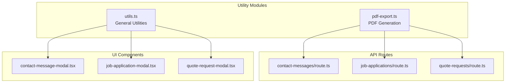
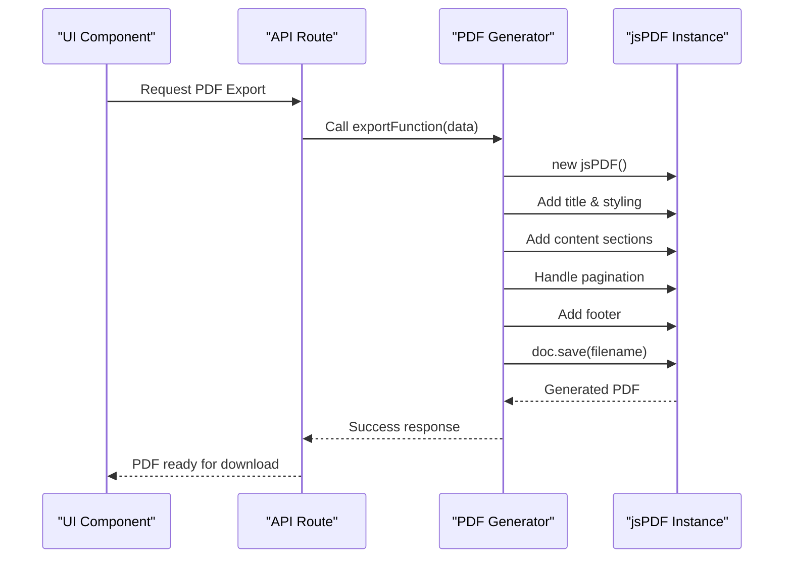
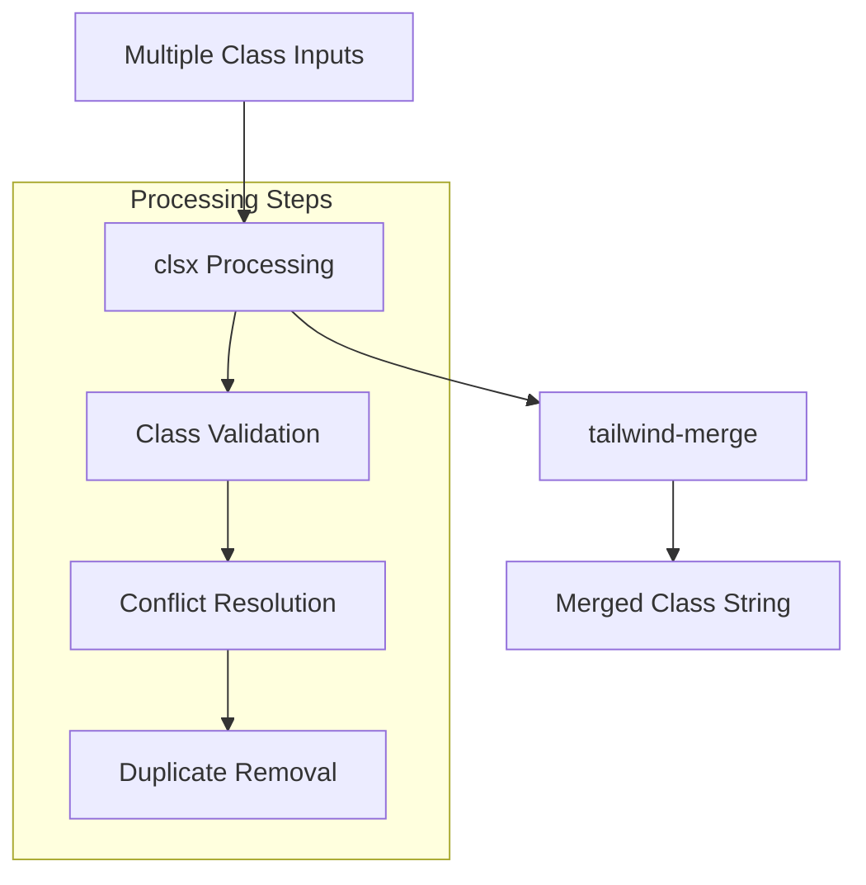
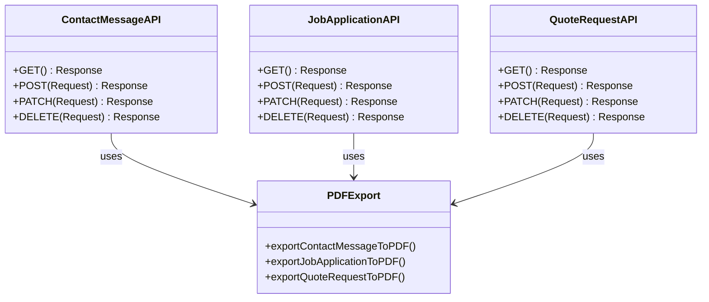
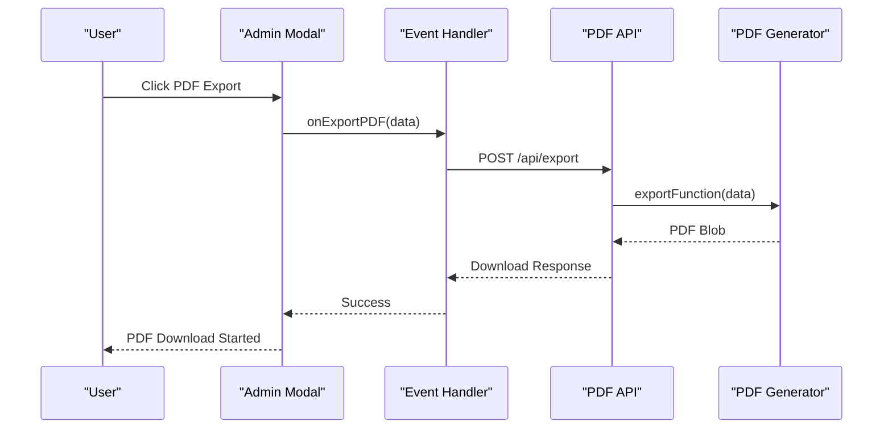

# Utility Functions

<cite>
**Referenced Files in This Document**
- [pdf-export.ts](file://src/lib/pdf-export.ts)
- [utils.ts](file://src/lib/utils.ts)
- [contact-message-modal.tsx](file://src/components/admin/contact-message-modal.tsx)
- [job-application-modal.tsx](file://src/components/admin/job-application-modal.tsx)
- [quote-request-modal.tsx](file://src/components/admin/quote-request-modal.tsx)
- [contact-messages/route.ts](file://src/app/api/contact-messages/route.ts)
- [job-applications/route.ts](file://src/app/api/job-applications/route.ts)
- [quote-requests/route.ts](file://src/app/api/quote-requests/route.ts)
- [package.json](file://package.json)
- [tsconfig.json](file://tsconfig.json)
</cite>

## Table of Contents
1. [Introduction](#introduction)
2. [Project Structure](#project-structure)
3. [PDF Export Functionality](#pdf-export-functionality)
4. [Utility Functions](#utility-functions)
5. [Integration Across Application](#integration-across-application)
6. [Performance Considerations](#performance-considerations)
7. [Extending the Utility Library](#extending-the-utility-library)
8. [Best Practices](#best-practices)
9. [Troubleshooting Guide](#troubleshooting-guide)
10. [Conclusion](#conclusion)

## Introduction

The smmm-system utility functions provide essential functionality for PDF document generation and general utility operations. The system consists of two primary utility modules: `pdf-export.ts` for generating PDF documents from various communication and application data, and `utils.ts` for general utility functions including Tailwind CSS class merging.

These utilities serve as the backbone for document generation, data formatting, and UI enhancement throughout the application, supporting administrative interfaces for managing contact messages, job applications, and quote requests.

## Project Structure

The utility functions are organized within the `/src/lib/` directory, following a clean separation of concerns:



**Diagram sources**
- [pdf-export.ts](file://src/lib/pdf-export.ts#L1-L241)
- [utils.ts](file://src/lib/utils.ts#L1-L7)

**Section sources**
- [pdf-export.ts](file://src/lib/pdf-export.ts#L1-L241)
- [utils.ts](file://src/lib/utils.ts#L1-L7)

## PDF Export Functionality

The PDF export functionality in `pdf-export.ts` leverages the jsPDF library to generate professional PDF documents from various data sources within the application.

### Core PDF Export Functions

The system provides three main export functions, each tailored for specific data types:

#### Contact Message Export
The `exportContactMessageToPDF` function creates detailed PDF reports from contact messages, including:
- Message metadata (ID, creation date, status)
- Contact information (name, email, phone, subject)
- Full message content with automatic text wrapping
- Status translation to Turkish
- Automatic pagination for long content

#### Job Application Export
The `exportJobApplicationToPDF` function generates comprehensive application reports containing:
- Application details (ID, creation date, status)
- Applicant personal information
- Position and qualification details
- Cover letter with text wrapping
- CV file information
- Base64-encoded CV download capability

#### Quote Request Export
The `exportQuoteRequestToPDF` function produces quote request reports featuring:
- Request metadata and timeline
- Company and service information
- Contact details
- Request message with formatting
- Status tracking

### PDF Generation Architecture



**Diagram sources**
- [contact-message-modal.tsx](file://src/components/admin/contact-message-modal.tsx#L165-L168)
- [job-application-modal.tsx](file://src/components/admin/job-application-modal.tsx#L265-L269)
- [quote-request-modal.tsx](file://src/components/admin/quote-request-modal.tsx#L180-L182)

### Text Processing and Layout Management

The PDF generation system implements sophisticated text processing:

#### Automatic Text Wrapping
Using `doc.splitTextToSize()` for intelligent text wrapping based on column width constraints.

#### Dynamic Pagination
Automatic page addition when content exceeds printable area limits (270 units vertical threshold).

#### Status Translation
Localized status labels using dedicated helper functions for each entity type.

**Section sources**
- [pdf-export.ts](file://src/lib/pdf-export.ts#L1-L241)

## Utility Functions

The `utils.ts` module provides a single, focused utility function for Tailwind CSS class merging.

### Class Name Utility

The `cn()` function combines and merges Tailwind CSS classes using clsx and tailwind-merge:



**Diagram sources**
- [utils.ts](file://src/lib/utils.ts#L1-L7)

### Function Implementation Details

The utility function accepts multiple class inputs and returns a single optimized class string:

- **Input Type**: `ClassValue[]` - Supports strings, objects, arrays, and conditional logic
- **Processing**: Uses clsx for initial class combination and tailwind-merge for conflict resolution
- **Output**: Optimized class string with minimal footprint

**Section sources**
- [utils.ts](file://src/lib/utils.ts#L1-L7)

## Integration Across Application

The utility functions integrate seamlessly across the application architecture, supporting both server-side and client-side operations.

### API Route Integration

Each API route leverages the PDF export functionality for document generation:



**Diagram sources**
- [contact-messages/route.ts](file://src/app/api/contact-messages/route.ts#L1-L97)
- [job-applications/route.ts](file://src/app/api/job-applications/route.ts#L1-L130)
- [quote-requests/route.ts](file://src/app/api/quote-requests/route.ts#L1-L99)

### UI Component Integration

The utility functions enhance the user interface through:

#### Modal Components
- **Contact Message Modal**: Provides PDF export functionality for individual messages
- **Job Application Modal**: Offers comprehensive application report generation
- **Quote Request Modal**: Enables quote request documentation

#### Event Handling
Each modal component integrates the PDF export function through event handlers, enabling seamless document generation from user interactions.

### Data Flow Architecture



**Diagram sources**
- [contact-message-modal.tsx](file://src/components/admin/contact-message-modal.tsx#L165-L168)
- [job-application-modal.tsx](file://src/components/admin/job-application-modal.tsx#L265-L269)

**Section sources**
- [contact-message-modal.tsx](file://src/components/admin/contact-message-modal.tsx#L1-L169)
- [job-application-modal.tsx](file://src/components/admin/job-application-modal.tsx#L1-L270)
- [quote-request-modal.tsx](file://src/components/admin/quote-request-modal.tsx#L1-L183)

## Performance Considerations

The utility functions are designed with performance and memory efficiency in mind, particularly for PDF generation which can be resource-intensive.

### Memory Management

#### PDF Generation Optimization
- **Streaming Approach**: Documents are generated in memory before download
- **Garbage Collection**: Automatic cleanup after document generation
- **Base64 Encoding**: Efficient binary data handling for CV attachments

#### Text Processing Efficiency
- **Intelligent Wrapping**: Prevents unnecessary text splitting operations
- **Pagination Logic**: Minimizes page additions through threshold-based calculations

### Scalability Factors

#### Concurrent Operations
- **Thread Safety**: Pure functions prevent race conditions
- **Stateless Design**: No shared mutable state between operations

#### Resource Limits
- **Memory Thresholds**: Automatic page breaks prevent excessive memory usage
- **Timeout Handling**: Graceful degradation for large documents

### Performance Monitoring

Key metrics to monitor for optimal performance:

| Metric | Target | Monitoring Method |
|--------|--------|-------------------|
| PDF Generation Time | < 2 seconds | Console timing |
| Memory Usage | < 50MB per operation | Browser DevTools |
| Download Success Rate | > 99% | Error logging |
| Document Size | < 10MB | File size validation |

## Extending the Utility Library

The utility functions are designed for extensibility while maintaining type safety and code quality standards.

### Adding New PDF Export Functions

To add support for new data types:

1. **Define Export Function**: Create a new function following the established pattern
2. **Add Status Helpers**: Implement localized status translation functions
3. **Update UI Integration**: Extend modal components with export capabilities
4. **Test Thoroughly**: Ensure proper text wrapping and pagination

Example extension pattern:
```typescript
export const exportNewDataTypeToPDF = (data: any) => {
  const doc = new jsPDF()
  // Implementation following existing patterns
}
```

### Enhancing Utility Functions

#### Type Safety Improvements
- **Generic Types**: Use TypeScript generics for flexible data handling
- **Interface Definitions**: Define strict interfaces for data structures
- **Validation**: Implement runtime type checking

#### New Utility Categories
- **Data Formatting**: Additional formatters for dates, numbers, currencies
- **File Processing**: Enhanced file manipulation utilities
- **UI Enhancements**: Additional class manipulation functions

### Code Quality Standards

#### Development Guidelines
- **Consistent Naming**: Follow established naming conventions
- **Documentation**: Include JSDoc comments for all public functions
- **Testing**: Implement comprehensive unit tests
- **TypeScript**: Maintain strict type checking

#### Maintenance Best Practices
- **Version Control**: Semantic versioning for utility updates
- **Backward Compatibility**: Ensure API stability
- **Performance Testing**: Regular performance benchmarking

## Best Practices

### PDF Export Best Practices

#### Content Organization
- **Logical Structure**: Maintain consistent section ordering
- **Readable Formatting**: Use appropriate font sizes and spacing
- **Accessibility**: Ensure screen reader compatibility

#### Error Handling
- **Graceful Degradation**: Handle missing data gracefully
- **User Feedback**: Provide meaningful error messages
- **Logging**: Implement comprehensive error logging

### Utility Function Development

#### Code Organization
- **Single Responsibility**: Each function has a clear, focused purpose
- **Minimal Dependencies**: Reduce external dependencies
- **Reusability**: Design for broad applicability

#### Testing Strategies
- **Unit Testing**: Test individual functions in isolation
- **Integration Testing**: Verify cross-module functionality
- **Performance Testing**: Monitor resource usage

## Troubleshooting Guide

### Common PDF Generation Issues

#### Document Not Appearing
**Symptoms**: PDF generation completes but no download occurs
**Causes**: 
- Browser popup blockers
- Insufficient memory allocation
- Network connectivity issues

**Solutions**:
- Check browser settings for popup permissions
- Verify available memory resources
- Implement retry mechanisms for network operations

#### Text Overflow Problems
**Symptoms**: Content cuts off or appears misaligned
**Causes**:
- Incorrect column width calculations
- Font size inconsistencies
- Page margin adjustments

**Solutions**:
- Review text wrapping logic
- Standardize font sizing
- Adjust page margins consistently

#### Status Translation Failures
**Symptoms**: Status codes appear instead of localized text
**Causes**:
- Missing status mappings
- Case sensitivity issues
- Type mismatches

**Solutions**:
- Verify complete status label mappings
- Implement case-insensitive lookups
- Add type validation for status parameters

### Utility Function Issues

#### Class Merging Problems
**Symptoms**: CSS classes not applying correctly
**Causes**:
- Conflicting class names
- Incorrect input types
- Merge conflicts

**Solutions**:
- Review class naming conventions
- Validate input types
- Use explicit class precedence rules

**Section sources**
- [pdf-export.ts](file://src/lib/pdf-export.ts#L202-L241)
- [utils.ts](file://src/lib/utils.ts#L1-L7)

## Conclusion

The smmm-system utility functions provide a robust foundation for document generation and general utility operations. The PDF export functionality offers comprehensive document generation capabilities with intelligent text processing and localization support. The utility functions maintain high standards for performance, type safety, and code quality.

The modular architecture enables easy extension and maintenance while providing reliable functionality across the application. Future enhancements should focus on expanding the utility library while maintaining the established patterns and quality standards.

Key strengths include:
- **Type Safety**: Comprehensive TypeScript support
- **Performance**: Optimized for efficient resource usage
- **Extensibility**: Well-designed for future enhancements
- **Maintainability**: Clean, well-documented codebase

The utility functions serve as an excellent example of how to build scalable, maintainable utility libraries that support complex application requirements while remaining accessible to developers.